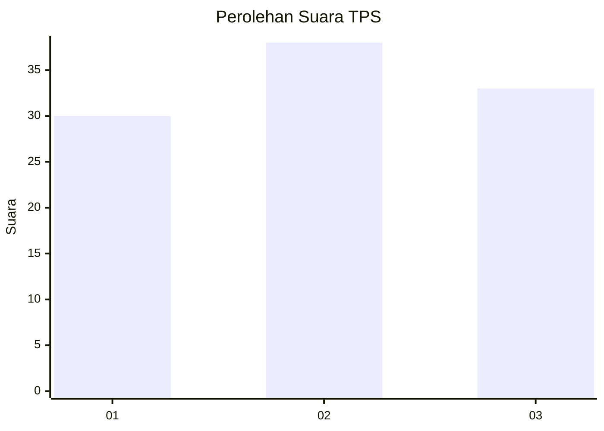
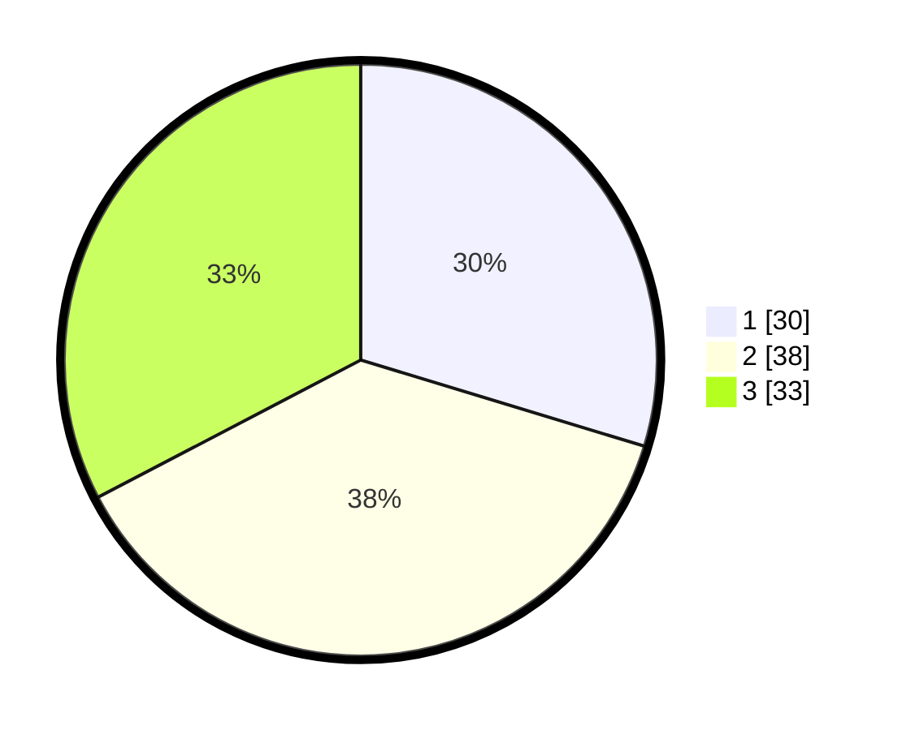

# Hasil

## Grafik

## Tabel

| No. | Nama Paslon    | Suara | Suara (raw) | Persentase |
|:--- |:-------------- | -----:| -----------:| ----------:|
| 1   | ANIES MUHAIMIN | 30    | [30][p-1]   | 29,70      |
| 2   | PRABOWO GIBRAN | 38    | [38][p-2]   | 37,62      |
| 3   | GANJAR MAHFUD  | 33    | [33][p-3]   | 32,67      |

[p-1]: https://github.com/gigit-pemilu/pemilu-2024-33-jawa-tengah/blob/main/pilpres/hitung-suara/sub/33-jawa-tengah/sub/73-kota-salatiga/sub/04-sidomukti/sub/1003-mangunsari/sub/006-tps/sub/paslon-1.txt
[p-2]: https://github.com/gigit-pemilu/pemilu-2024-33-jawa-tengah/blob/main/pilpres/hitung-suara/sub/33-jawa-tengah/sub/73-kota-salatiga/sub/04-sidomukti/sub/1003-mangunsari/sub/006-tps/sub/paslon-2.txt
[p-3]: https://github.com/gigit-pemilu/pemilu-2024-33-jawa-tengah/blob/main/pilpres/hitung-suara/sub/33-jawa-tengah/sub/73-kota-salatiga/sub/04-sidomukti/sub/1003-mangunsari/sub/006-tps/sub/paslon-3.txt

## Foto C Plano

https://sirekap-obj-formc.kpu.go.id/7155/pemilu/ppwp/33/73/04/10/03/3373041003006-20240214-194137--2439f158-4e58-48e1-8d26-f289553ea96f.jpg

https://sirekap-obj-formc.kpu.go.id/7155/pemilu/ppwp/33/73/04/10/03/3373041003006-20240214-204916--e6f0ee0d-2153-4660-8eb5-9127b5b29a49.jpg

https://sirekap-obj-formc.kpu.go.id/7155/pemilu/ppwp/33/73/04/10/03/3373041003006-20240214-220439--831b0aae-e45b-4923-89ee-64f4fdf765eb.jpg

## Metadata

| Key        | Value               |
| ---------- | ------------------- |
| Time Stamp | 2024-02-15 12:00:28 |

