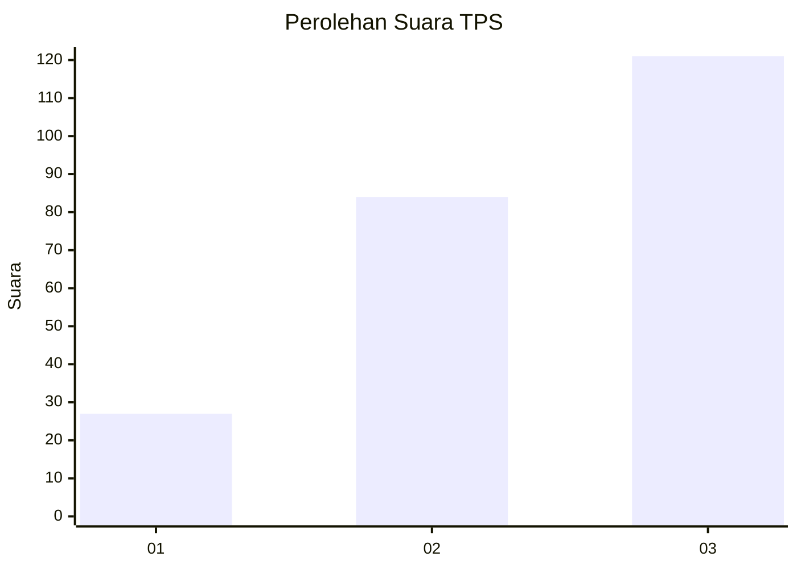
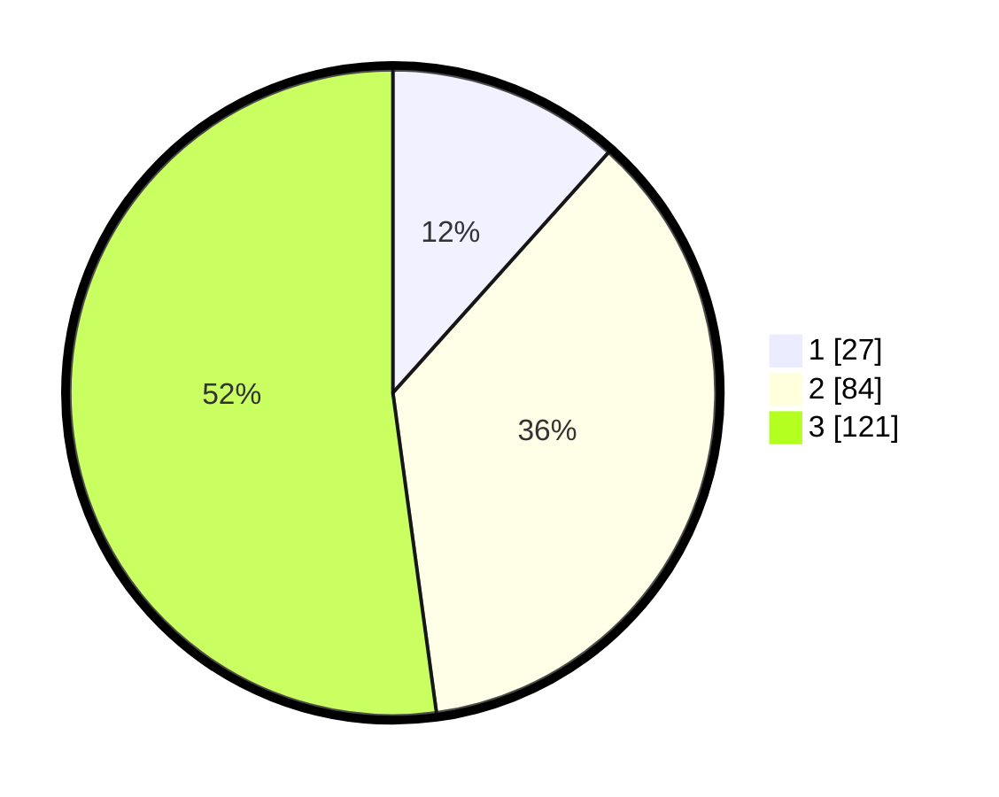

# Hasil

## Grafik

## Tabel

| No. | Nama Paslon    | Suara | Suara (raw) | Persentase |
|:--- |:-------------- | -----:| -----------:| ----------:|
| 1   | ANIES MUHAIMIN | 27    | [27][p-1]   | 11,64      |
| 2   | PRABOWO GIBRAN | 84    | [84][p-2]   | 36,21      |
| 3   | GANJAR MAHFUD  | 121   | [121][p-3]  | 52,16      |

[p-1]: https://github.com/gigit-pemilu/pemilu-2024/blob/main/pilpres/hitung-suara/sub/33-jawa-tengah/sub/74-kota-semarang/sub/01-semarang-tengah/sub/1001-miroto/sub/002-tps/sub/paslon-1.txt
[p-2]: https://github.com/gigit-pemilu/pemilu-2024/blob/main/pilpres/hitung-suara/sub/33-jawa-tengah/sub/74-kota-semarang/sub/01-semarang-tengah/sub/1001-miroto/sub/002-tps/sub/paslon-2.txt
[p-3]: https://github.com/gigit-pemilu/pemilu-2024/blob/main/pilpres/hitung-suara/sub/33-jawa-tengah/sub/74-kota-semarang/sub/01-semarang-tengah/sub/1001-miroto/sub/002-tps/sub/paslon-3.txt

## Foto C Plano

https://sirekap-obj-formc.kpu.go.id/6009/pemilu/ppwp/33/74/01/10/01/3374011001002-20240215-043146--3eae9974-e0aa-47b4-b232-acd4804d09fb.jpg

https://sirekap-obj-formc.kpu.go.id/6009/pemilu/ppwp/33/74/01/10/01/3374011001002-20240215-043316--a9f085da-a4cf-4159-ab38-d5179349701d.jpg

https://sirekap-obj-formc.kpu.go.id/6009/pemilu/ppwp/33/74/01/10/01/3374011001002-20240215-043519--8ad165fc-33f1-4507-bd88-0368ebe175b5.jpg

## Metadata

| Key        | Value               |
| ---------- | ------------------- |
| Time Stamp | 2024-02-15 19:30:26 |

