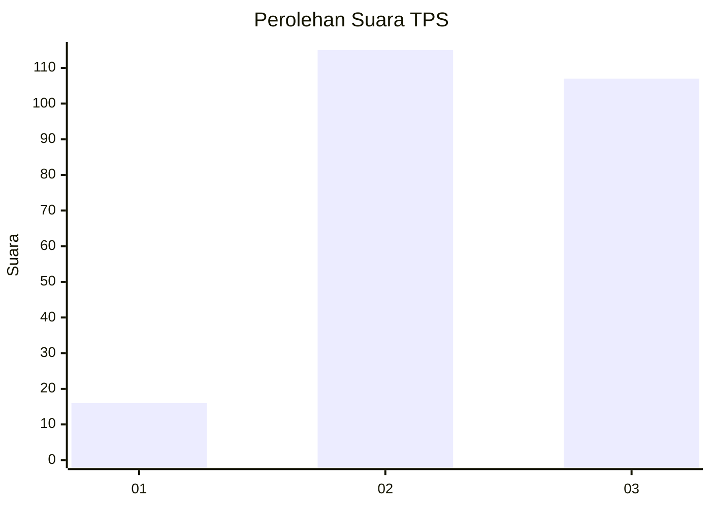
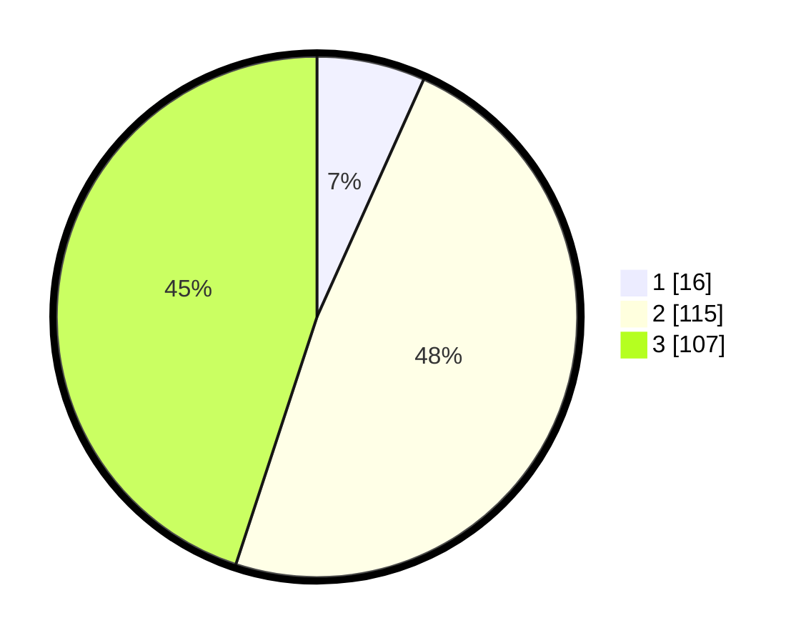

# Hasil

## Grafik

## Tabel

| No. | Nama Paslon    | Suara | Suara (raw) | Persentase |
|:--- |:-------------- | -----:| -----------:| ----------:|
| 1   | ANIES MUHAIMIN | 16    | [16][p-1]   | 6,72       |
| 2   | PRABOWO GIBRAN | 115   | [115][p-2]  | 48,32      |
| 3   | GANJAR MAHFUD  | 107   | [107][p-3]  | 44,96      |

[p-1]: https://github.com/gigit-pemilu/pemilu-2024-33-jawa-tengah/blob/main/pilpres/hitung-suara/sub/33-jawa-tengah/sub/74-kota-semarang/sub/01-semarang-tengah/sub/1001-miroto/sub/003-tps/sub/paslon-1.txt
[p-2]: https://github.com/gigit-pemilu/pemilu-2024-33-jawa-tengah/blob/main/pilpres/hitung-suara/sub/33-jawa-tengah/sub/74-kota-semarang/sub/01-semarang-tengah/sub/1001-miroto/sub/003-tps/sub/paslon-2.txt
[p-3]: https://github.com/gigit-pemilu/pemilu-2024-33-jawa-tengah/blob/main/pilpres/hitung-suara/sub/33-jawa-tengah/sub/74-kota-semarang/sub/01-semarang-tengah/sub/1001-miroto/sub/003-tps/sub/paslon-3.txt

## Foto C Plano

https://sirekap-obj-formc.kpu.go.id/6bdf/pemilu/ppwp/33/74/01/10/01/3374011001003-20240311-132117--3cc3ca87-67a8-47e0-a4c0-9ad50b9280b3.jpg

https://sirekap-obj-formc.kpu.go.id/6bdf/pemilu/ppwp/33/74/01/10/01/3374011001003-20240214-200927--4cfdafbb-9fe1-4910-bc76-24feea0461ae.jpg

https://sirekap-obj-formc.kpu.go.id/6bdf/pemilu/ppwp/33/74/01/10/01/3374011001003-20240214-200931--141dd625-6f8f-4edc-9d7c-1eedccec885e.jpg

## Metadata

| Key        | Value               |
| ---------- | ------------------- |
| Time Stamp | 2024-03-11 14:00:00 |

