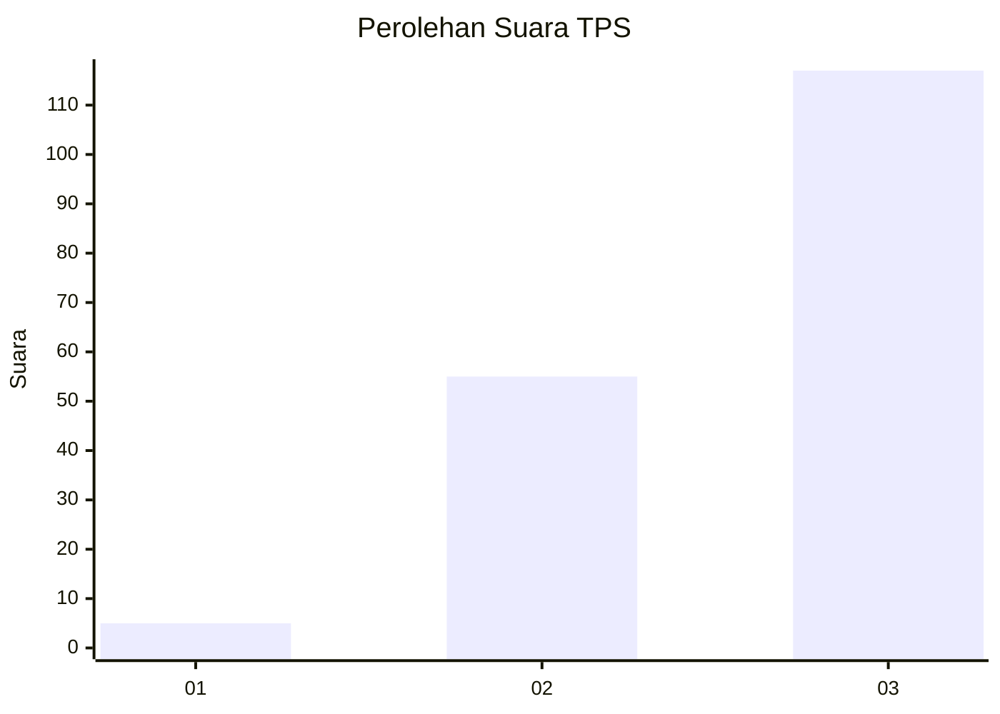
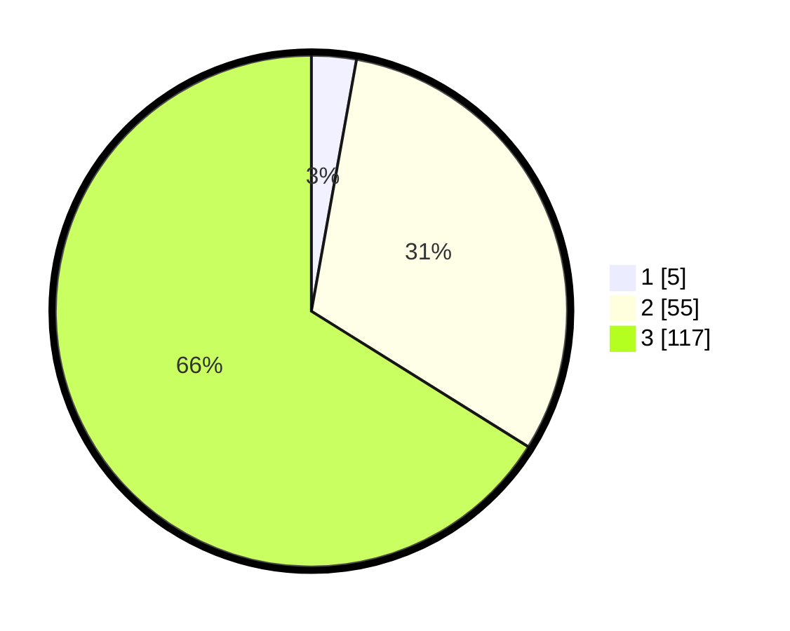

# Hasil

## Grafik

## Tabel

| No. | Nama Paslon    | Suara | Suara (raw) | Persentase |
|:--- |:-------------- | -----:| -----------:| ----------:|
| 1   | ANIES MUHAIMIN | 5     | [5][p-1]    | 2,82       |
| 2   | PRABOWO GIBRAN | 55    | [55][p-2]   | 31,07      |
| 3   | GANJAR MAHFUD  | 117   | [117][p-3]  | 66,10      |

[p-1]: https://github.com/gigit-pemilu/pemilu-2024-33-jawa-tengah/blob/main/pilpres/hitung-suara/sub/33-jawa-tengah/sub/74-kota-semarang/sub/01-semarang-tengah/sub/1001-miroto/sub/009-tps/sub/paslon-1.txt
[p-2]: https://github.com/gigit-pemilu/pemilu-2024-33-jawa-tengah/blob/main/pilpres/hitung-suara/sub/33-jawa-tengah/sub/74-kota-semarang/sub/01-semarang-tengah/sub/1001-miroto/sub/009-tps/sub/paslon-2.txt
[p-3]: https://github.com/gigit-pemilu/pemilu-2024-33-jawa-tengah/blob/main/pilpres/hitung-suara/sub/33-jawa-tengah/sub/74-kota-semarang/sub/01-semarang-tengah/sub/1001-miroto/sub/009-tps/sub/paslon-3.txt

## Foto C Plano

https://sirekap-obj-formc.kpu.go.id/b56c/pemilu/ppwp/33/74/01/10/01/3374011001009-20240216-210637--a42cf106-3feb-49c2-96da-56c3c98e86ce.jpg

https://sirekap-obj-formc.kpu.go.id/b56c/pemilu/ppwp/33/74/01/10/01/3374011001009-20240216-210824--b6fa9655-faa0-4ba8-b5cd-ac2934b08e35.jpg

https://sirekap-obj-formc.kpu.go.id/b56c/pemilu/ppwp/33/74/01/10/01/3374011001009-20240216-205832--5686f1aa-ce7a-47a6-a513-7fe199c0d62d.jpg

## Metadata

| Key        | Value               |
| ---------- | ------------------- |
| Time Stamp | 2024-02-24 22:31:28 |

