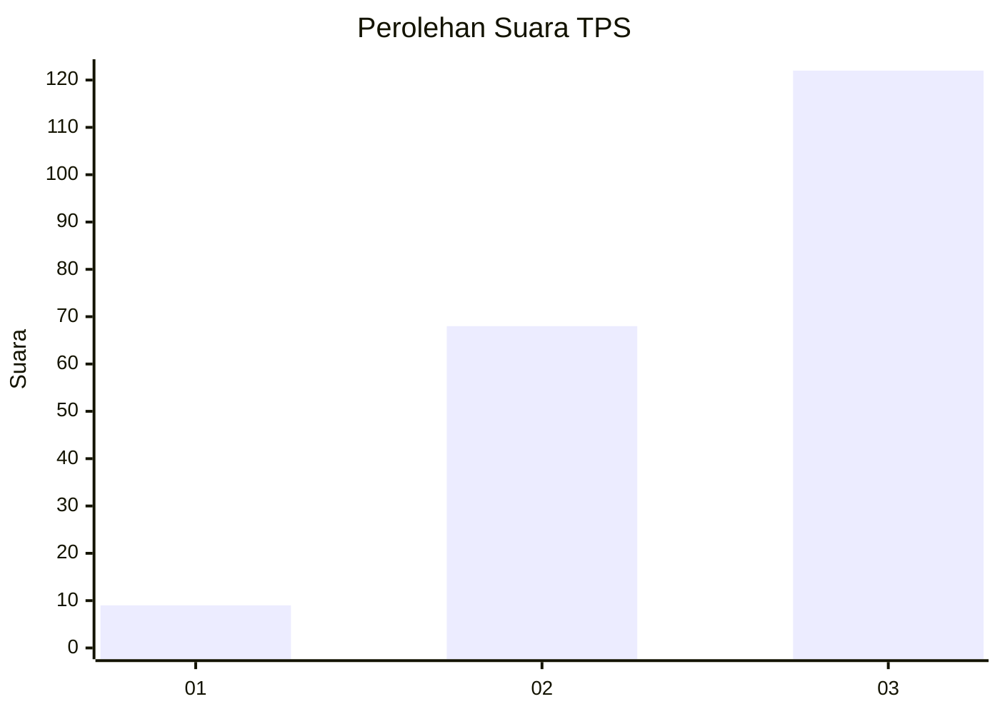
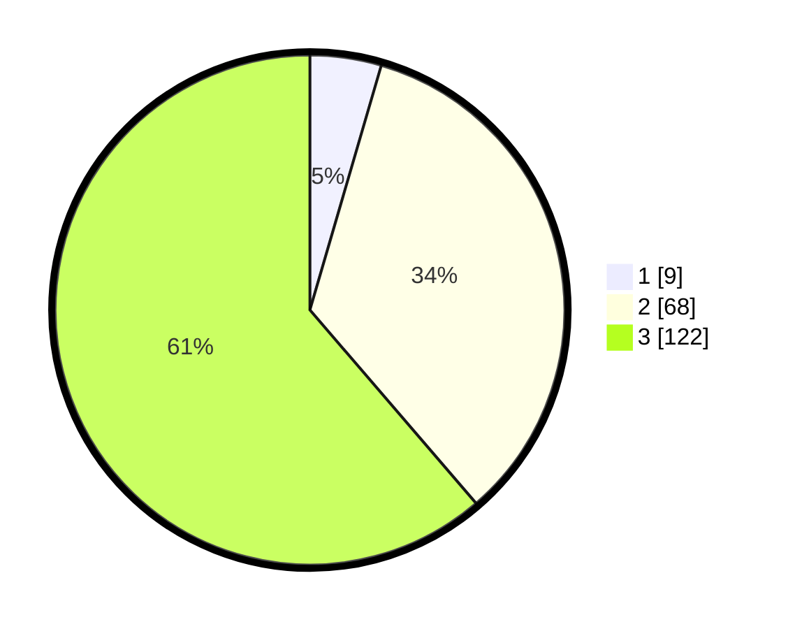

# Hasil

## Grafik

## Tabel

| No. | Nama Paslon    | Suara | Suara (raw) | Persentase |
|:--- |:-------------- | -----:| -----------:| ----------:|
| 1   | ANIES MUHAIMIN | 9     | [9][p-1]    | 4,52       |
| 2   | PRABOWO GIBRAN | 68    | [68][p-2]   | 34,17      |
| 3   | GANJAR MAHFUD  | 122   | [122][p-3]  | 61,31      |

[p-1]: https://github.com/gigit-pemilu/pemilu-2024/blob/main/pilpres/hitung-suara/sub/33-jawa-tengah/sub/74-kota-semarang/sub/01-semarang-tengah/sub/1004-kranggan/sub/007-tps/sub/paslon-1.txt
[p-2]: https://github.com/gigit-pemilu/pemilu-2024/blob/main/pilpres/hitung-suara/sub/33-jawa-tengah/sub/74-kota-semarang/sub/01-semarang-tengah/sub/1004-kranggan/sub/007-tps/sub/paslon-2.txt
[p-3]: https://github.com/gigit-pemilu/pemilu-2024/blob/main/pilpres/hitung-suara/sub/33-jawa-tengah/sub/74-kota-semarang/sub/01-semarang-tengah/sub/1004-kranggan/sub/007-tps/sub/paslon-3.txt

## Foto C Plano

https://sirekap-obj-formc.kpu.go.id/be57/pemilu/ppwp/33/74/01/10/04/3374011004007-20240214-214131--8c97dd28-b54d-4cda-bb86-00c25464d0bc.jpg

https://sirekap-obj-formc.kpu.go.id/be57/pemilu/ppwp/33/74/01/10/04/3374011004007-20240214-214015--4442e6b6-4876-4b63-b00d-d15d770a14cf.jpg

https://sirekap-obj-formc.kpu.go.id/be57/pemilu/ppwp/33/74/01/10/04/3374011004007-20240214-214904--5b80068a-498f-47b9-af7a-21c75a12d5e7.jpg

## Metadata

| Key        | Value               |
| ---------- | ------------------- |
| Time Stamp | 2024-02-15 19:30:26 |

