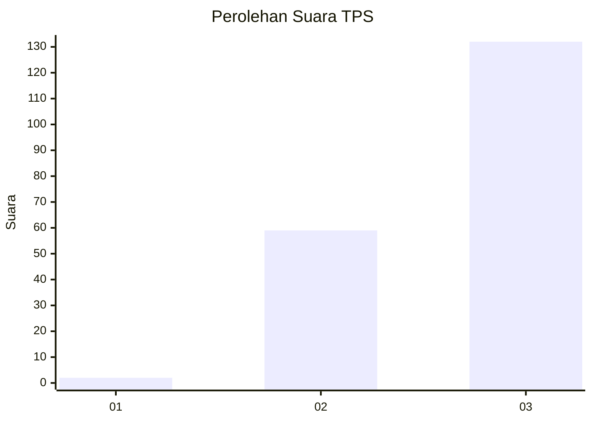
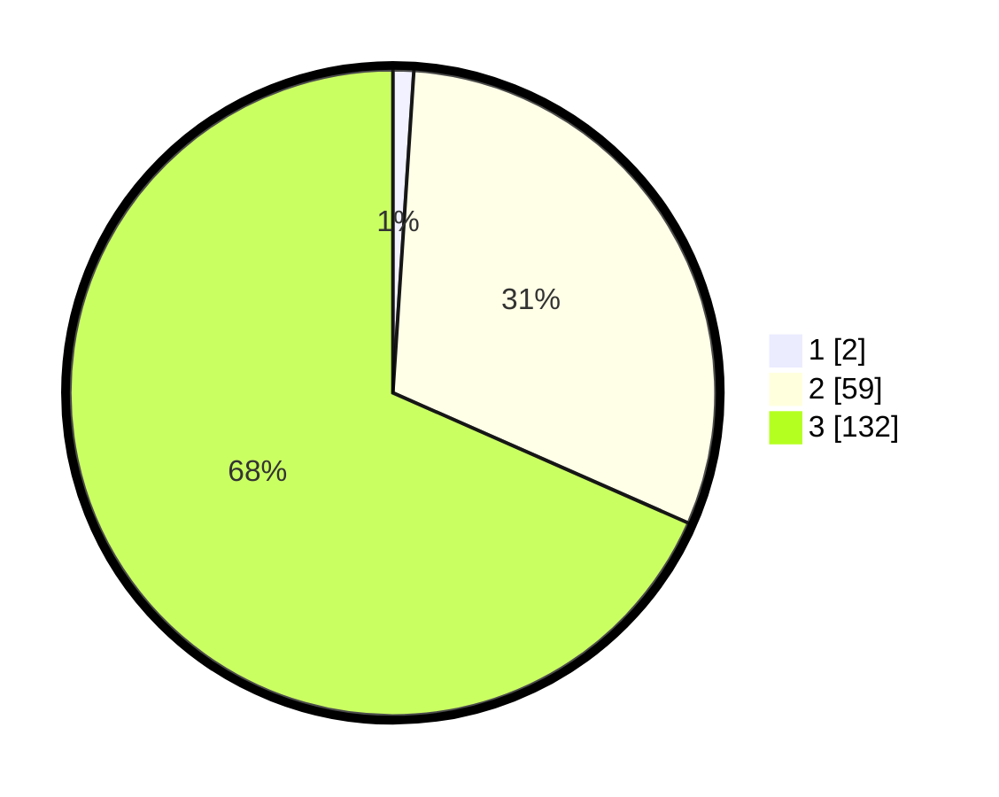

# Hasil

## Grafik

## Tabel

| No. | Nama Paslon    | Suara | Suara (raw) | Persentase |
|:--- |:-------------- | -----:| -----------:| ----------:|
| 1   | ANIES MUHAIMIN | 2     | [2][p-1]    | 1,04       |
| 2   | PRABOWO GIBRAN | 59    | [59][p-2]   | 30,57      |
| 3   | GANJAR MAHFUD  | 132   | [132][p-3]  | 68,39      |

[p-1]: https://github.com/gigit-pemilu/pemilu-2024-33-jawa-tengah/blob/main/pilpres/hitung-suara/sub/33-jawa-tengah/sub/74-kota-semarang/sub/01-semarang-tengah/sub/1004-kranggan/sub/008-tps/sub/paslon-1.txt
[p-2]: https://github.com/gigit-pemilu/pemilu-2024-33-jawa-tengah/blob/main/pilpres/hitung-suara/sub/33-jawa-tengah/sub/74-kota-semarang/sub/01-semarang-tengah/sub/1004-kranggan/sub/008-tps/sub/paslon-2.txt
[p-3]: https://github.com/gigit-pemilu/pemilu-2024-33-jawa-tengah/blob/main/pilpres/hitung-suara/sub/33-jawa-tengah/sub/74-kota-semarang/sub/01-semarang-tengah/sub/1004-kranggan/sub/008-tps/sub/paslon-3.txt

## Foto C Plano

https://sirekap-obj-formc.kpu.go.id/451b/pemilu/ppwp/33/74/01/10/04/3374011004008-20240214-220646--5ba62f98-6b11-41e5-ab31-6c23ebe8ea14.jpg

https://sirekap-obj-formc.kpu.go.id/451b/pemilu/ppwp/33/74/01/10/04/3374011004008-20240214-220740--80ce8341-23e8-4759-b646-6339c6c48fd3.jpg

https://sirekap-obj-formc.kpu.go.id/451b/pemilu/ppwp/33/74/01/10/04/3374011004008-20240214-220916--6a131e29-44dc-43a1-8870-4bd9672c5066.jpg

## Metadata

| Key        | Value               |
| ---------- | ------------------- |
| Time Stamp | 2024-02-15 19:30:26 |

