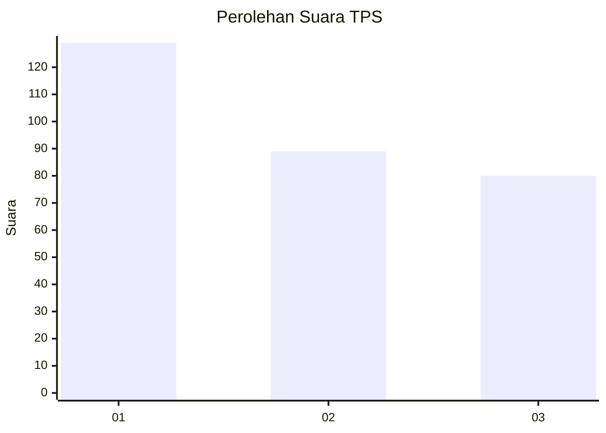
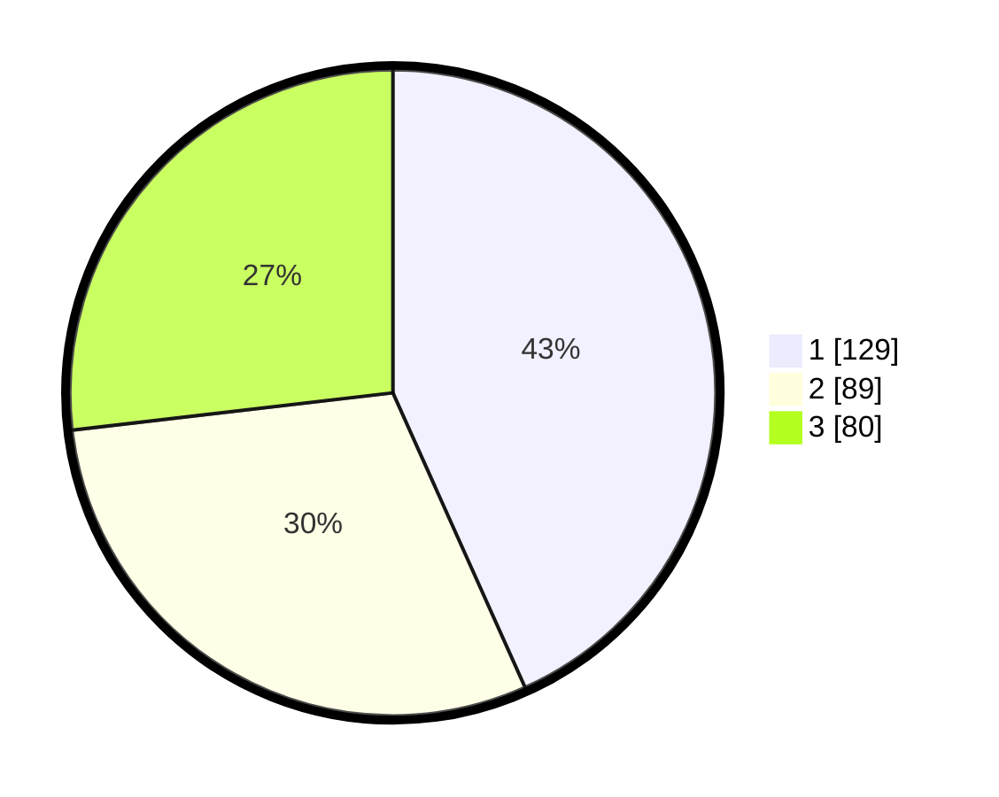

# Hasil

## Grafik

## Tabel

| No. | Nama Paslon    | Suara | Suara (raw) | Persentase |
|:--- |:-------------- | -----:| -----------:| ----------:|
| 1   | ANIES MUHAIMIN | 129   | [129][p-1]  | 43,29      |
| 2   | PRABOWO GIBRAN | 89    | [89][p-2]   | 29,87      |
| 3   | GANJAR MAHFUD  | 80    | [80][p-3]   | 26,85      |

[p-1]: https://github.com/gigit-pemilu/pemilu-2024/blob/main/pilpres/hitung-suara/sub/33-jawa-tengah/sub/74-kota-semarang/sub/01-semarang-tengah/sub/1006-kembangsari/sub/008-tps/sub/paslon-1.txt
[p-2]: https://github.com/gigit-pemilu/pemilu-2024/blob/main/pilpres/hitung-suara/sub/33-jawa-tengah/sub/74-kota-semarang/sub/01-semarang-tengah/sub/1006-kembangsari/sub/008-tps/sub/paslon-2.txt
[p-3]: https://github.com/gigit-pemilu/pemilu-2024/blob/main/pilpres/hitung-suara/sub/33-jawa-tengah/sub/74-kota-semarang/sub/01-semarang-tengah/sub/1006-kembangsari/sub/008-tps/sub/paslon-3.txt

## Foto C Plano

https://sirekap-obj-formc.kpu.go.id/177f/pemilu/ppwp/33/74/01/10/06/3374011006008-20240219-095059--a91bcdf4-f40d-4b8d-a79a-0e76c1347234.jpg

https://sirekap-obj-formc.kpu.go.id/177f/pemilu/ppwp/33/74/01/10/06/3374011006008-20240219-095148--4d2d00db-4218-4102-8115-fcd02b400716.jpg

https://sirekap-obj-formc.kpu.go.id/177f/pemilu/ppwp/33/74/01/10/06/3374011006008-20240219-091741--2728c983-77bf-4e91-802c-a9dba10a7eda.jpg

## Metadata

| Key        | Value               |
| ---------- | ------------------- |
| Time Stamp | 2024-02-24 22:31:28 |

