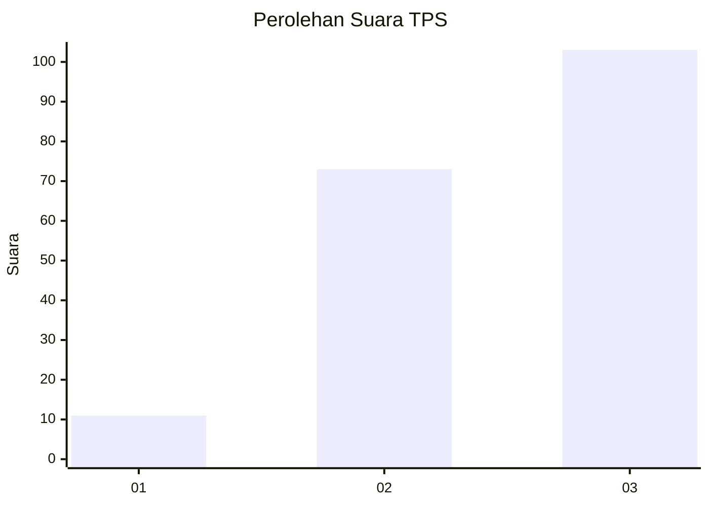
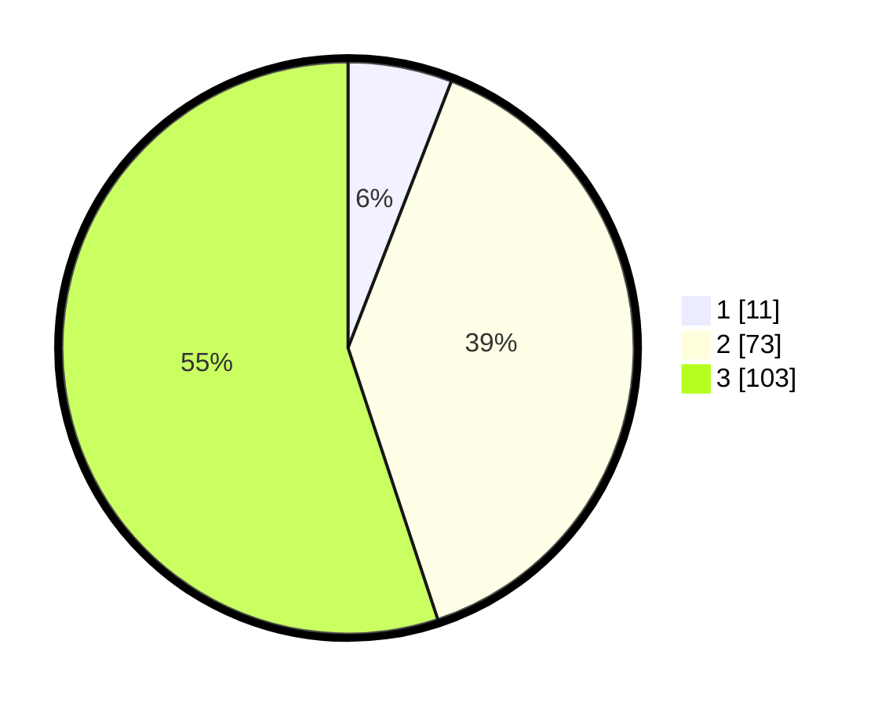

# Hasil

## Grafik

## Tabel

| No. | Nama Paslon    | Suara | Suara (raw) | Persentase |
|:--- |:-------------- | -----:| -----------:| ----------:|
| 1   | ANIES MUHAIMIN | 11    | [11][p-1]   | 5,88       |
| 2   | PRABOWO GIBRAN | 73    | [73][p-2]   | 39,04      |
| 3   | GANJAR MAHFUD  | 103   | [103][p-3]  | 55,08      |

[p-1]: https://github.com/gigit-pemilu/pemilu-2024-33-jawa-tengah/blob/main/pilpres/hitung-suara/sub/33-jawa-tengah/sub/74-kota-semarang/sub/01-semarang-tengah/sub/1007-sekayu/sub/010-tps/sub/paslon-1.txt
[p-2]: https://github.com/gigit-pemilu/pemilu-2024-33-jawa-tengah/blob/main/pilpres/hitung-suara/sub/33-jawa-tengah/sub/74-kota-semarang/sub/01-semarang-tengah/sub/1007-sekayu/sub/010-tps/sub/paslon-2.txt
[p-3]: https://github.com/gigit-pemilu/pemilu-2024-33-jawa-tengah/blob/main/pilpres/hitung-suara/sub/33-jawa-tengah/sub/74-kota-semarang/sub/01-semarang-tengah/sub/1007-sekayu/sub/010-tps/sub/paslon-3.txt

## Foto C Plano

https://sirekap-obj-formc.kpu.go.id/2c2c/pemilu/ppwp/33/74/01/10/07/3374011007010-20240215-020915--1f4b6a3b-bf4b-4597-ba66-c8b48f90f706.jpg

https://sirekap-obj-formc.kpu.go.id/2c2c/pemilu/ppwp/33/74/01/10/07/3374011007010-20240215-021118--fb94dacc-d4fa-4fea-815d-4dd2ac64b2fb.jpg

https://sirekap-obj-formc.kpu.go.id/2c2c/pemilu/ppwp/33/74/01/10/07/3374011007010-20240215-021236--c6789eaf-d76c-4833-9b1e-67deff3418ab.jpg

## Metadata

| Key        | Value               |
| ---------- | ------------------- |
| Time Stamp | 2024-02-15 21:01:18 |

