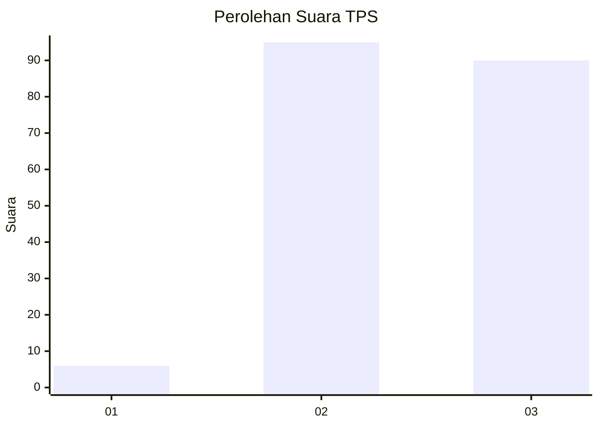
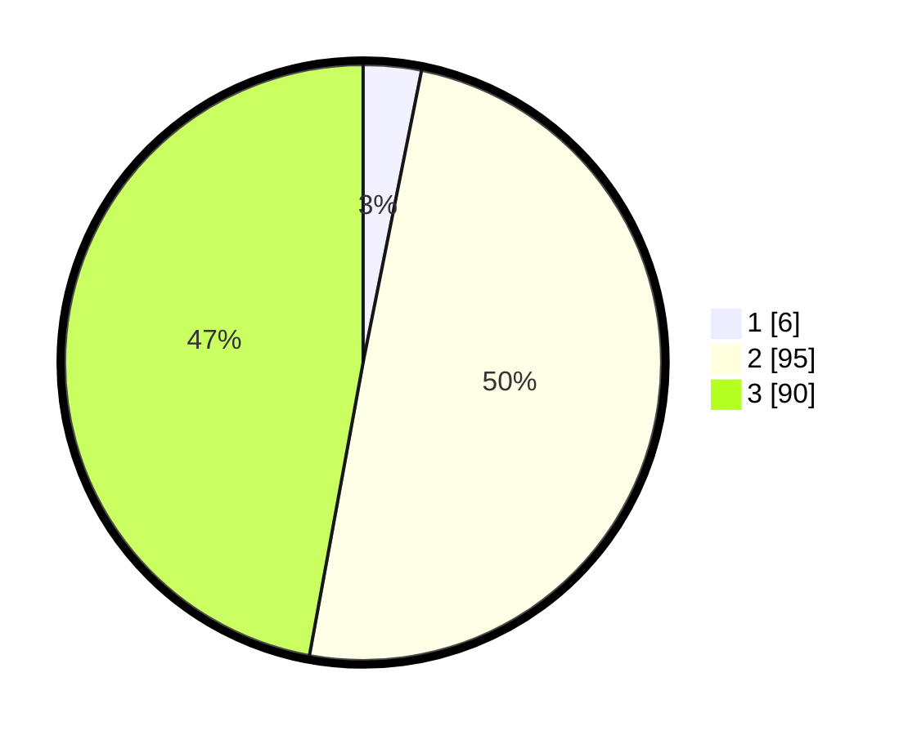

# Hasil

## Grafik

## Tabel

| No. | Nama Paslon    | Suara | Suara (raw) | Persentase |
|:--- |:-------------- | -----:| -----------:| ----------:|
| 1   | ANIES MUHAIMIN | 6     | [6][p-1]    | 3,14       |
| 2   | PRABOWO GIBRAN | 95    | [95][p-2]   | 49,74      |
| 3   | GANJAR MAHFUD  | 90    | [90][p-3]   | 47,12      |

[p-1]: https://github.com/gigit-pemilu/pemilu-2024/blob/main/pilpres/hitung-suara/sub/33-jawa-tengah/sub/74-kota-semarang/sub/02-semarang-utara/sub/1001-bandarharjo/sub/005-tps/sub/paslon-1.txt
[p-2]: https://github.com/gigit-pemilu/pemilu-2024/blob/main/pilpres/hitung-suara/sub/33-jawa-tengah/sub/74-kota-semarang/sub/02-semarang-utara/sub/1001-bandarharjo/sub/005-tps/sub/paslon-2.txt
[p-3]: https://github.com/gigit-pemilu/pemilu-2024/blob/main/pilpres/hitung-suara/sub/33-jawa-tengah/sub/74-kota-semarang/sub/02-semarang-utara/sub/1001-bandarharjo/sub/005-tps/sub/paslon-3.txt

## Foto C Plano

https://sirekap-obj-formc.kpu.go.id/7221/pemilu/ppwp/33/74/02/10/01/3374021001005-20240215-113307--8d77a0f3-f0fa-4094-bd52-173211f89d2b.jpg

https://sirekap-obj-formc.kpu.go.id/7221/pemilu/ppwp/33/74/02/10/01/3374021001005-20240215-113314--09d25b60-3631-4f24-b692-cf0bf574bf5f.jpg

https://sirekap-obj-formc.kpu.go.id/7221/pemilu/ppwp/33/74/02/10/01/3374021001005-20240215-113320--ab476dcf-cd8a-4c45-b92b-6624c40cc30f.jpg

## Metadata

| Key        | Value               |
| ---------- | ------------------- |
| Time Stamp | 2024-02-15 20:00:44 |

