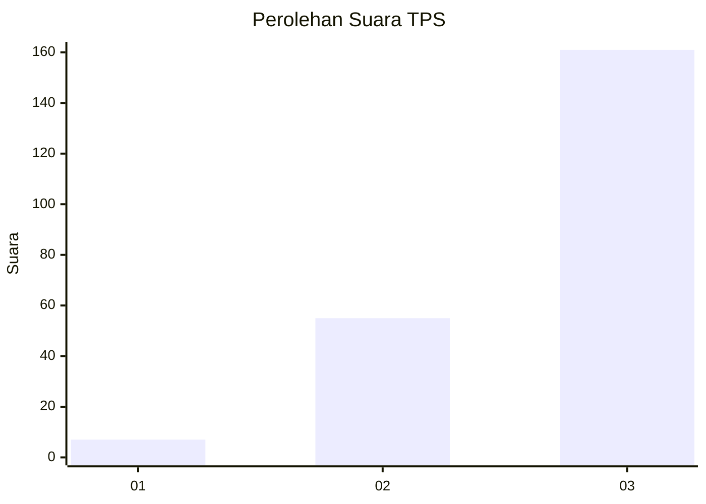
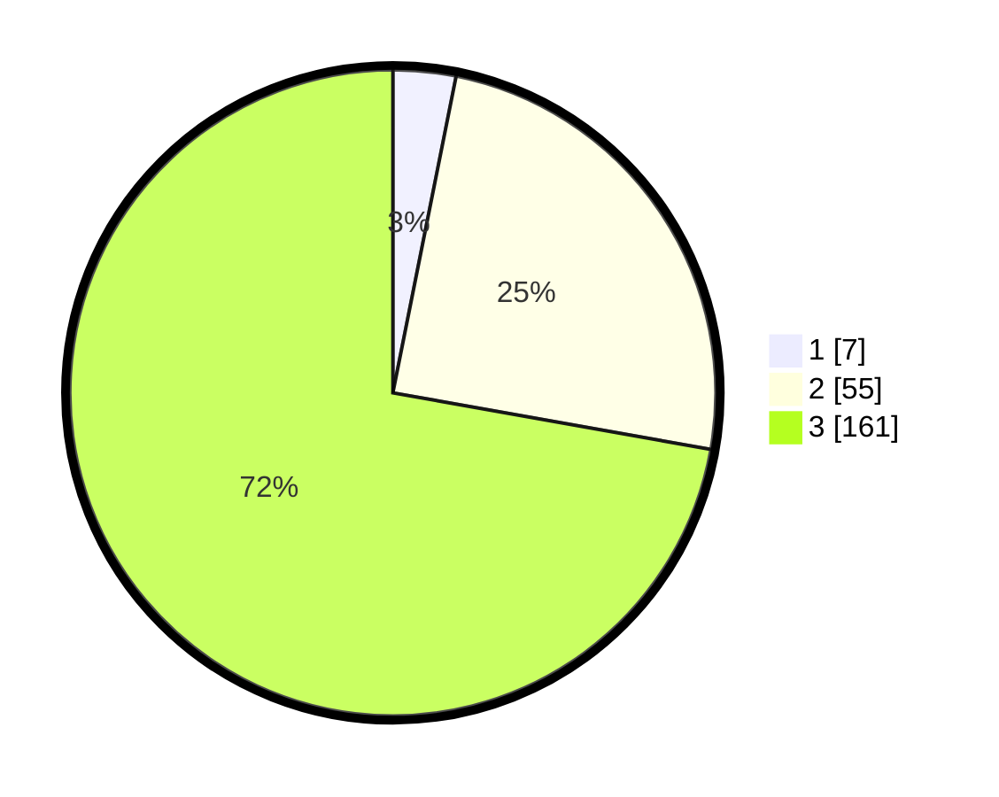

# Hasil

## Grafik

## Tabel

| No. | Nama Paslon    | Suara | Suara (raw) | Persentase |
|:--- |:-------------- | -----:| -----------:| ----------:|
| 1   | ANIES MUHAIMIN | 7     | [7][p-1]    | 3,14       |
| 2   | PRABOWO GIBRAN | 55    | [55][p-2]   | 24,66      |
| 3   | GANJAR MAHFUD  | 161   | [161][p-3]  | 72,20      |

[p-1]: https://github.com/gigit-pemilu/pemilu-2024/blob/main/pilpres/hitung-suara/sub/33-jawa-tengah/sub/74-kota-semarang/sub/02-semarang-utara/sub/1006-panggung-lor/sub/033-tps/sub/paslon-1.txt
[p-2]: https://github.com/gigit-pemilu/pemilu-2024/blob/main/pilpres/hitung-suara/sub/33-jawa-tengah/sub/74-kota-semarang/sub/02-semarang-utara/sub/1006-panggung-lor/sub/033-tps/sub/paslon-2.txt
[p-3]: https://github.com/gigit-pemilu/pemilu-2024/blob/main/pilpres/hitung-suara/sub/33-jawa-tengah/sub/74-kota-semarang/sub/02-semarang-utara/sub/1006-panggung-lor/sub/033-tps/sub/paslon-3.txt

## Foto C Plano

https://sirekap-obj-formc.kpu.go.id/83ee/pemilu/ppwp/33/74/02/10/06/3374021006033-20240214-193621--a191ea8d-31d3-440f-a6f0-627cac0b2b2d.jpg

https://sirekap-obj-formc.kpu.go.id/83ee/pemilu/ppwp/33/74/02/10/06/3374021006033-20240214-193729--ea472574-14e0-46d1-af87-24056745c740.jpg

https://sirekap-obj-formc.kpu.go.id/83ee/pemilu/ppwp/33/74/02/10/06/3374021006033-20240214-193923--dbd36008-8444-40c8-8bf8-47d5e599d37a.jpg

## Metadata

| Key        | Value               |
| ---------- | ------------------- |
| Time Stamp | 2024-02-15 18:30:25 |

