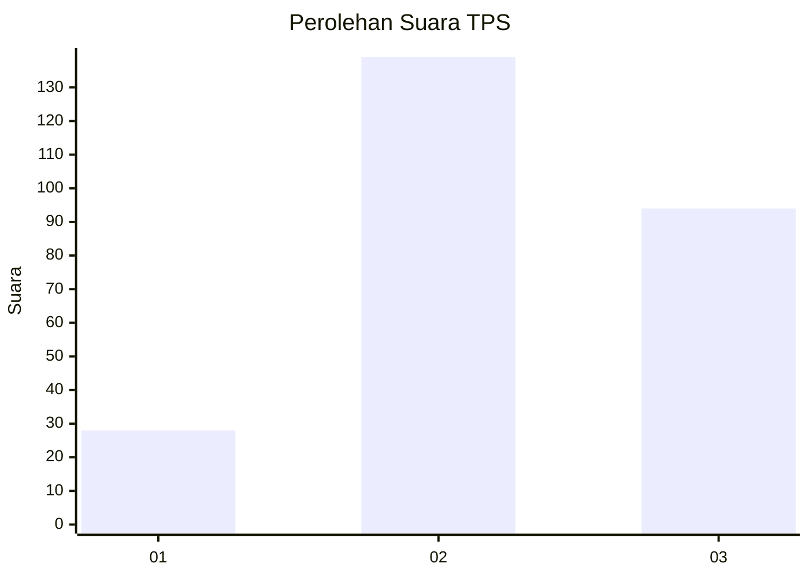
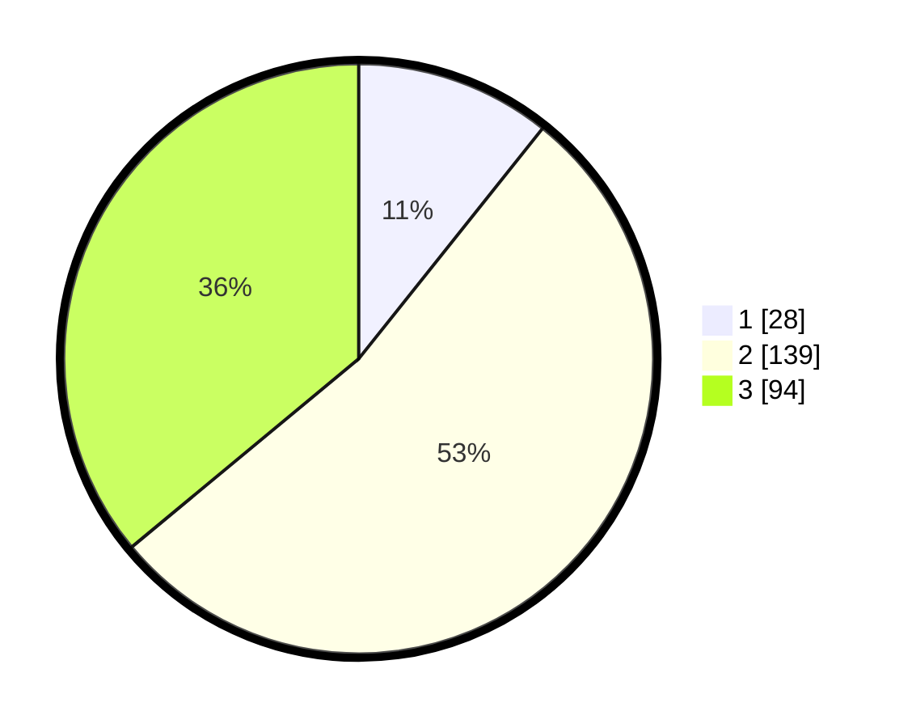

# Hasil

## Grafik

## Tabel

| No. | Nama Paslon    | Suara | Suara (raw) | Persentase |
|:--- |:-------------- | -----:| -----------:| ----------:|
| 1   | ANIES MUHAIMIN | 28    | [28][p-1]   | 10,73      |
| 2   | PRABOWO GIBRAN | 139   | [139][p-2]  | 53,26      |
| 3   | GANJAR MAHFUD  | 94    | [94][p-3]   | 36,02      |

[p-1]: https://github.com/gigit-pemilu/pemilu-2024-33-jawa-tengah/blob/main/pilpres/hitung-suara/sub/33-jawa-tengah/sub/74-kota-semarang/sub/02-semarang-utara/sub/1008-tanjung-mas/sub/027-tps/sub/paslon-1.txt
[p-2]: https://github.com/gigit-pemilu/pemilu-2024-33-jawa-tengah/blob/main/pilpres/hitung-suara/sub/33-jawa-tengah/sub/74-kota-semarang/sub/02-semarang-utara/sub/1008-tanjung-mas/sub/027-tps/sub/paslon-2.txt
[p-3]: https://github.com/gigit-pemilu/pemilu-2024-33-jawa-tengah/blob/main/pilpres/hitung-suara/sub/33-jawa-tengah/sub/74-kota-semarang/sub/02-semarang-utara/sub/1008-tanjung-mas/sub/027-tps/sub/paslon-3.txt

## Foto C Plano

https://sirekap-obj-formc.kpu.go.id/a585/pemilu/ppwp/33/74/02/10/08/3374021008027-20240214-223036--92bc1c50-cea4-4de4-aa05-836b921b35ca.jpg

https://sirekap-obj-formc.kpu.go.id/a585/pemilu/ppwp/33/74/02/10/08/3374021008027-20240214-223419--77953667-8f0d-4002-903f-7a091f13fca0.jpg

https://sirekap-obj-formc.kpu.go.id/a585/pemilu/ppwp/33/74/02/10/08/3374021008027-20240214-223650--06fecfbd-9ebe-4566-a802-a1fb2035b264.jpg

## Metadata

| Key        | Value               |
| ---------- | ------------------- |
| Time Stamp | 2024-02-15 22:00:27 |

