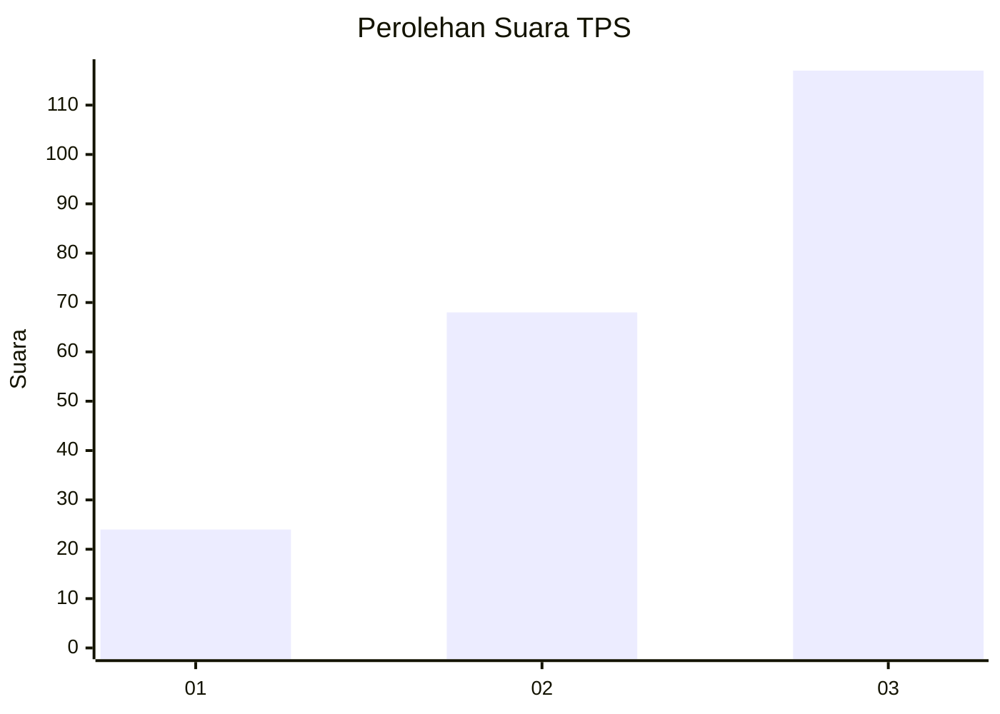
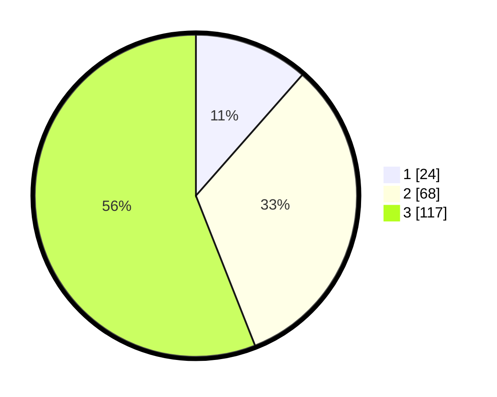

# Hasil

## Grafik

## Tabel

| No. | Nama Paslon    | Suara | Suara (raw) | Persentase |
|:--- |:-------------- | -----:| -----------:| ----------:|
| 1   | ANIES MUHAIMIN | 24    | [24][p-1]   | 11,48      |
| 2   | PRABOWO GIBRAN | 68    | [68][p-2]   | 32,54      |
| 3   | GANJAR MAHFUD  | 117   | [117][p-3]  | 55,98      |

[p-1]: https://github.com/gigit-pemilu/pemilu-2024-33-jawa-tengah/blob/main/pilpres/hitung-suara/sub/33-jawa-tengah/sub/74-kota-semarang/sub/03-semarang-timur/sub/1001-kemijen/sub/009-tps/sub/paslon-1.txt
[p-2]: https://github.com/gigit-pemilu/pemilu-2024-33-jawa-tengah/blob/main/pilpres/hitung-suara/sub/33-jawa-tengah/sub/74-kota-semarang/sub/03-semarang-timur/sub/1001-kemijen/sub/009-tps/sub/paslon-2.txt
[p-3]: https://github.com/gigit-pemilu/pemilu-2024-33-jawa-tengah/blob/main/pilpres/hitung-suara/sub/33-jawa-tengah/sub/74-kota-semarang/sub/03-semarang-timur/sub/1001-kemijen/sub/009-tps/sub/paslon-3.txt

## Foto C Plano

https://sirekap-obj-formc.kpu.go.id/1a46/pemilu/ppwp/33/74/03/10/01/3374031001009-20240214-233706--2bfe4f7f-fa24-4411-80fd-c18b1ea3239e.jpg

https://sirekap-obj-formc.kpu.go.id/1a46/pemilu/ppwp/33/74/03/10/01/3374031001009-20240214-233719--b49787a0-fc0d-4223-83a4-773f27af8573.jpg

https://sirekap-obj-formc.kpu.go.id/1a46/pemilu/ppwp/33/74/03/10/01/3374031001009-20240214-233728--5c6b9aeb-5d5e-448a-b9c6-8641df6be39c.jpg

## Metadata

| Key        | Value               |
| ---------- | ------------------- |
| Time Stamp | 2024-02-15 22:30:27 |

