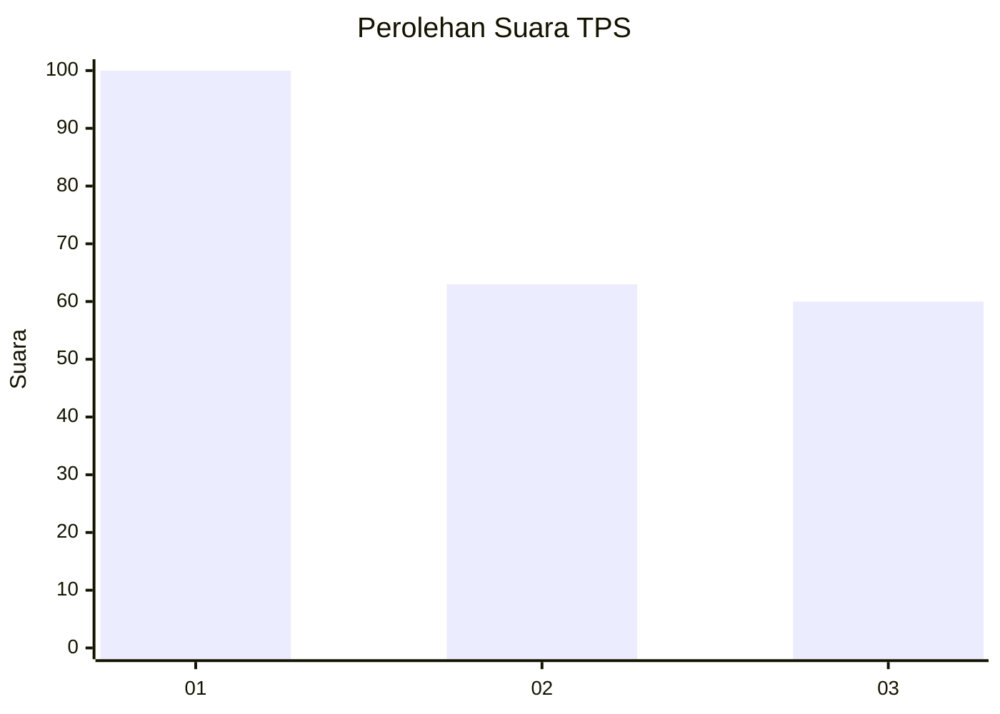
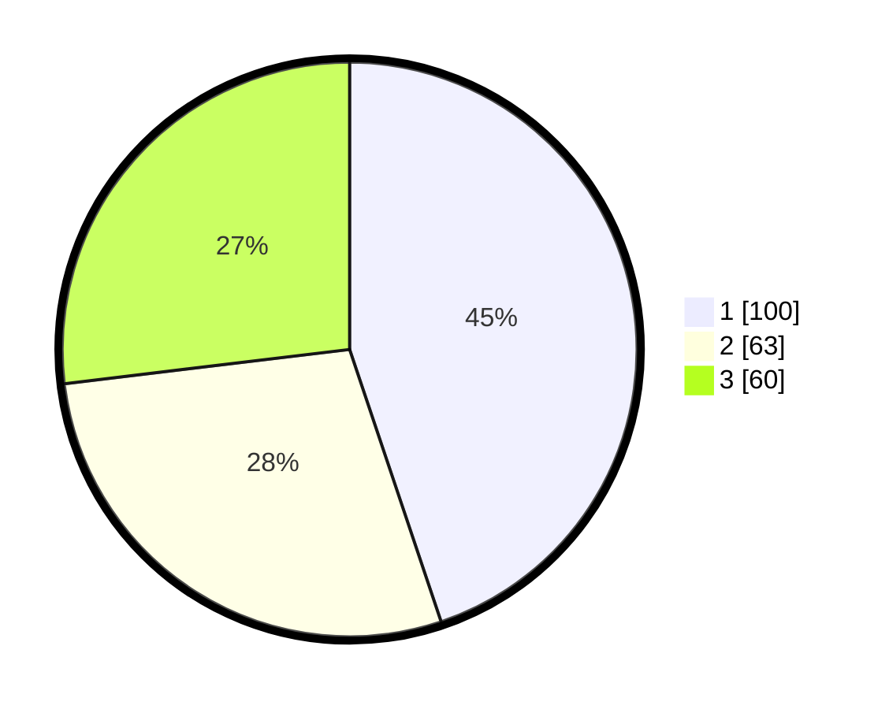

# Hasil

## Grafik

## Tabel

| No. | Nama Paslon    | Suara | Suara (raw) | Persentase |
|:--- |:-------------- | -----:| -----------:| ----------:|
| 1   | ANIES MUHAIMIN | 100   | [100][p-1]  | 44,84      |
| 2   | PRABOWO GIBRAN | 63    | [63][p-2]   | 28,25      |
| 3   | GANJAR MAHFUD  | 60    | [60][p-3]   | 26,91      |

[p-1]: https://github.com/gigit-pemilu/pemilu-2024-33-jawa-tengah/blob/main/pilpres/hitung-suara/sub/33-jawa-tengah/sub/74-kota-semarang/sub/03-semarang-timur/sub/1004-kebonagung/sub/005-tps/sub/paslon-1.txt
[p-2]: https://github.com/gigit-pemilu/pemilu-2024-33-jawa-tengah/blob/main/pilpres/hitung-suara/sub/33-jawa-tengah/sub/74-kota-semarang/sub/03-semarang-timur/sub/1004-kebonagung/sub/005-tps/sub/paslon-2.txt
[p-3]: https://github.com/gigit-pemilu/pemilu-2024-33-jawa-tengah/blob/main/pilpres/hitung-suara/sub/33-jawa-tengah/sub/74-kota-semarang/sub/03-semarang-timur/sub/1004-kebonagung/sub/005-tps/sub/paslon-3.txt

## Foto C Plano

https://sirekap-obj-formc.kpu.go.id/f17f/pemilu/ppwp/33/74/03/10/04/3374031004005-20240214-202324--c40726d1-9a3b-4f3e-a459-84f5c5fa83cd.jpg

https://sirekap-obj-formc.kpu.go.id/f17f/pemilu/ppwp/33/74/03/10/04/3374031004005-20240214-202650--64e22883-e23c-4130-afe2-ba25ae588120.jpg

https://sirekap-obj-formc.kpu.go.id/f17f/pemilu/ppwp/33/74/03/10/04/3374031004005-20240214-202938--e10e9ebd-d5e0-4874-8056-fd8641c24f19.jpg

## Metadata

| Key        | Value               |
| ---------- | ------------------- |
| Time Stamp | 2024-02-15 21:30:27 |

