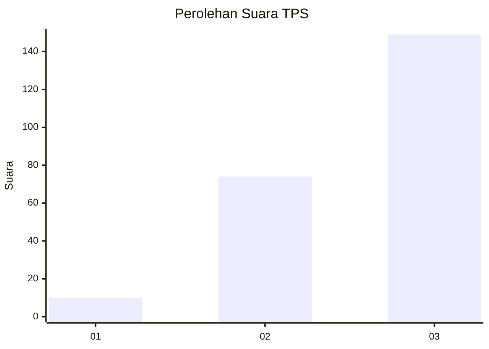
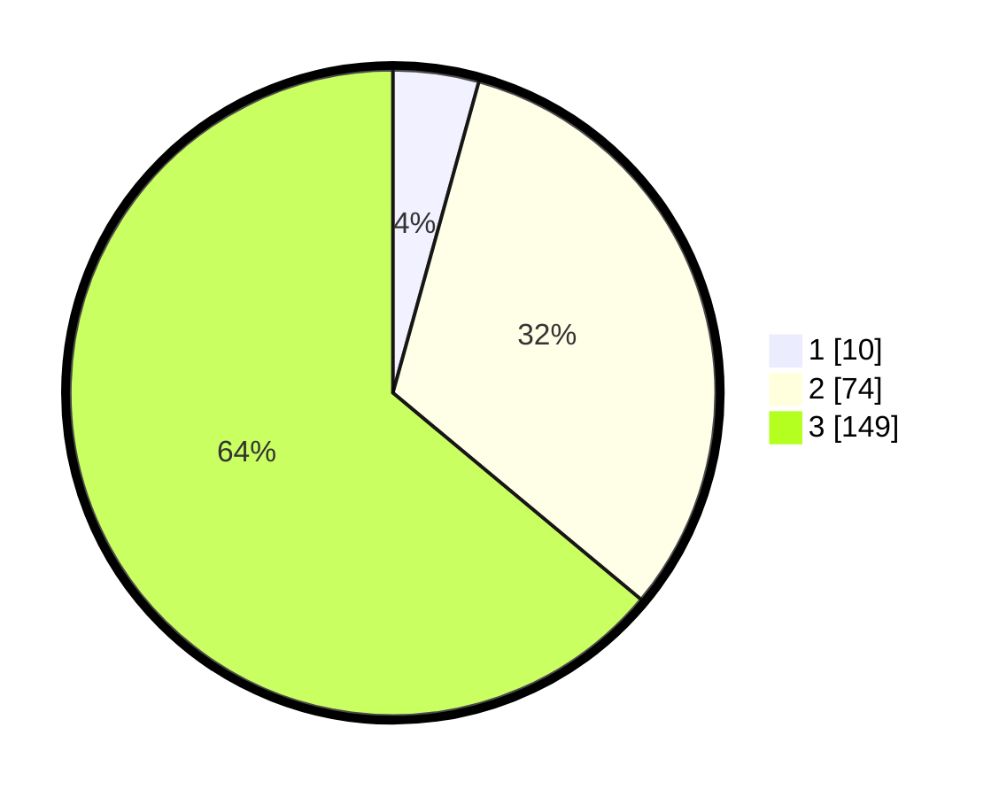

# Hasil

## Grafik

## Tabel

| No. | Nama Paslon    | Suara | Suara (raw) | Persentase |
|:--- |:-------------- | -----:| -----------:| ----------:|
| 1   | ANIES MUHAIMIN | 10    | [10][p-1]   | 4,29       |
| 2   | PRABOWO GIBRAN | 74    | [74][p-2]   | 31,76      |
| 3   | GANJAR MAHFUD  | 149   | [149][p-3]  | 63,95      |

[p-1]: https://github.com/gigit-pemilu/pemilu-2024/blob/main/pilpres/hitung-suara/sub/33-jawa-tengah/sub/74-kota-semarang/sub/03-semarang-timur/sub/1007-sarirejo/sub/010-tps/sub/paslon-1.txt
[p-2]: https://github.com/gigit-pemilu/pemilu-2024/blob/main/pilpres/hitung-suara/sub/33-jawa-tengah/sub/74-kota-semarang/sub/03-semarang-timur/sub/1007-sarirejo/sub/010-tps/sub/paslon-2.txt
[p-3]: https://github.com/gigit-pemilu/pemilu-2024/blob/main/pilpres/hitung-suara/sub/33-jawa-tengah/sub/74-kota-semarang/sub/03-semarang-timur/sub/1007-sarirejo/sub/010-tps/sub/paslon-3.txt

## Foto C Plano

https://sirekap-obj-formc.kpu.go.id/fb0b/pemilu/ppwp/33/74/03/10/07/3374031007010-20240214-193147--00fe7a33-b743-4ad6-8d29-78c646c2afa9.jpg

https://sirekap-obj-formc.kpu.go.id/fb0b/pemilu/ppwp/33/74/03/10/07/3374031007010-20240214-193143--7eba2832-78a0-4802-a540-ce0d5a2fb223.jpg

https://sirekap-obj-formc.kpu.go.id/fb0b/pemilu/ppwp/33/74/03/10/07/3374031007010-20240214-193137--8a238466-ea0e-42a7-8206-49efdc14b812.jpg

## Metadata

| Key        | Value               |
| ---------- | ------------------- |
| Time Stamp | 2024-02-15 21:30:27 |

