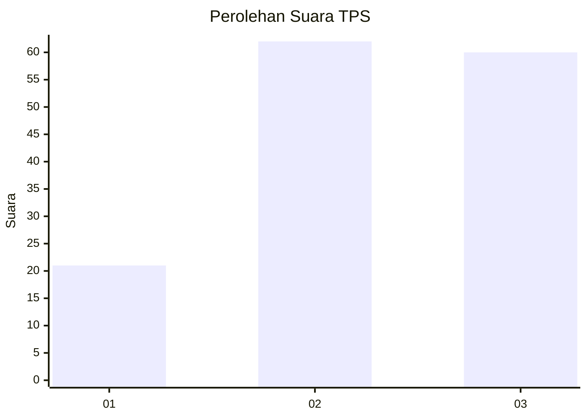
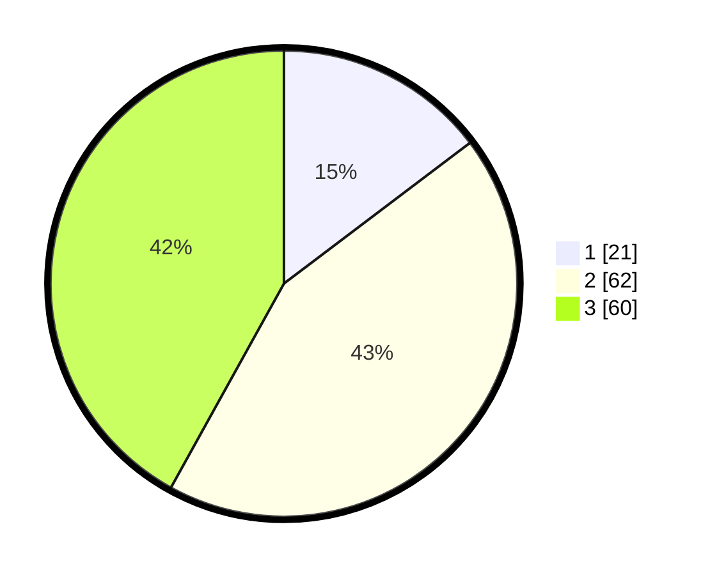

# Hasil

## Grafik

## Tabel

| No. | Nama Paslon    | Suara | Suara (raw) | Persentase |
|:--- |:-------------- | -----:| -----------:| ----------:|
| 1   | ANIES MUHAIMIN | 21    | [21][p-1]   | 14,69      |
| 2   | PRABOWO GIBRAN | 62    | [62][p-2]   | 43,36      |
| 3   | GANJAR MAHFUD  | 60    | [60][p-3]   | 41,96      |

[p-1]: https://github.com/gigit-pemilu/pemilu-2024-33-jawa-tengah/blob/main/pilpres/hitung-suara/sub/33-jawa-tengah/sub/74-kota-semarang/sub/04-gayamsari/sub/1001-tambakrejo/sub/001-tps/sub/paslon-1.txt
[p-2]: https://github.com/gigit-pemilu/pemilu-2024-33-jawa-tengah/blob/main/pilpres/hitung-suara/sub/33-jawa-tengah/sub/74-kota-semarang/sub/04-gayamsari/sub/1001-tambakrejo/sub/001-tps/sub/paslon-2.txt
[p-3]: https://github.com/gigit-pemilu/pemilu-2024-33-jawa-tengah/blob/main/pilpres/hitung-suara/sub/33-jawa-tengah/sub/74-kota-semarang/sub/04-gayamsari/sub/1001-tambakrejo/sub/001-tps/sub/paslon-3.txt

## Foto C Plano

https://sirekap-obj-formc.kpu.go.id/f06e/pemilu/ppwp/33/74/04/10/01/3374041001001-20240214-200602--2f8f3978-c111-4d56-8669-cc1673c5f8c6.jpg

https://sirekap-obj-formc.kpu.go.id/f06e/pemilu/ppwp/33/74/04/10/01/3374041001001-20240214-185237--73d6eb1f-eb94-4133-9f1c-57d815410a36.jpg

https://sirekap-obj-formc.kpu.go.id/f06e/pemilu/ppwp/33/74/04/10/01/3374041001001-20240214-185254--6b582577-ad53-4f1e-9c71-3eefe02304c9.jpg

## Metadata

| Key        | Value               |
| ---------- | ------------------- |
| Time Stamp | 2024-02-16 06:00:27 |

