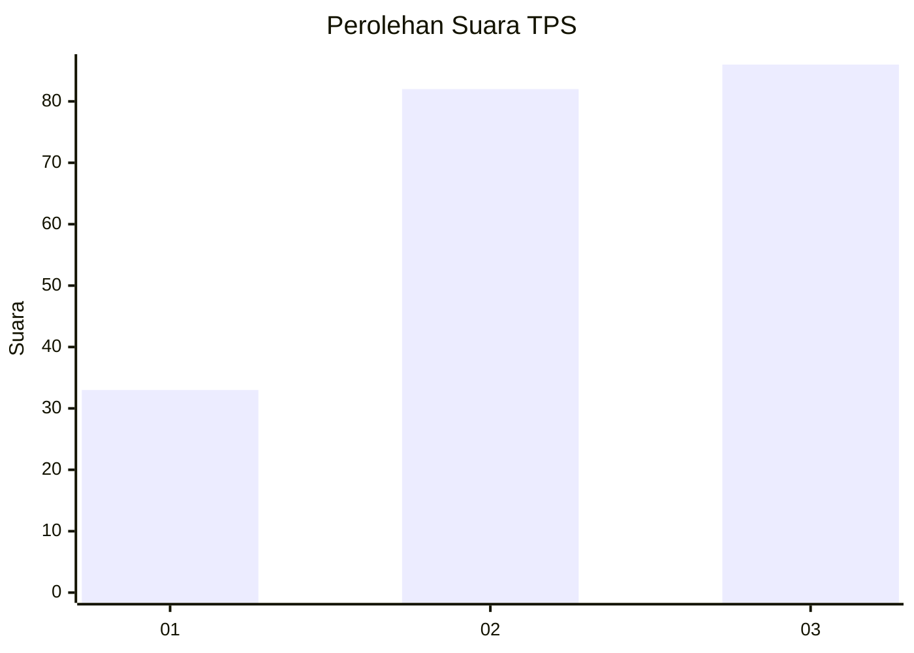
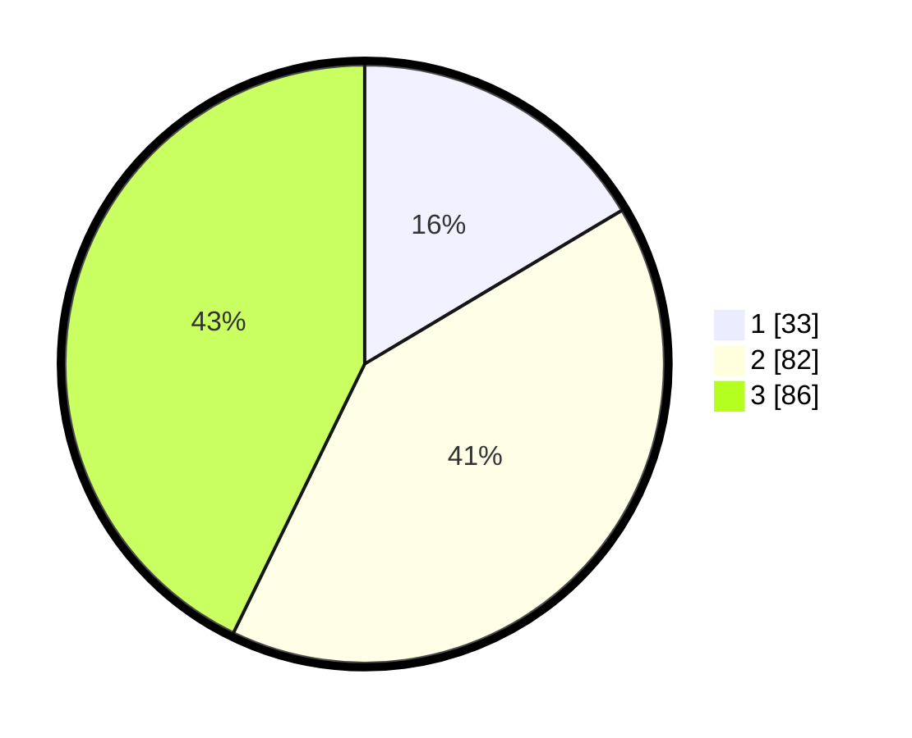

# Hasil

## Grafik

## Tabel

| No. | Nama Paslon    | Suara | Suara (raw) | Persentase |
|:--- |:-------------- | -----:| -----------:| ----------:|
| 1   | ANIES MUHAIMIN | 33    | [33][p-1]   | 16,42      |
| 2   | PRABOWO GIBRAN | 82    | [82][p-2]   | 40,80      |
| 3   | GANJAR MAHFUD  | 86    | [86][p-3]   | 42,79      |

[p-1]: https://github.com/gigit-pemilu/pemilu-2024/blob/main/pilpres/hitung-suara/sub/33-jawa-tengah/sub/74-kota-semarang/sub/04-gayamsari/sub/1006-pandean-lamper/sub/028-tps/sub/paslon-1.txt
[p-2]: https://github.com/gigit-pemilu/pemilu-2024/blob/main/pilpres/hitung-suara/sub/33-jawa-tengah/sub/74-kota-semarang/sub/04-gayamsari/sub/1006-pandean-lamper/sub/028-tps/sub/paslon-2.txt
[p-3]: https://github.com/gigit-pemilu/pemilu-2024/blob/main/pilpres/hitung-suara/sub/33-jawa-tengah/sub/74-kota-semarang/sub/04-gayamsari/sub/1006-pandean-lamper/sub/028-tps/sub/paslon-3.txt

## Foto C Plano

https://sirekap-obj-formc.kpu.go.id/31f6/pemilu/ppwp/33/74/04/10/06/3374041006028-20240215-205914--42929359-d8f5-465c-bfe4-34dddf4165cf.jpg

https://sirekap-obj-formc.kpu.go.id/31f6/pemilu/ppwp/33/74/04/10/06/3374041006028-20240214-194924--6202174c-3151-4402-a7f8-509bb03a9e6e.jpg

https://sirekap-obj-formc.kpu.go.id/31f6/pemilu/ppwp/33/74/04/10/06/3374041006028-20240214-194932--ecafec07-7a91-4a41-95ca-3aef00845d1b.jpg

## Metadata

| Key        | Value               |
| ---------- | ------------------- |
| Time Stamp | 2024-02-15 21:01:18 |

