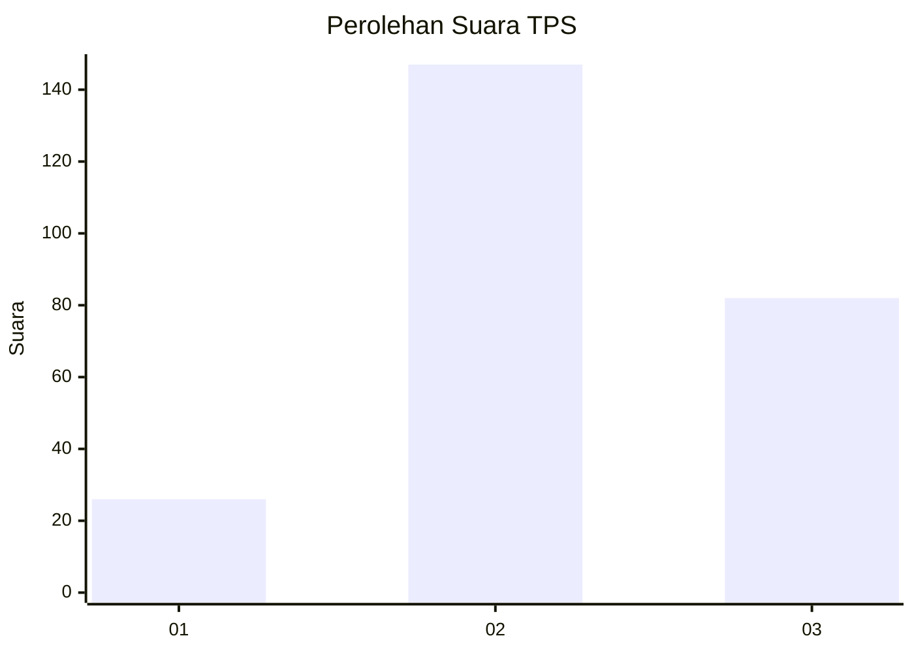
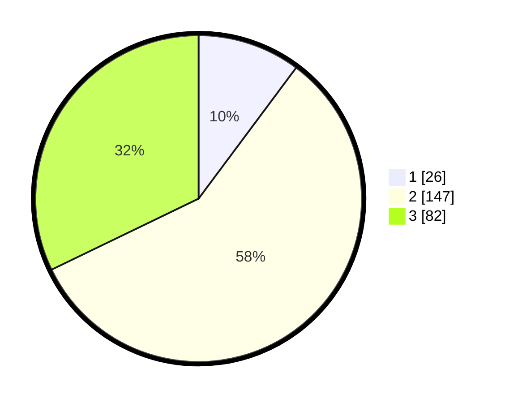

# Hasil

## Grafik

## Tabel

| No. | Nama Paslon    | Suara | Suara (raw) | Persentase |
|:--- |:-------------- | -----:| -----------:| ----------:|
| 1   | ANIES MUHAIMIN | 26    | [26][p-1]   | 10,20      |
| 2   | PRABOWO GIBRAN | 147   | [147][p-2]  | 57,65      |
| 3   | GANJAR MAHFUD  | 82    | [82][p-3]   | 32,16      |

[p-1]: https://github.com/gigit-pemilu/pemilu-2024-33-jawa-tengah/blob/main/pilpres/hitung-suara/sub/33-jawa-tengah/sub/74-kota-semarang/sub/05-genuk/sub/1001-sembungharjo/sub/004-tps/sub/paslon-1.txt
[p-2]: https://github.com/gigit-pemilu/pemilu-2024-33-jawa-tengah/blob/main/pilpres/hitung-suara/sub/33-jawa-tengah/sub/74-kota-semarang/sub/05-genuk/sub/1001-sembungharjo/sub/004-tps/sub/paslon-2.txt
[p-3]: https://github.com/gigit-pemilu/pemilu-2024-33-jawa-tengah/blob/main/pilpres/hitung-suara/sub/33-jawa-tengah/sub/74-kota-semarang/sub/05-genuk/sub/1001-sembungharjo/sub/004-tps/sub/paslon-3.txt

## Foto C Plano

https://sirekap-obj-formc.kpu.go.id/80c6/pemilu/ppwp/33/74/05/10/01/3374051001004-20240214-235104--0e4705c7-1e91-4ea6-9fe9-76a3ed2c52a6.jpg

https://sirekap-obj-formc.kpu.go.id/80c6/pemilu/ppwp/33/74/05/10/01/3374051001004-20240214-235220--2ced8907-8219-4ed5-b09c-852570b183c7.jpg

https://sirekap-obj-formc.kpu.go.id/80c6/pemilu/ppwp/33/74/05/10/01/3374051001004-20240214-235333--b3166931-41bf-4839-af6c-8cb94c70935a.jpg

## Metadata

| Key        | Value               |
| ---------- | ------------------- |
| Time Stamp | 2024-02-16 09:00:28 |

