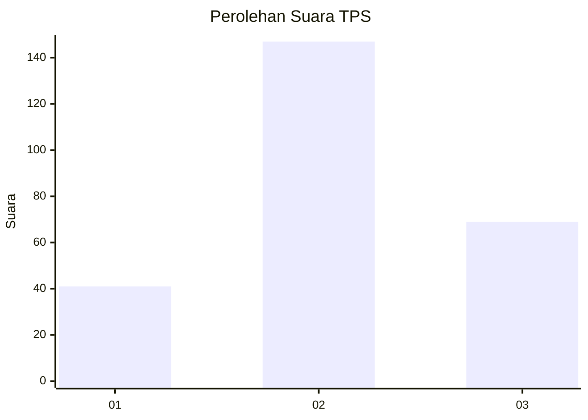
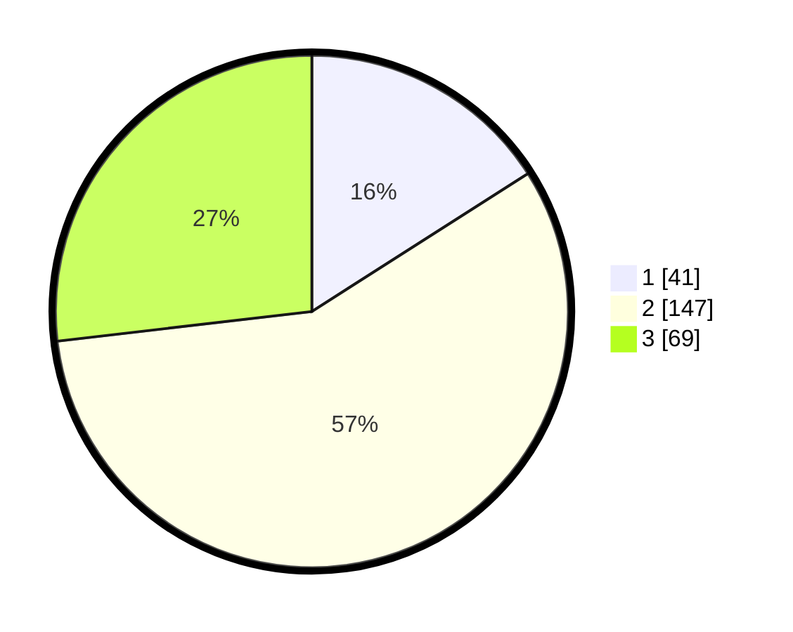

# Hasil

## Grafik

## Tabel

| No. | Nama Paslon    | Suara | Suara (raw) | Persentase |
|:--- |:-------------- | -----:| -----------:| ----------:|
| 1   | ANIES MUHAIMIN | 41    | [41][p-1]   | 15,95      |
| 2   | PRABOWO GIBRAN | 147   | [147][p-2]  | 57,20      |
| 3   | GANJAR MAHFUD  | 69    | [69][p-3]   | 26,85      |

[p-1]: https://github.com/gigit-pemilu/pemilu-2024/blob/main/pilpres/hitung-suara/sub/33-jawa-tengah/sub/74-kota-semarang/sub/05-genuk/sub/1002-kudu/sub/005-tps/sub/paslon-1.txt
[p-2]: https://github.com/gigit-pemilu/pemilu-2024/blob/main/pilpres/hitung-suara/sub/33-jawa-tengah/sub/74-kota-semarang/sub/05-genuk/sub/1002-kudu/sub/005-tps/sub/paslon-2.txt
[p-3]: https://github.com/gigit-pemilu/pemilu-2024/blob/main/pilpres/hitung-suara/sub/33-jawa-tengah/sub/74-kota-semarang/sub/05-genuk/sub/1002-kudu/sub/005-tps/sub/paslon-3.txt

## Foto C Plano

https://sirekap-obj-formc.kpu.go.id/7f34/pemilu/ppwp/33/74/05/10/02/3374051002005-20240215-194407--1320ba75-ca76-4e9b-ac1d-0381e7d8dae2.jpg

https://sirekap-obj-formc.kpu.go.id/7f34/pemilu/ppwp/33/74/05/10/02/3374051002005-20240215-194523--87bac9cb-6ad0-4cc1-80a7-a920ab8808d3.jpg

https://sirekap-obj-formc.kpu.go.id/7f34/pemilu/ppwp/33/74/05/10/02/3374051002005-20240215-194630--0a6fa807-513c-4759-b330-f440d65c0015.jpg

## Metadata

| Key        | Value               |
| ---------- | ------------------- |
| Time Stamp | 2024-02-16 09:00:28 |

