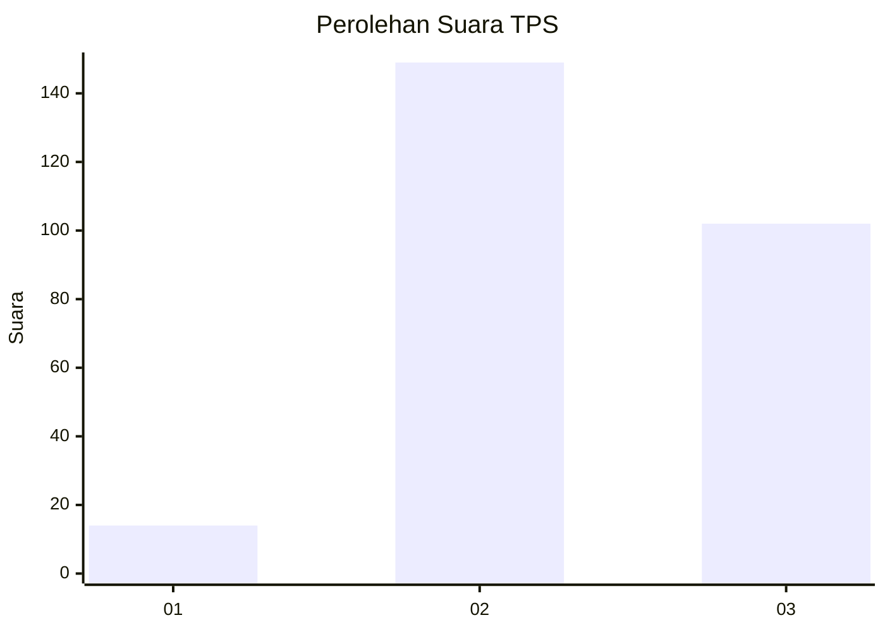
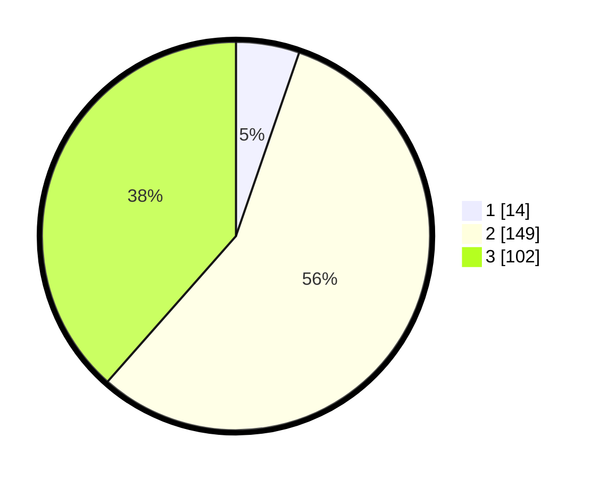

# Hasil

## Grafik

## Tabel

| No. | Nama Paslon    | Suara | Suara (raw) | Persentase |
|:--- |:-------------- | -----:| -----------:| ----------:|
| 1   | ANIES MUHAIMIN | 14    | [14][p-1]   | 5,28       |
| 2   | PRABOWO GIBRAN | 149   | [149][p-2]  | 56,23      |
| 3   | GANJAR MAHFUD  | 102   | [102][p-3]  | 38,49      |

[p-1]: https://github.com/gigit-pemilu/pemilu-2024/blob/main/pilpres/hitung-suara/sub/33-jawa-tengah/sub/74-kota-semarang/sub/05-genuk/sub/1002-kudu/sub/019-tps/sub/paslon-1.txt
[p-2]: https://github.com/gigit-pemilu/pemilu-2024/blob/main/pilpres/hitung-suara/sub/33-jawa-tengah/sub/74-kota-semarang/sub/05-genuk/sub/1002-kudu/sub/019-tps/sub/paslon-2.txt
[p-3]: https://github.com/gigit-pemilu/pemilu-2024/blob/main/pilpres/hitung-suara/sub/33-jawa-tengah/sub/74-kota-semarang/sub/05-genuk/sub/1002-kudu/sub/019-tps/sub/paslon-3.txt

## Foto C Plano

https://sirekap-obj-formc.kpu.go.id/9128/pemilu/ppwp/33/74/05/10/02/3374051002019-20240215-001221--9cfaad42-1473-45a8-b997-d32a441396f4.jpg

https://sirekap-obj-formc.kpu.go.id/9128/pemilu/ppwp/33/74/05/10/02/3374051002019-20240215-001420--c2b49bcc-b3e9-4735-8f21-0fa8e93baae5.jpg

https://sirekap-obj-formc.kpu.go.id/9128/pemilu/ppwp/33/74/05/10/02/3374051002019-20240215-001612--a587a79e-1660-4464-b629-fc371ca06ad7.jpg

## Metadata

| Key        | Value               |
| ---------- | ------------------- |
| Time Stamp | 2024-02-16 09:00:28 |

