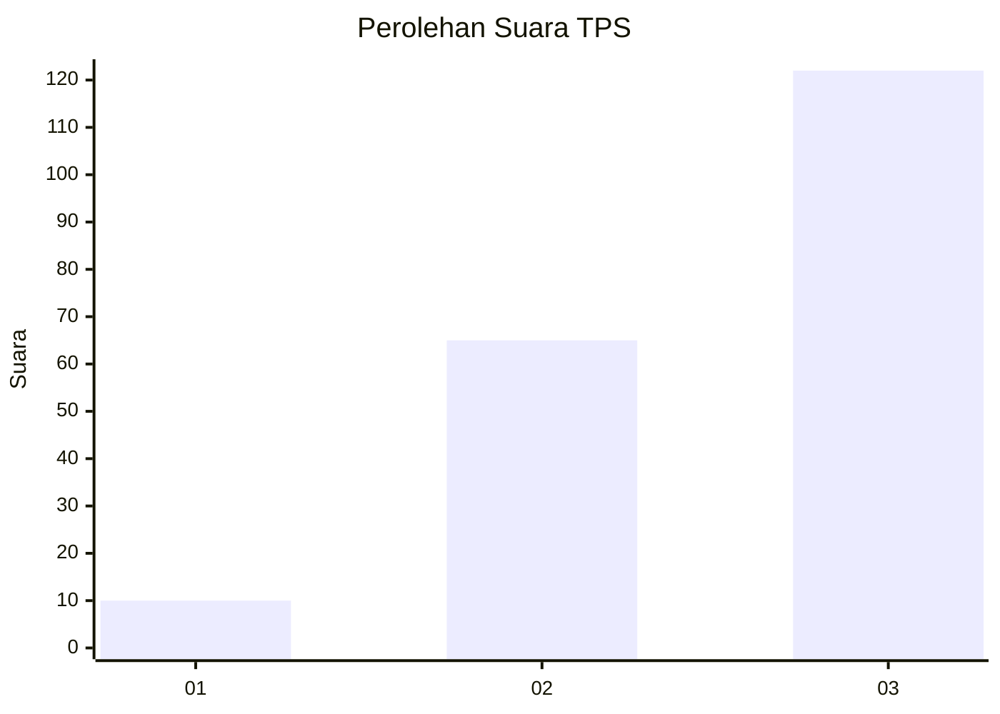
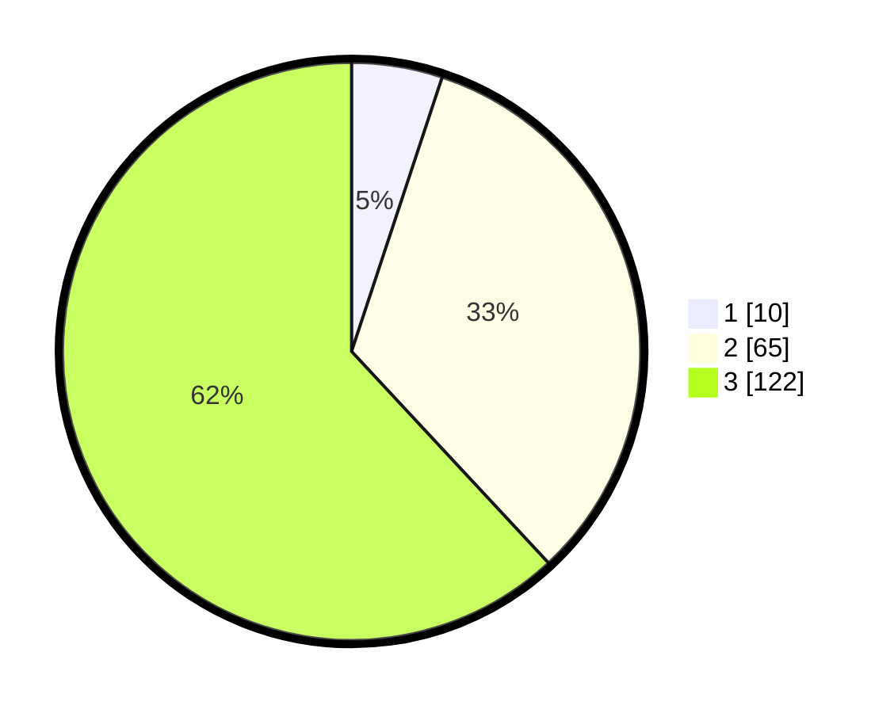

# Hasil

## Grafik

## Tabel

| No. | Nama Paslon    | Suara | Suara (raw) | Persentase |
|:--- |:-------------- | -----:| -----------:| ----------:|
| 1   | ANIES MUHAIMIN | 10    | [10][p-1]   | 5,08       |
| 2   | PRABOWO GIBRAN | 65    | [65][p-2]   | 32,99      |
| 3   | GANJAR MAHFUD  | 122   | [122][p-3]  | 61,93      |

[p-1]: https://github.com/gigit-pemilu/pemilu-2024/blob/main/pilpres/hitung-suara/sub/33-jawa-tengah/sub/74-kota-semarang/sub/05-genuk/sub/1003-karangroto/sub/031-tps/sub/paslon-1.txt
[p-2]: https://github.com/gigit-pemilu/pemilu-2024/blob/main/pilpres/hitung-suara/sub/33-jawa-tengah/sub/74-kota-semarang/sub/05-genuk/sub/1003-karangroto/sub/031-tps/sub/paslon-2.txt
[p-3]: https://github.com/gigit-pemilu/pemilu-2024/blob/main/pilpres/hitung-suara/sub/33-jawa-tengah/sub/74-kota-semarang/sub/05-genuk/sub/1003-karangroto/sub/031-tps/sub/paslon-3.txt

## Foto C Plano

https://sirekap-obj-formc.kpu.go.id/cc23/pemilu/ppwp/33/74/05/10/03/3374051003031-20240215-031238--5a258fab-b30a-4a60-b7f8-3e2cb3254fdb.jpg

https://sirekap-obj-formc.kpu.go.id/cc23/pemilu/ppwp/33/74/05/10/03/3374051003031-20240215-031349--f1a4ed4c-1926-4dcb-8617-5a2810dff198.jpg

https://sirekap-obj-formc.kpu.go.id/cc23/pemilu/ppwp/33/74/05/10/03/3374051003031-20240215-003245--71e3d3a7-2745-4542-b9fb-1273571e2e40.jpg

## Metadata

| Key        | Value               |
| ---------- | ------------------- |
| Time Stamp | 2024-02-15 22:00:27 |

