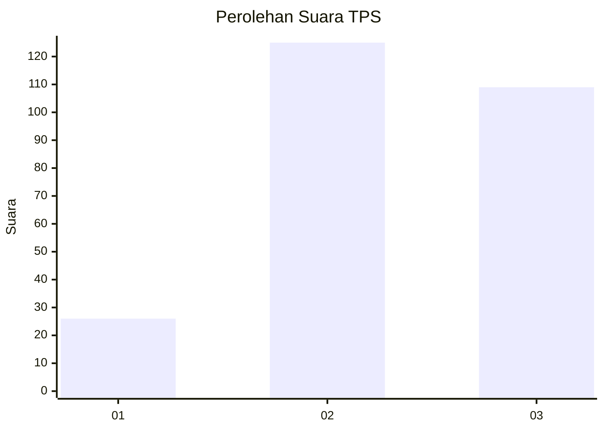
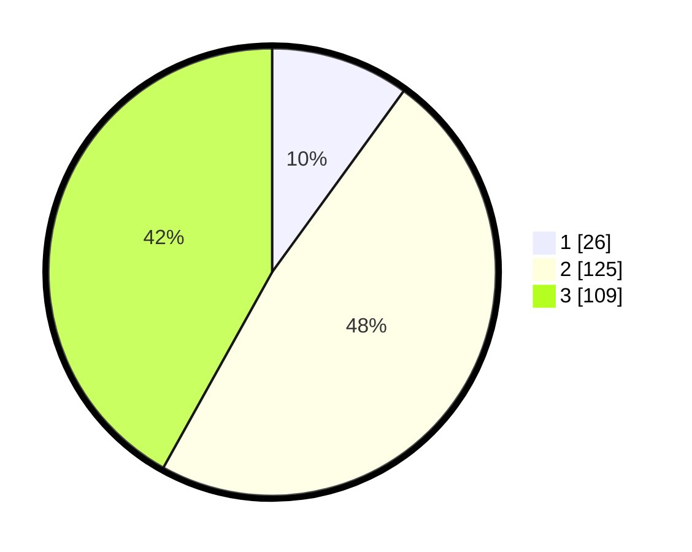

# Hasil

## Grafik

## Tabel

| No. | Nama Paslon    | Suara | Suara (raw) | Persentase |
|:--- |:-------------- | -----:| -----------:| ----------:|
| 1   | ANIES MUHAIMIN | 26    | [26][p-1]   | 10,00      |
| 2   | PRABOWO GIBRAN | 125   | [125][p-2]  | 48,08      |
| 3   | GANJAR MAHFUD  | 109   | [109][p-3]  | 41,92      |

[p-1]: https://github.com/gigit-pemilu/pemilu-2024-33-jawa-tengah/blob/main/pilpres/hitung-suara/sub/33-jawa-tengah/sub/74-kota-semarang/sub/05-genuk/sub/1004-genuksari/sub/022-tps/sub/paslon-1.txt
[p-2]: https://github.com/gigit-pemilu/pemilu-2024-33-jawa-tengah/blob/main/pilpres/hitung-suara/sub/33-jawa-tengah/sub/74-kota-semarang/sub/05-genuk/sub/1004-genuksari/sub/022-tps/sub/paslon-2.txt
[p-3]: https://github.com/gigit-pemilu/pemilu-2024-33-jawa-tengah/blob/main/pilpres/hitung-suara/sub/33-jawa-tengah/sub/74-kota-semarang/sub/05-genuk/sub/1004-genuksari/sub/022-tps/sub/paslon-3.txt

## Foto C Plano

https://sirekap-obj-formc.kpu.go.id/184e/pemilu/ppwp/33/74/05/10/04/3374051004022-20240217-013352--716cfbee-70db-4938-bf69-5e7fdc210213.jpg

https://sirekap-obj-formc.kpu.go.id/184e/pemilu/ppwp/33/74/05/10/04/3374051004022-20240217-013414--7f6db56a-2246-47b8-b57c-ebed08f3efa1.jpg

https://sirekap-obj-formc.kpu.go.id/184e/pemilu/ppwp/33/74/05/10/04/3374051004022-20240217-013432--cd75fd82-9a18-4bcc-ac24-3fd9780dd1ff.jpg

## Metadata

| Key        | Value               |
| ---------- | ------------------- |
| Time Stamp | 2024-02-17 02:00:02 |

