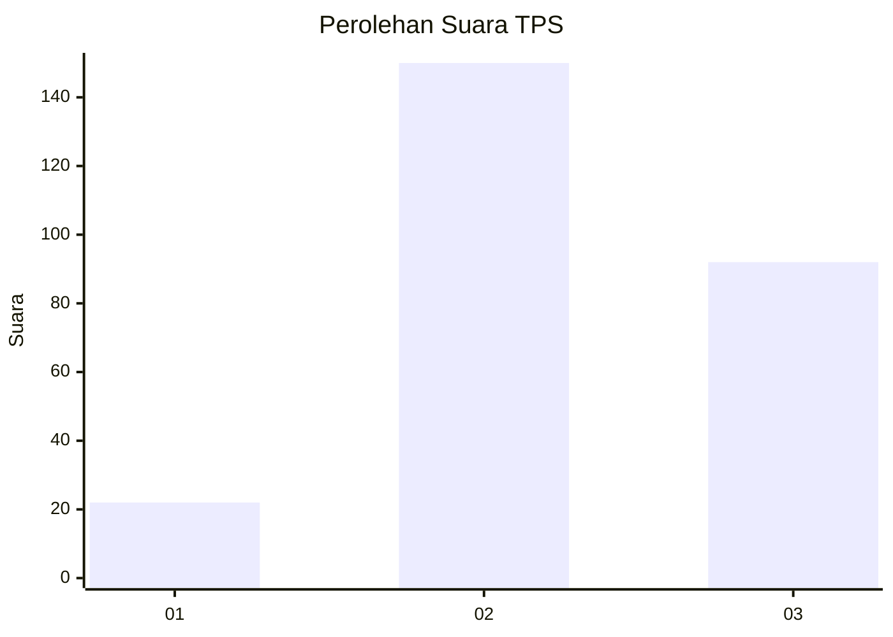
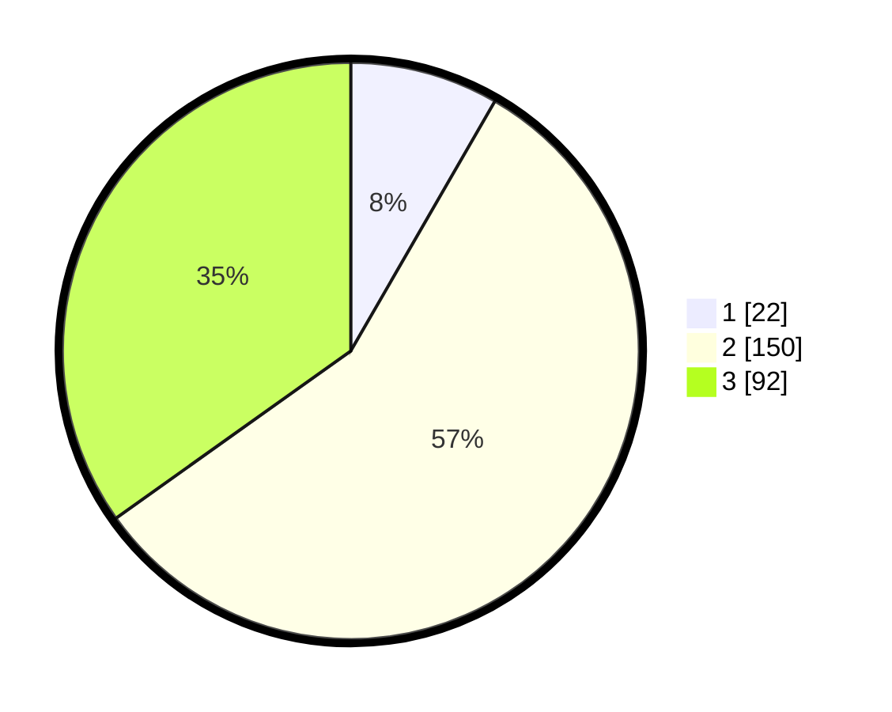

# Hasil

## Grafik

## Tabel

| No. | Nama Paslon    | Suara | Suara (raw) | Persentase |
|:--- |:-------------- | -----:| -----------:| ----------:|
| 1   | ANIES MUHAIMIN | 22    | [22][p-1]   | 8,33       |
| 2   | PRABOWO GIBRAN | 150   | [150][p-2]  | 56,82      |
| 3   | GANJAR MAHFUD  | 92    | [92][p-3]   | 34,85      |

[p-1]: https://github.com/gigit-pemilu/pemilu-2024-33-jawa-tengah/blob/main/pilpres/hitung-suara/sub/33-jawa-tengah/sub/74-kota-semarang/sub/05-genuk/sub/1005-banjardowo/sub/007-tps/sub/paslon-1.txt
[p-2]: https://github.com/gigit-pemilu/pemilu-2024-33-jawa-tengah/blob/main/pilpres/hitung-suara/sub/33-jawa-tengah/sub/74-kota-semarang/sub/05-genuk/sub/1005-banjardowo/sub/007-tps/sub/paslon-2.txt
[p-3]: https://github.com/gigit-pemilu/pemilu-2024-33-jawa-tengah/blob/main/pilpres/hitung-suara/sub/33-jawa-tengah/sub/74-kota-semarang/sub/05-genuk/sub/1005-banjardowo/sub/007-tps/sub/paslon-3.txt

## Foto C Plano

https://sirekap-obj-formc.kpu.go.id/821b/pemilu/ppwp/33/74/05/10/05/3374051005007-20240214-231406--5636a058-3a78-4bc5-a123-964b4fba33c2.jpg

https://sirekap-obj-formc.kpu.go.id/821b/pemilu/ppwp/33/74/05/10/05/3374051005007-20240214-231526--be5c3df7-98b4-4a20-834a-3df382663469.jpg

https://sirekap-obj-formc.kpu.go.id/821b/pemilu/ppwp/33/74/05/10/05/3374051005007-20240214-231614--7c8c37ed-cb37-488d-8fcd-699a563ae319.jpg

## Metadata

| Key        | Value               |
| ---------- | ------------------- |
| Time Stamp | 2024-02-16 09:30:28 |

