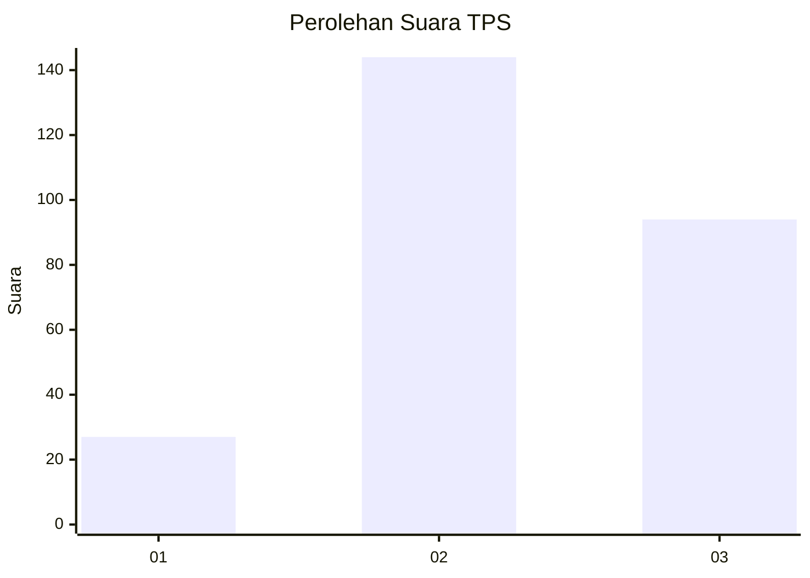
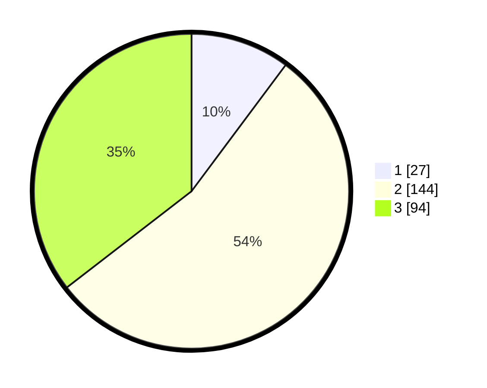

# Hasil

## Grafik

## Tabel

| No. | Nama Paslon    | Suara | Suara (raw) | Persentase |
|:--- |:-------------- | -----:| -----------:| ----------:|
| 1   | ANIES MUHAIMIN | 27    | [27][p-1]   | 10,19      |
| 2   | PRABOWO GIBRAN | 144   | [144][p-2]  | 54,34      |
| 3   | GANJAR MAHFUD  | 94    | [94][p-3]   | 35,47      |

[p-1]: https://github.com/gigit-pemilu/pemilu-2024-33-jawa-tengah/blob/main/pilpres/hitung-suara/sub/33-jawa-tengah/sub/74-kota-semarang/sub/05-genuk/sub/1005-banjardowo/sub/009-tps/sub/paslon-1.txt
[p-2]: https://github.com/gigit-pemilu/pemilu-2024-33-jawa-tengah/blob/main/pilpres/hitung-suara/sub/33-jawa-tengah/sub/74-kota-semarang/sub/05-genuk/sub/1005-banjardowo/sub/009-tps/sub/paslon-2.txt
[p-3]: https://github.com/gigit-pemilu/pemilu-2024-33-jawa-tengah/blob/main/pilpres/hitung-suara/sub/33-jawa-tengah/sub/74-kota-semarang/sub/05-genuk/sub/1005-banjardowo/sub/009-tps/sub/paslon-3.txt

## Foto C Plano

https://sirekap-obj-formc.kpu.go.id/dba1/pemilu/ppwp/33/74/05/10/05/3374051005009-20240215-003208--e4ced00a-5dd3-4054-9525-5bb80d463dfd.jpg

https://sirekap-obj-formc.kpu.go.id/dba1/pemilu/ppwp/33/74/05/10/05/3374051005009-20240215-004404--4737c86c-3864-4670-b54a-89f33a755d06.jpg

https://sirekap-obj-formc.kpu.go.id/dba1/pemilu/ppwp/33/74/05/10/05/3374051005009-20240215-004531--46376be8-2037-4d6e-a97e-f560677e272a.jpg

## Metadata

| Key        | Value               |
| ---------- | ------------------- |
| Time Stamp | 2024-02-16 09:30:28 |

