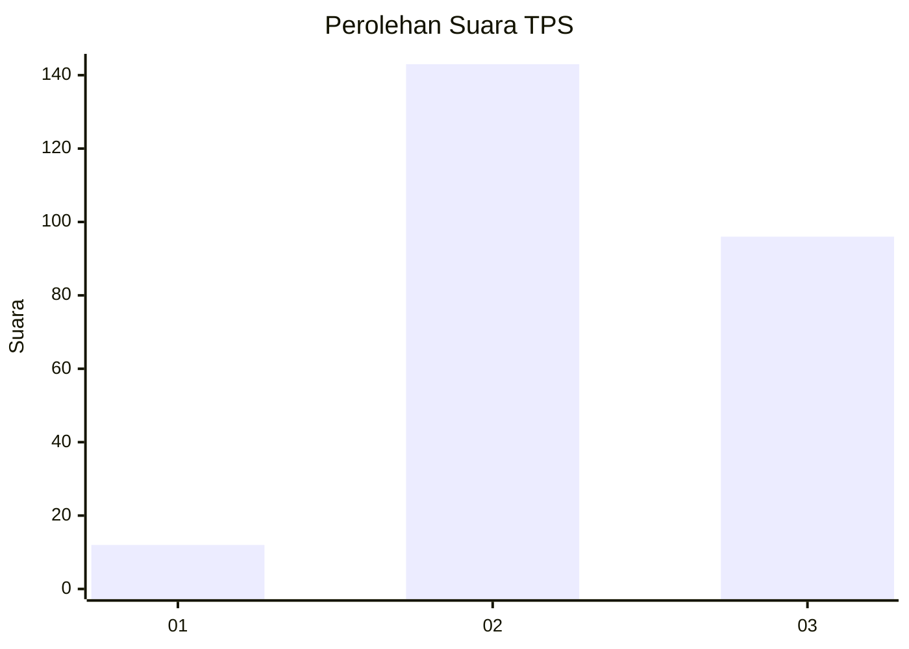
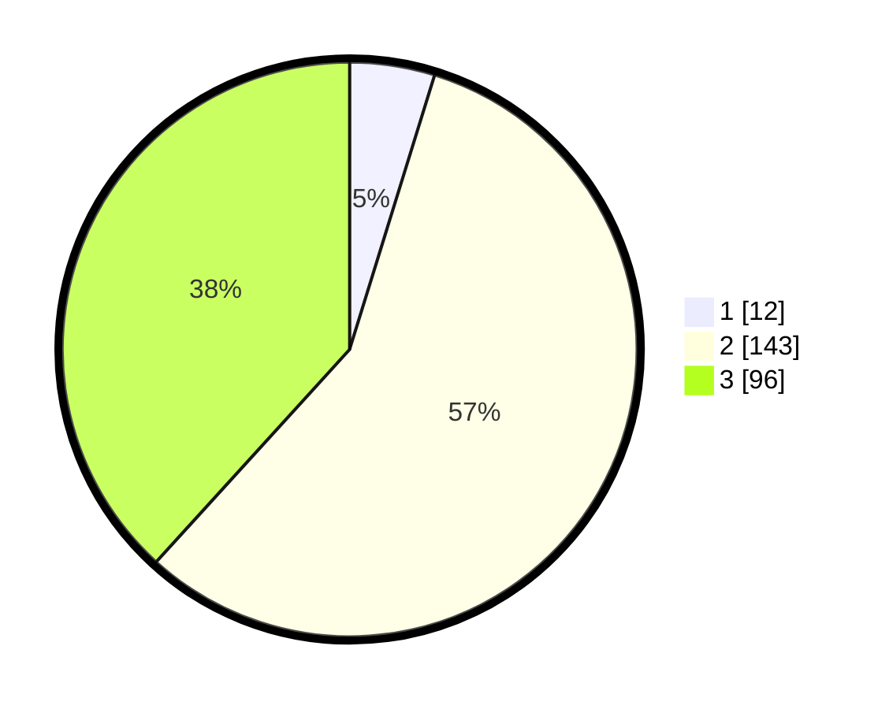

# Hasil

## Grafik

## Tabel

| No. | Nama Paslon    | Suara | Suara (raw) | Persentase |
|:--- |:-------------- | -----:| -----------:| ----------:|
| 1   | ANIES MUHAIMIN | 12    | [12][p-1]   | 4,78       |
| 2   | PRABOWO GIBRAN | 143   | [143][p-2]  | 56,97      |
| 3   | GANJAR MAHFUD  | 96    | [96][p-3]   | 38,25      |

[p-1]: https://github.com/gigit-pemilu/pemilu-2024/blob/main/pilpres/hitung-suara/sub/33-jawa-tengah/sub/74-kota-semarang/sub/05-genuk/sub/1010-bangetayu-kulon/sub/005-tps/sub/paslon-1.txt
[p-2]: https://github.com/gigit-pemilu/pemilu-2024/blob/main/pilpres/hitung-suara/sub/33-jawa-tengah/sub/74-kota-semarang/sub/05-genuk/sub/1010-bangetayu-kulon/sub/005-tps/sub/paslon-2.txt
[p-3]: https://github.com/gigit-pemilu/pemilu-2024/blob/main/pilpres/hitung-suara/sub/33-jawa-tengah/sub/74-kota-semarang/sub/05-genuk/sub/1010-bangetayu-kulon/sub/005-tps/sub/paslon-3.txt

## Foto C Plano

https://sirekap-obj-formc.kpu.go.id/c5e3/pemilu/ppwp/33/74/05/10/10/3374051010005-20240218-105014--72f55e58-157b-467d-adaa-70cdcdac5487.jpg

https://sirekap-obj-formc.kpu.go.id/c5e3/pemilu/ppwp/33/74/05/10/10/3374051010005-20240214-222045--4887c84f-6b6b-4b35-ba8d-a3b6aa98493a.jpg

https://sirekap-obj-formc.kpu.go.id/c5e3/pemilu/ppwp/33/74/05/10/10/3374051010005-20240214-221938--ba51cce6-1d4f-4e08-a703-bc01e4a7e97b.jpg

## Metadata

| Key        | Value               |
| ---------- | ------------------- |
| Time Stamp | 2024-02-19 06:16:00 |

