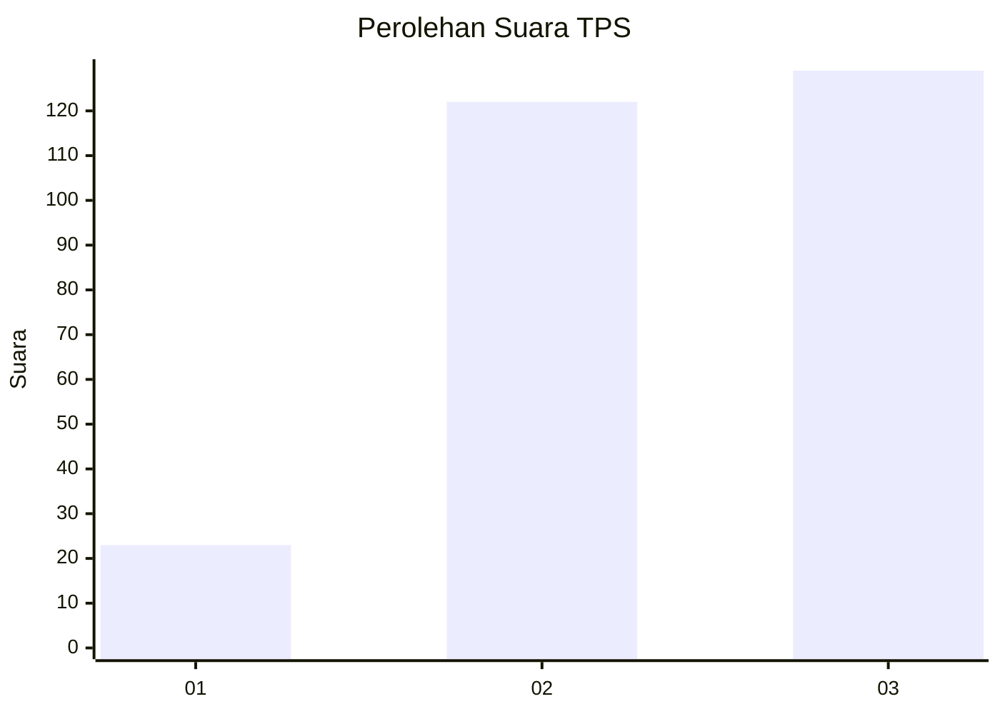
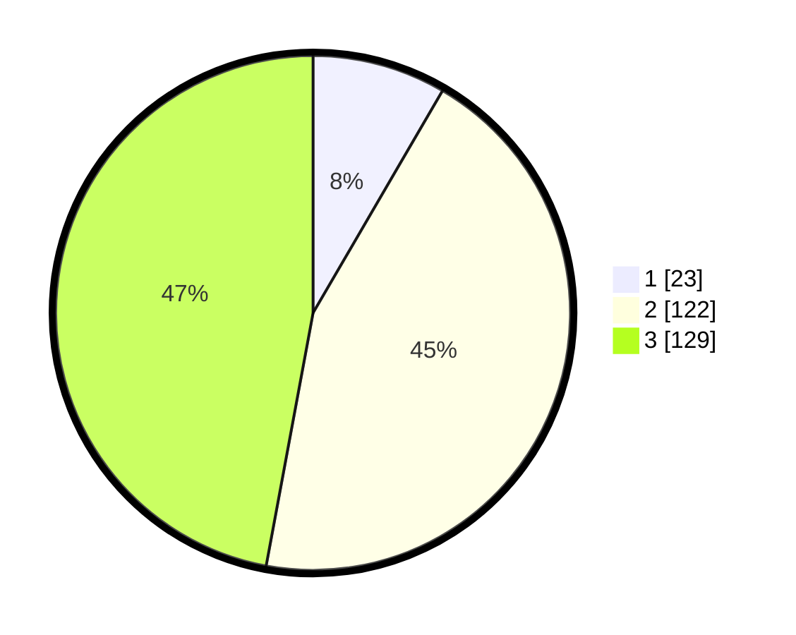

# Hasil

## Grafik

## Tabel

| No. | Nama Paslon    | Suara | Suara (raw) | Persentase |
|:--- |:-------------- | -----:| -----------:| ----------:|
| 1   | ANIES MUHAIMIN | 23    | [23][p-1]   | 8,39       |
| 2   | PRABOWO GIBRAN | 122   | [122][p-2]  | 44,53      |
| 3   | GANJAR MAHFUD  | 129   | [129][p-3]  | 47,08      |

[p-1]: https://github.com/gigit-pemilu/pemilu-2024-33-jawa-tengah/blob/main/pilpres/hitung-suara/sub/33-jawa-tengah/sub/74-kota-semarang/sub/05-genuk/sub/1011-bangetayu-wetan/sub/023-tps/sub/paslon-1.txt
[p-2]: https://github.com/gigit-pemilu/pemilu-2024-33-jawa-tengah/blob/main/pilpres/hitung-suara/sub/33-jawa-tengah/sub/74-kota-semarang/sub/05-genuk/sub/1011-bangetayu-wetan/sub/023-tps/sub/paslon-2.txt
[p-3]: https://github.com/gigit-pemilu/pemilu-2024-33-jawa-tengah/blob/main/pilpres/hitung-suara/sub/33-jawa-tengah/sub/74-kota-semarang/sub/05-genuk/sub/1011-bangetayu-wetan/sub/023-tps/sub/paslon-3.txt

## Foto C Plano

https://sirekap-obj-formc.kpu.go.id/cbb5/pemilu/ppwp/33/74/05/10/11/3374051011023-20240214-190848--e28c4ca4-efa2-414a-87a2-e1b7dd2dad87.jpg

https://sirekap-obj-formc.kpu.go.id/cbb5/pemilu/ppwp/33/74/05/10/11/3374051011023-20240214-190903--0c344384-ab1b-4508-b951-0dd31bbb5a3f.jpg

https://sirekap-obj-formc.kpu.go.id/cbb5/pemilu/ppwp/33/74/05/10/11/3374051011023-20240214-190908--497f8233-7445-4abf-b75f-7d2ee133fe87.jpg

## Metadata

| Key        | Value               |
| ---------- | ------------------- |
| Time Stamp | 2024-02-15 05:00:24 |

