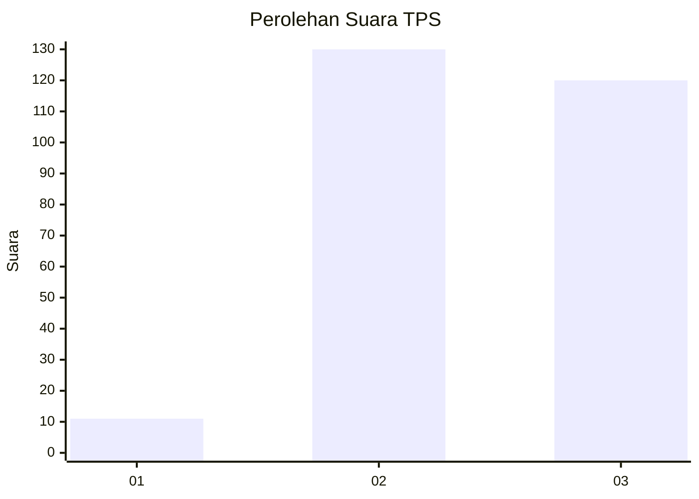
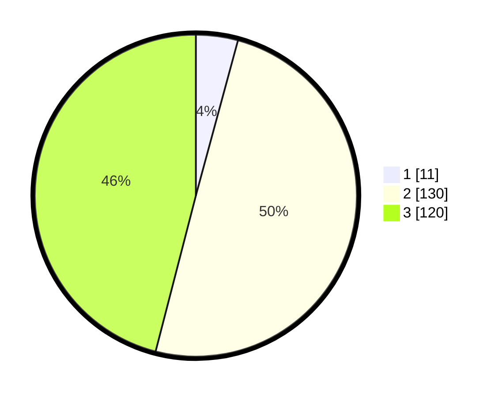

# Hasil

## Grafik

## Tabel

| No. | Nama Paslon    | Suara | Suara (raw) | Persentase |
|:--- |:-------------- | -----:| -----------:| ----------:|
| 1   | ANIES MUHAIMIN | 11    | [11][p-1]   | 4,21       |
| 2   | PRABOWO GIBRAN | 130   | [130][p-2]  | 49,81      |
| 3   | GANJAR MAHFUD  | 120   | [120][p-3]  | 45,98      |

[p-1]: https://github.com/gigit-pemilu/pemilu-2024/blob/main/pilpres/hitung-suara/sub/33-jawa-tengah/sub/74-kota-semarang/sub/05-genuk/sub/1011-bangetayu-wetan/sub/026-tps/sub/paslon-1.txt
[p-2]: https://github.com/gigit-pemilu/pemilu-2024/blob/main/pilpres/hitung-suara/sub/33-jawa-tengah/sub/74-kota-semarang/sub/05-genuk/sub/1011-bangetayu-wetan/sub/026-tps/sub/paslon-2.txt
[p-3]: https://github.com/gigit-pemilu/pemilu-2024/blob/main/pilpres/hitung-suara/sub/33-jawa-tengah/sub/74-kota-semarang/sub/05-genuk/sub/1011-bangetayu-wetan/sub/026-tps/sub/paslon-3.txt

## Foto C Plano

https://sirekap-obj-formc.kpu.go.id/f69f/pemilu/ppwp/33/74/05/10/11/3374051011026-20240215-003727--944b8312-b564-48ce-946a-f59723d44db8.jpg

https://sirekap-obj-formc.kpu.go.id/f69f/pemilu/ppwp/33/74/05/10/11/3374051011026-20240215-003904--cf4fec8d-e6dd-4ac6-acd7-979fb552e4e3.jpg

https://sirekap-obj-formc.kpu.go.id/f69f/pemilu/ppwp/33/74/05/10/11/3374051011026-20240215-004023--e1c2987e-b041-407a-a87f-38996707ca01.jpg

## Metadata

| Key        | Value               |
| ---------- | ------------------- |
| Time Stamp | 2024-02-15 22:00:27 |

