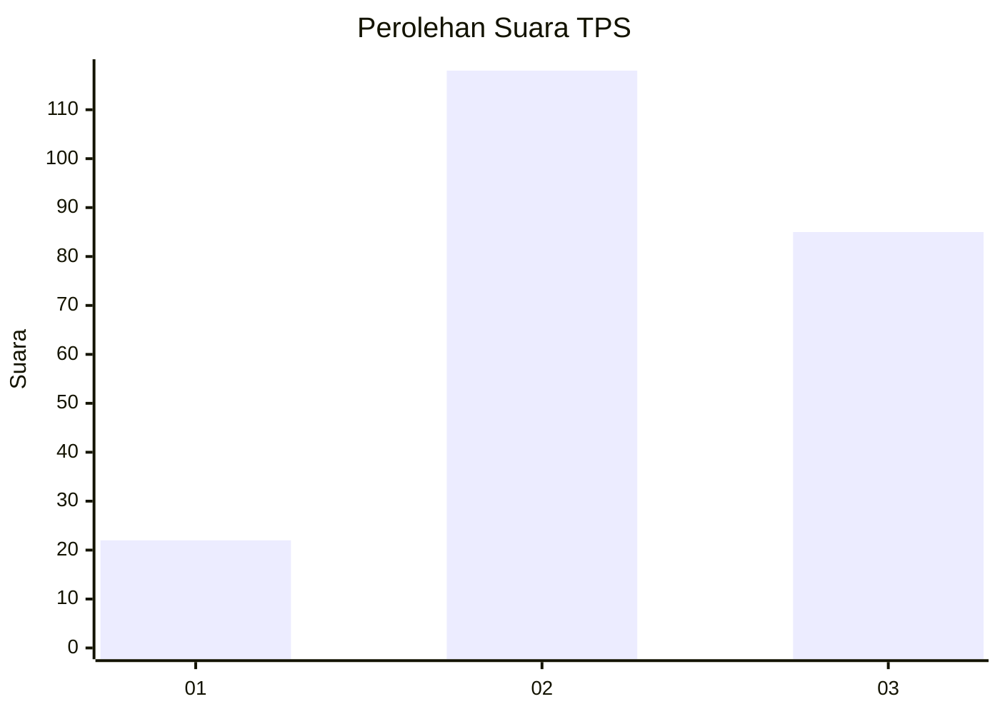
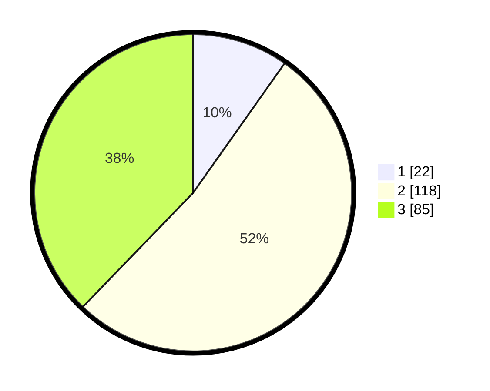

# Hasil

## Grafik

## Tabel

| No. | Nama Paslon    | Suara | Suara (raw) | Persentase |
|:--- |:-------------- | -----:| -----------:| ----------:|
| 1   | ANIES MUHAIMIN | 22    | [22][p-1]   | 9,78       |
| 2   | PRABOWO GIBRAN | 118   | [118][p-2]  | 52,44      |
| 3   | GANJAR MAHFUD  | 85    | [85][p-3]   | 37,78      |

[p-1]: https://github.com/gigit-pemilu/pemilu-2024/blob/main/pilpres/hitung-suara/sub/33-jawa-tengah/sub/74-kota-semarang/sub/06-pedurungan/sub/1001-penggaron-kidul/sub/002-tps/sub/paslon-1.txt
[p-2]: https://github.com/gigit-pemilu/pemilu-2024/blob/main/pilpres/hitung-suara/sub/33-jawa-tengah/sub/74-kota-semarang/sub/06-pedurungan/sub/1001-penggaron-kidul/sub/002-tps/sub/paslon-2.txt
[p-3]: https://github.com/gigit-pemilu/pemilu-2024/blob/main/pilpres/hitung-suara/sub/33-jawa-tengah/sub/74-kota-semarang/sub/06-pedurungan/sub/1001-penggaron-kidul/sub/002-tps/sub/paslon-3.txt

## Foto C Plano

https://sirekap-obj-formc.kpu.go.id/1f7b/pemilu/ppwp/33/74/06/10/01/3374061001002-20240214-212415--154249a4-4af0-4b4a-bdd8-a4b050d73d6d.jpg

https://sirekap-obj-formc.kpu.go.id/1f7b/pemilu/ppwp/33/74/06/10/01/3374061001002-20240214-212528--f91fbf36-3542-457a-a9c8-400e18f38e3c.jpg

https://sirekap-obj-formc.kpu.go.id/1f7b/pemilu/ppwp/33/74/06/10/01/3374061001002-20240214-212605--eb7c628a-ac7c-499e-aaf0-212268e84a46.jpg

## Metadata

| Key        | Value               |
| ---------- | ------------------- |
| Time Stamp | 2024-02-15 23:29:50 |

