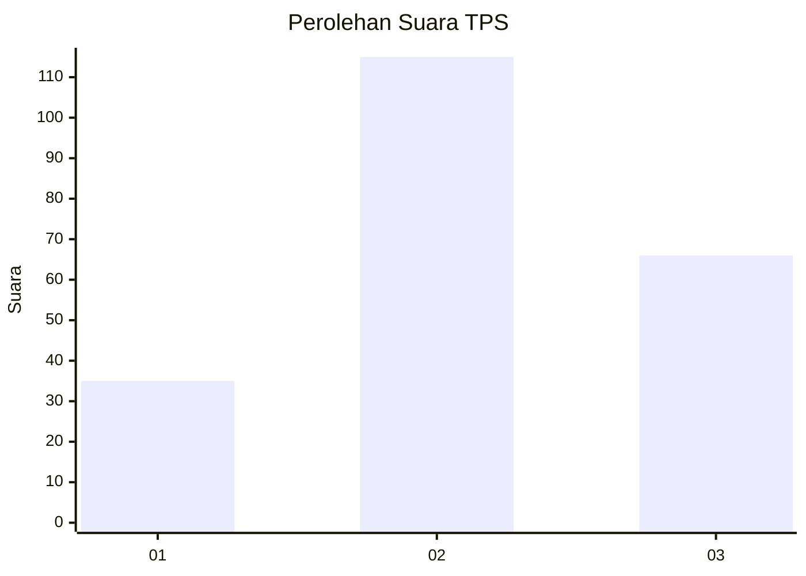
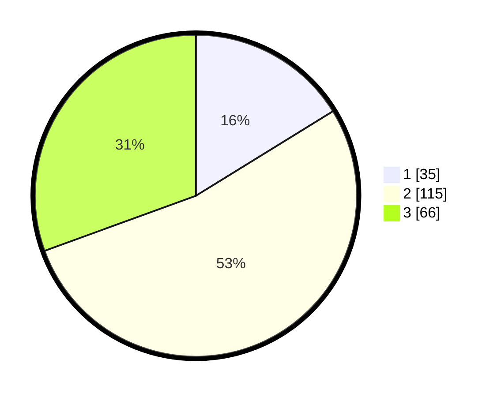

# Hasil

## Grafik

## Tabel

| No. | Nama Paslon    | Suara | Suara (raw) | Persentase |
|:--- |:-------------- | -----:| -----------:| ----------:|
| 1   | ANIES MUHAIMIN | 35    | [35][p-1]   | 16,20      |
| 2   | PRABOWO GIBRAN | 115   | [115][p-2]  | 53,24      |
| 3   | GANJAR MAHFUD  | 66    | [66][p-3]   | 30,56      |

[p-1]: https://github.com/gigit-pemilu/pemilu-2024-33-jawa-tengah/blob/main/pilpres/hitung-suara/sub/33-jawa-tengah/sub/74-kota-semarang/sub/06-pedurungan/sub/1001-penggaron-kidul/sub/004-tps/sub/paslon-1.txt
[p-2]: https://github.com/gigit-pemilu/pemilu-2024-33-jawa-tengah/blob/main/pilpres/hitung-suara/sub/33-jawa-tengah/sub/74-kota-semarang/sub/06-pedurungan/sub/1001-penggaron-kidul/sub/004-tps/sub/paslon-2.txt
[p-3]: https://github.com/gigit-pemilu/pemilu-2024-33-jawa-tengah/blob/main/pilpres/hitung-suara/sub/33-jawa-tengah/sub/74-kota-semarang/sub/06-pedurungan/sub/1001-penggaron-kidul/sub/004-tps/sub/paslon-3.txt

## Foto C Plano

https://sirekap-obj-formc.kpu.go.id/5a1f/pemilu/ppwp/33/74/06/10/01/3374061001004-20240215-045712--aa0c2ac7-c749-4258-ab37-8f9e30cf8c23.jpg

https://sirekap-obj-formc.kpu.go.id/5a1f/pemilu/ppwp/33/74/06/10/01/3374061001004-20240215-045744--705dea77-eec2-4c14-996f-b4dd1e1965ca.jpg

https://sirekap-obj-formc.kpu.go.id/5a1f/pemilu/ppwp/33/74/06/10/01/3374061001004-20240215-045918--ed5fa031-a4a3-41ae-b671-24f2d524cfaf.jpg

## Metadata

| Key        | Value               |
| ---------- | ------------------- |
| Time Stamp | 2024-02-16 10:00:28 |

