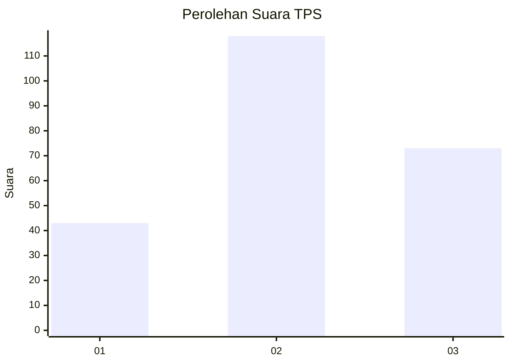
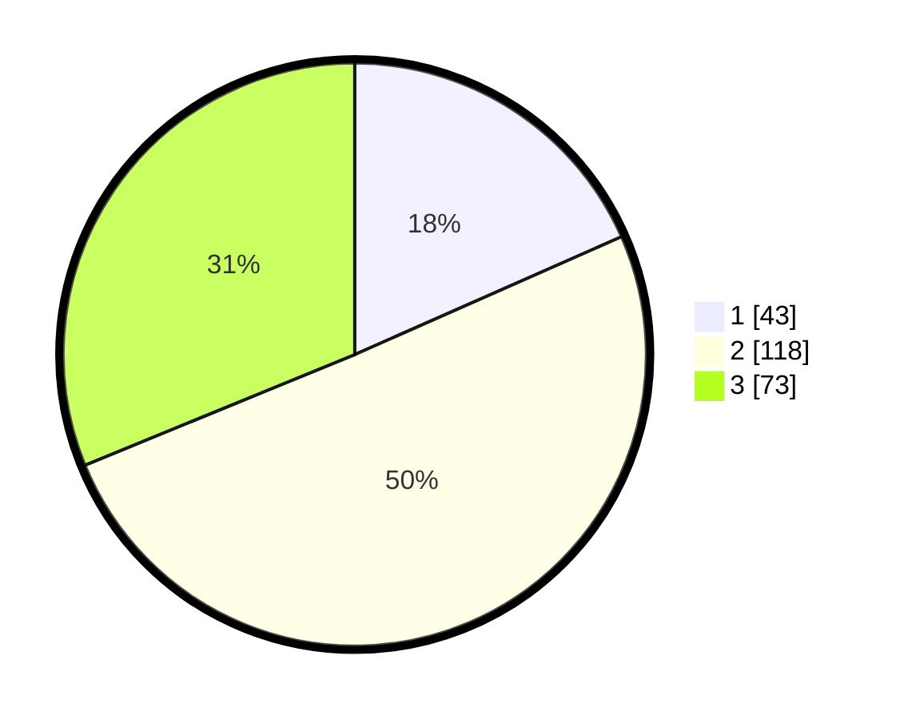

# Hasil

## Grafik

## Tabel

| No. | Nama Paslon    | Suara | Suara (raw) | Persentase |
|:--- |:-------------- | -----:| -----------:| ----------:|
| 1   | ANIES MUHAIMIN | 43    | [43][p-1]   | 18,38      |
| 2   | PRABOWO GIBRAN | 118   | [118][p-2]  | 50,43      |
| 3   | GANJAR MAHFUD  | 73    | [73][p-3]   | 31,20      |

[p-1]: https://github.com/gigit-pemilu/pemilu-2024/blob/main/pilpres/hitung-suara/sub/33-jawa-tengah/sub/74-kota-semarang/sub/06-pedurungan/sub/1001-penggaron-kidul/sub/005-tps/sub/paslon-1.txt
[p-2]: https://github.com/gigit-pemilu/pemilu-2024/blob/main/pilpres/hitung-suara/sub/33-jawa-tengah/sub/74-kota-semarang/sub/06-pedurungan/sub/1001-penggaron-kidul/sub/005-tps/sub/paslon-2.txt
[p-3]: https://github.com/gigit-pemilu/pemilu-2024/blob/main/pilpres/hitung-suara/sub/33-jawa-tengah/sub/74-kota-semarang/sub/06-pedurungan/sub/1001-penggaron-kidul/sub/005-tps/sub/paslon-3.txt

## Foto C Plano

https://sirekap-obj-formc.kpu.go.id/3f95/pemilu/ppwp/33/74/06/10/01/3374061001005-20240214-200849--98520a06-086d-4118-9cc5-ce240586f325.jpg

https://sirekap-obj-formc.kpu.go.id/3f95/pemilu/ppwp/33/74/06/10/01/3374061001005-20240214-200906--330557b8-e51f-46ee-b5cc-cd38a98eb45c.jpg

https://sirekap-obj-formc.kpu.go.id/3f95/pemilu/ppwp/33/74/06/10/01/3374061001005-20240214-200925--40ce46e0-af0e-4a16-bfd4-5208550c8019.jpg

## Metadata

| Key        | Value               |
| ---------- | ------------------- |
| Time Stamp | 2024-02-16 10:00:28 |

