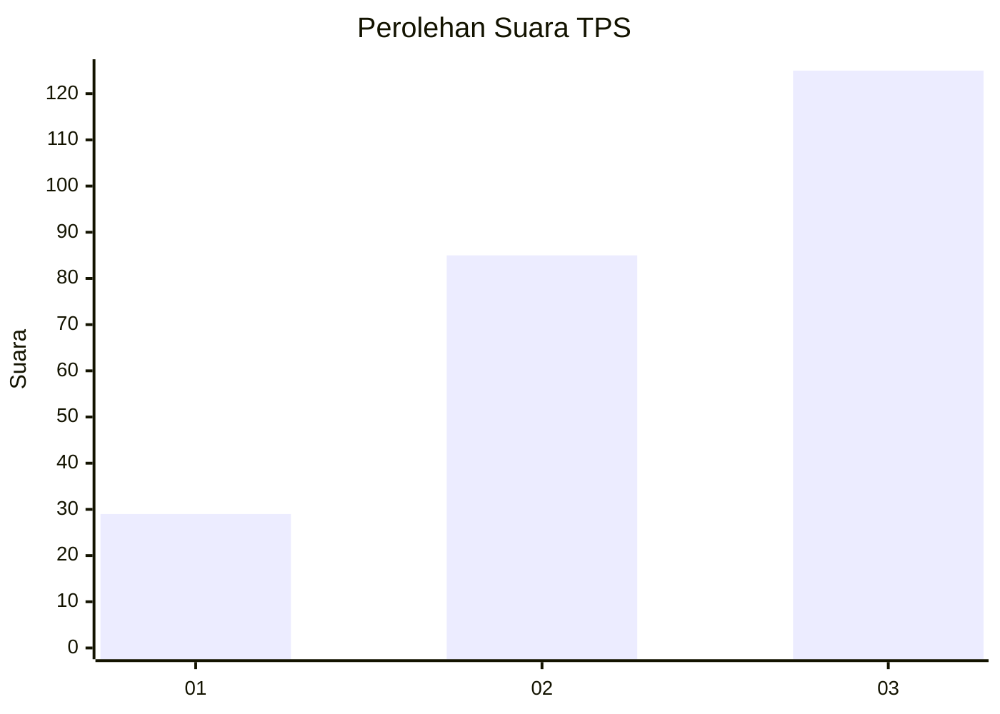
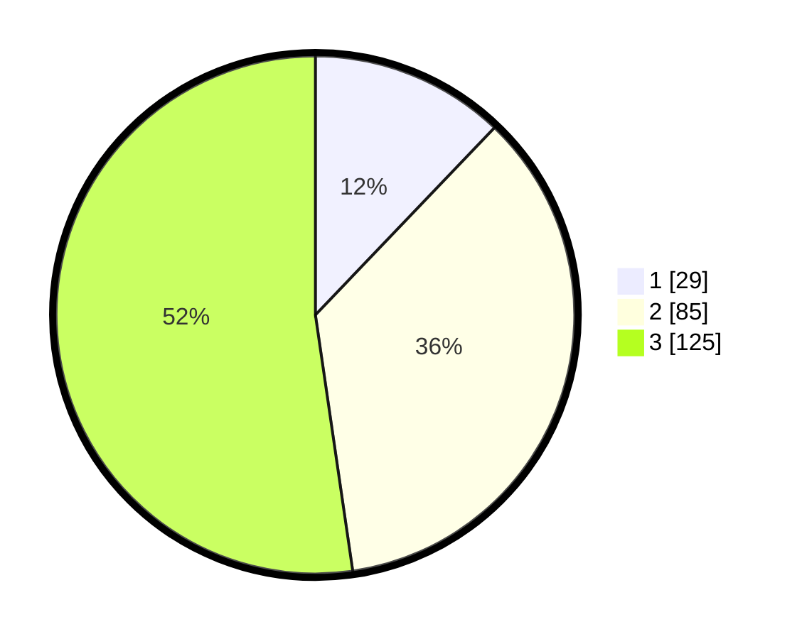

# Hasil

## Grafik

## Tabel

| No. | Nama Paslon    | Suara | Suara (raw) | Persentase |
|:--- |:-------------- | -----:| -----------:| ----------:|
| 1   | ANIES MUHAIMIN | 29    | [29][p-1]   | 12,13      |
| 2   | PRABOWO GIBRAN | 85    | [85][p-2]   | 35,56      |
| 3   | GANJAR MAHFUD  | 125   | [125][p-3]  | 52,30      |

[p-1]: https://github.com/gigit-pemilu/pemilu-2024/blob/main/pilpres/hitung-suara/sub/33-jawa-tengah/sub/74-kota-semarang/sub/06-pedurungan/sub/1002-tlogomulyo/sub/006-tps/sub/paslon-1.txt
[p-2]: https://github.com/gigit-pemilu/pemilu-2024/blob/main/pilpres/hitung-suara/sub/33-jawa-tengah/sub/74-kota-semarang/sub/06-pedurungan/sub/1002-tlogomulyo/sub/006-tps/sub/paslon-2.txt
[p-3]: https://github.com/gigit-pemilu/pemilu-2024/blob/main/pilpres/hitung-suara/sub/33-jawa-tengah/sub/74-kota-semarang/sub/06-pedurungan/sub/1002-tlogomulyo/sub/006-tps/sub/paslon-3.txt

## Foto C Plano

https://sirekap-obj-formc.kpu.go.id/a24c/pemilu/ppwp/33/74/06/10/02/3374061002006-20240214-155327--a858d3ba-0323-4f7d-b64b-6c3a7bcb6c83.jpg

https://sirekap-obj-formc.kpu.go.id/a24c/pemilu/ppwp/33/74/06/10/02/3374061002006-20240214-155643--fe8a4219-be4a-41e8-a22e-f3e424e0eaad.jpg

https://sirekap-obj-formc.kpu.go.id/a24c/pemilu/ppwp/33/74/06/10/02/3374061002006-20240214-192736--7010913f-ec87-412d-84ce-c46bb7bdb137.jpg

## Metadata

| Key        | Value               |
| ---------- | ------------------- |
| Time Stamp | 2024-02-16 10:00:28 |

