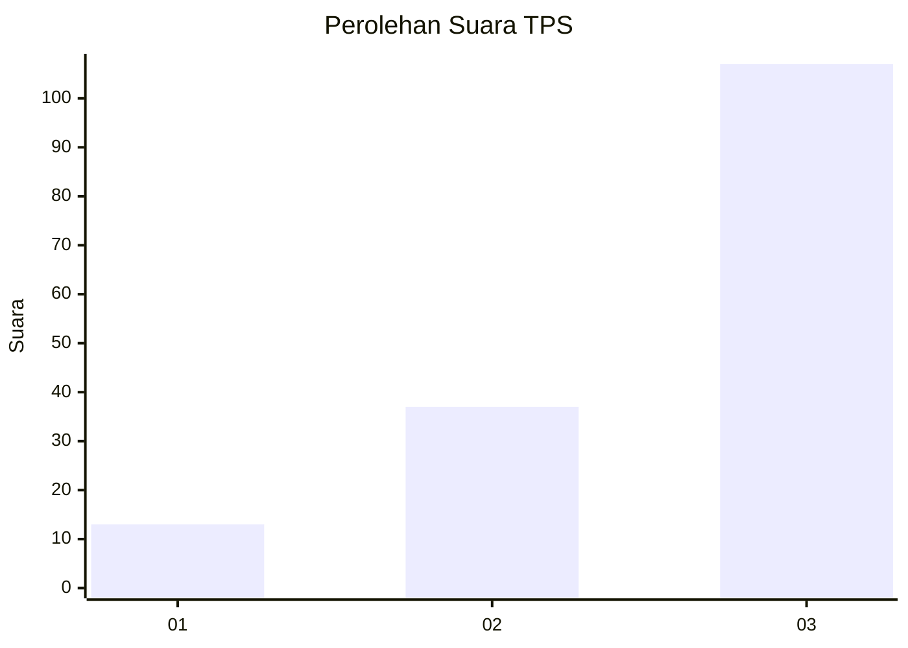
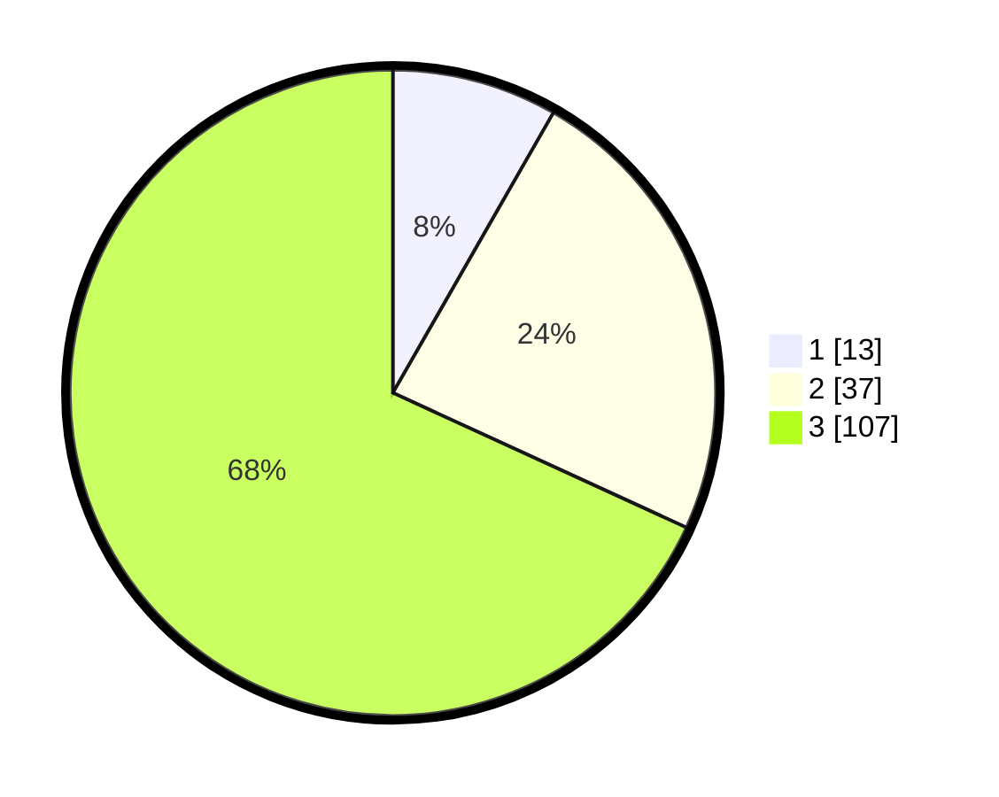

# Hasil

## Grafik

## Tabel

| No. | Nama Paslon    | Suara | Suara (raw) | Persentase |
|:--- |:-------------- | -----:| -----------:| ----------:|
| 1   | ANIES MUHAIMIN | 13    | [13][p-1]   | 8,28       |
| 2   | PRABOWO GIBRAN | 37    | [37][p-2]   | 23,57      |
| 3   | GANJAR MAHFUD  | 107   | [107][p-3]  | 68,15      |

[p-1]: https://github.com/gigit-pemilu/pemilu-2024-33-jawa-tengah/blob/main/pilpres/hitung-suara/sub/33-jawa-tengah/sub/74-kota-semarang/sub/06-pedurungan/sub/1004-tlogosari-kulon/sub/004-tps/sub/paslon-1.txt
[p-2]: https://github.com/gigit-pemilu/pemilu-2024-33-jawa-tengah/blob/main/pilpres/hitung-suara/sub/33-jawa-tengah/sub/74-kota-semarang/sub/06-pedurungan/sub/1004-tlogosari-kulon/sub/004-tps/sub/paslon-2.txt
[p-3]: https://github.com/gigit-pemilu/pemilu-2024-33-jawa-tengah/blob/main/pilpres/hitung-suara/sub/33-jawa-tengah/sub/74-kota-semarang/sub/06-pedurungan/sub/1004-tlogosari-kulon/sub/004-tps/sub/paslon-3.txt

## Foto C Plano

https://sirekap-obj-formc.kpu.go.id/30ed/pemilu/ppwp/33/74/06/10/04/3374061004004-20240214-230615--dbf2915c-fa22-4f6d-9f0f-f810540c573c.jpg

https://sirekap-obj-formc.kpu.go.id/30ed/pemilu/ppwp/33/74/06/10/04/3374061004004-20240214-230723--59c5d672-9e7f-460e-b43b-48d5baf42cbb.jpg

https://sirekap-obj-formc.kpu.go.id/30ed/pemilu/ppwp/33/74/06/10/04/3374061004004-20240214-230855--d970da4d-0f8f-4916-b819-d7993c1c9256.jpg

## Metadata

| Key        | Value               |
| ---------- | ------------------- |
| Time Stamp | 2024-02-16 10:30:29 |

