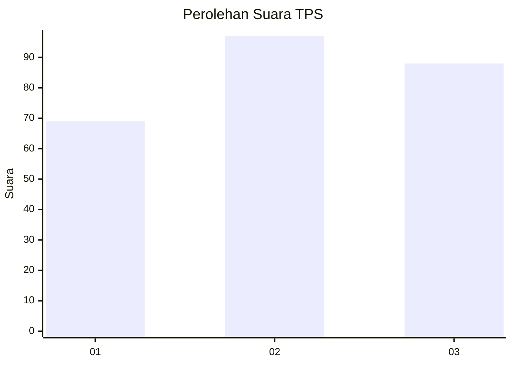
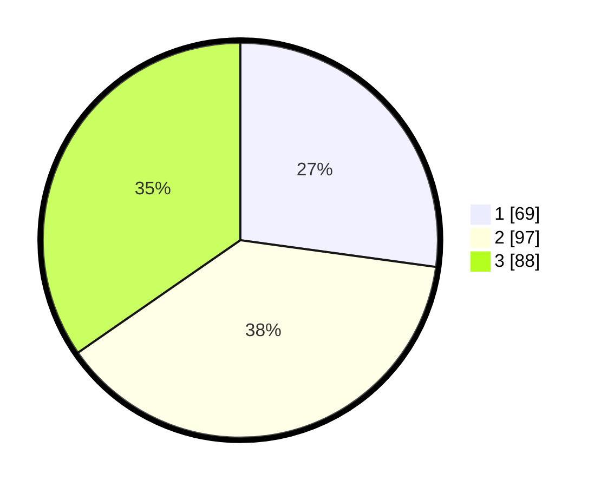

# Hasil

## Grafik

## Tabel

| No. | Nama Paslon    | Suara | Suara (raw) | Persentase |
|:--- |:-------------- | -----:| -----------:| ----------:|
| 1   | ANIES MUHAIMIN | 69    | [69][p-1]   | 27,17      |
| 2   | PRABOWO GIBRAN | 97    | [97][p-2]   | 38,19      |
| 3   | GANJAR MAHFUD  | 88    | [88][p-3]   | 34,65      |

[p-1]: https://github.com/gigit-pemilu/pemilu-2024/blob/main/pilpres/hitung-suara/sub/33-jawa-tengah/sub/74-kota-semarang/sub/06-pedurungan/sub/1004-tlogosari-kulon/sub/043-tps/sub/paslon-1.txt
[p-2]: https://github.com/gigit-pemilu/pemilu-2024/blob/main/pilpres/hitung-suara/sub/33-jawa-tengah/sub/74-kota-semarang/sub/06-pedurungan/sub/1004-tlogosari-kulon/sub/043-tps/sub/paslon-2.txt
[p-3]: https://github.com/gigit-pemilu/pemilu-2024/blob/main/pilpres/hitung-suara/sub/33-jawa-tengah/sub/74-kota-semarang/sub/06-pedurungan/sub/1004-tlogosari-kulon/sub/043-tps/sub/paslon-3.txt

## Foto C Plano

https://sirekap-obj-formc.kpu.go.id/f34c/pemilu/ppwp/33/74/06/10/04/3374061004043-20240215-062739--ae6641ad-d188-4cf6-8263-5cdc89e922db.jpg

https://sirekap-obj-formc.kpu.go.id/f34c/pemilu/ppwp/33/74/06/10/04/3374061004043-20240215-062941--4f511eb5-603c-4060-8901-ab00e67e5845.jpg

https://sirekap-obj-formc.kpu.go.id/f34c/pemilu/ppwp/33/74/06/10/04/3374061004043-20240215-063202--b2397781-a8be-43f1-a239-c652a4bf0408.jpg

## Metadata

| Key        | Value               |
| ---------- | ------------------- |
| Time Stamp | 2024-02-16 10:30:29 |

