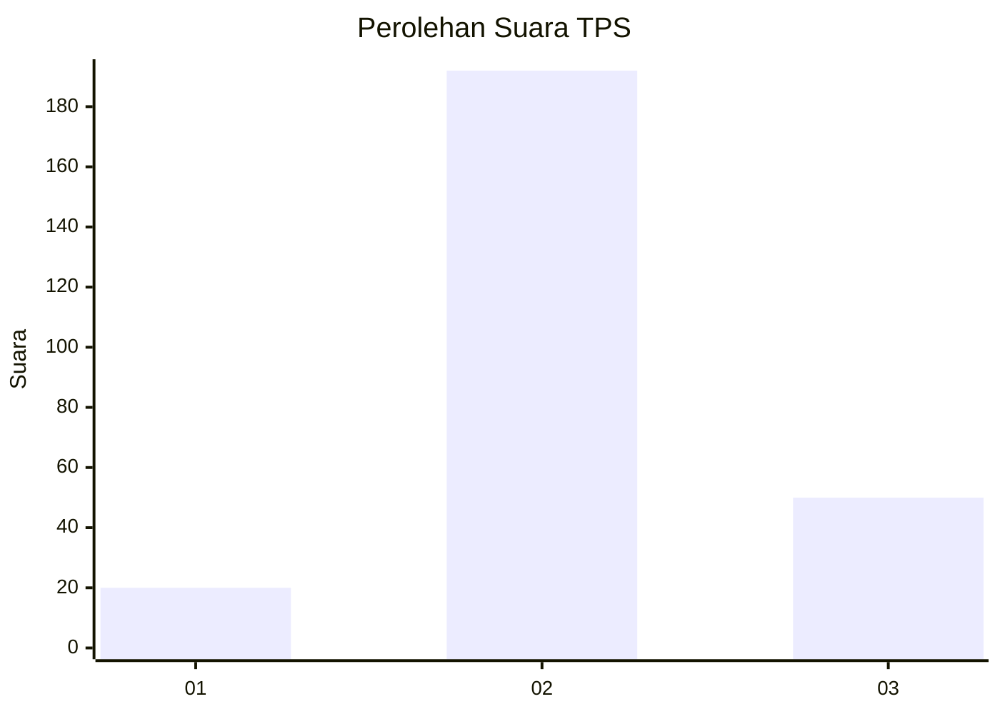
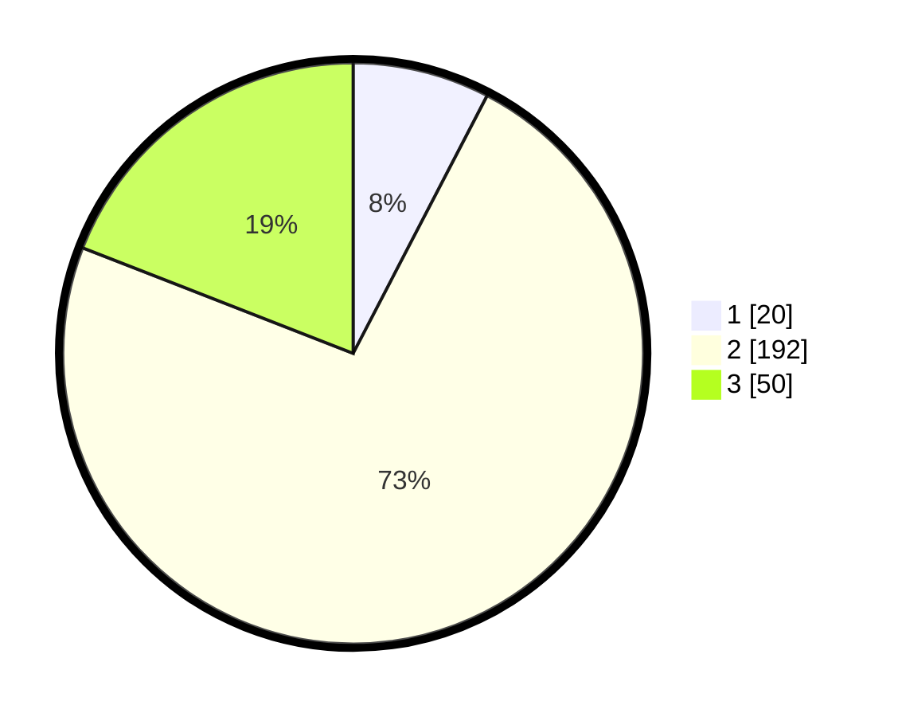

# Hasil

## Grafik

## Tabel

| No. | Nama Paslon    | Suara | Suara (raw) | Persentase |
|:--- |:-------------- | -----:| -----------:| ----------:|
| 1   | ANIES MUHAIMIN | 20    | [20][p-1]   | 7,63       |
| 2   | PRABOWO GIBRAN | 192   | [192][p-2]  | 73,28      |
| 3   | GANJAR MAHFUD  | 50    | [50][p-3]   | 19,08      |

[p-1]: https://github.com/gigit-pemilu/pemilu-2024-33-jawa-tengah/blob/main/pilpres/hitung-suara/sub/33-jawa-tengah/sub/74-kota-semarang/sub/06-pedurungan/sub/1006-plamongansari/sub/001-tps/sub/paslon-1.txt
[p-2]: https://github.com/gigit-pemilu/pemilu-2024-33-jawa-tengah/blob/main/pilpres/hitung-suara/sub/33-jawa-tengah/sub/74-kota-semarang/sub/06-pedurungan/sub/1006-plamongansari/sub/001-tps/sub/paslon-2.txt
[p-3]: https://github.com/gigit-pemilu/pemilu-2024-33-jawa-tengah/blob/main/pilpres/hitung-suara/sub/33-jawa-tengah/sub/74-kota-semarang/sub/06-pedurungan/sub/1006-plamongansari/sub/001-tps/sub/paslon-3.txt

## Foto C Plano

https://sirekap-obj-formc.kpu.go.id/17d6/pemilu/ppwp/33/74/06/10/06/3374061006001-20240214-223117--7849a6a8-ff3f-453e-985b-610ac3cda4e5.jpg

https://sirekap-obj-formc.kpu.go.id/17d6/pemilu/ppwp/33/74/06/10/06/3374061006001-20240214-223405--d2f789fc-0451-4e9c-8d72-0a909b4ffcc9.jpg

https://sirekap-obj-formc.kpu.go.id/17d6/pemilu/ppwp/33/74/06/10/06/3374061006001-20240214-223455--b5a52288-c382-4ac5-ac15-b9f6c4b7a213.jpg

## Metadata

| Key        | Value               |
| ---------- | ------------------- |
| Time Stamp | 2024-02-15 18:00:26 |

