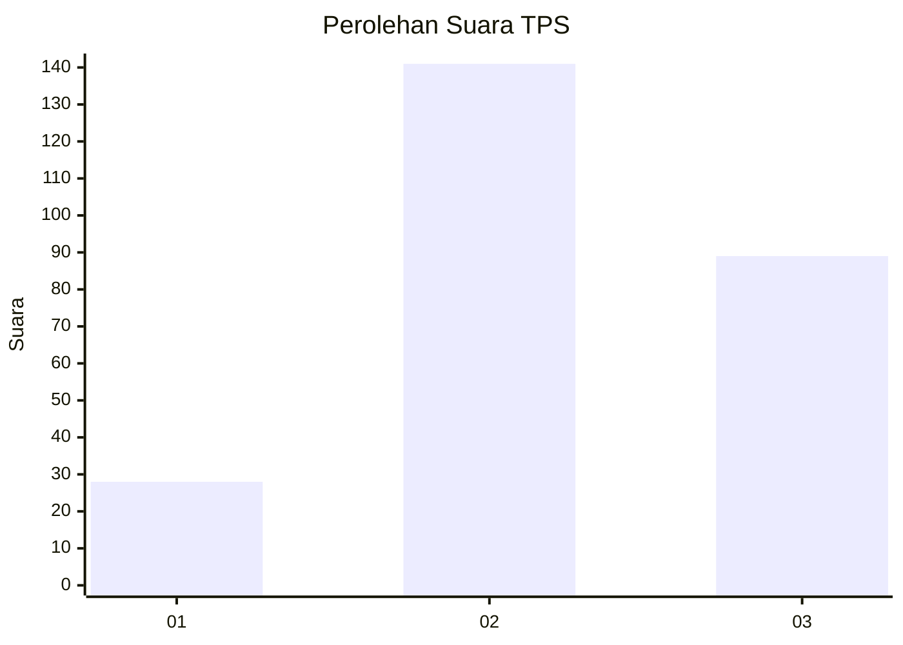
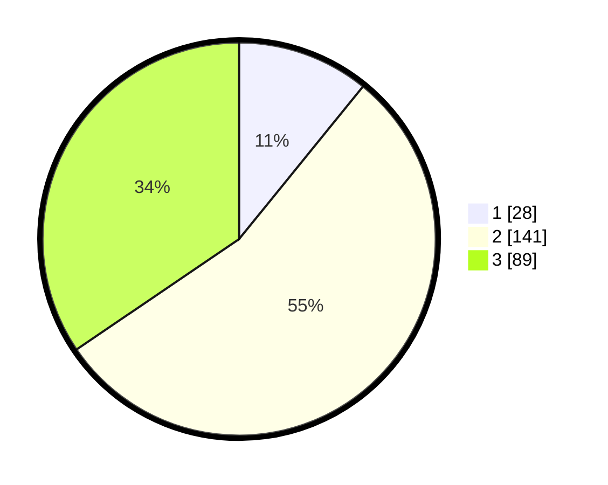

# Hasil

## Grafik

## Tabel

| No. | Nama Paslon    | Suara | Suara (raw) | Persentase |
|:--- |:-------------- | -----:| -----------:| ----------:|
| 1   | ANIES MUHAIMIN | 28    | [28][p-1]   | 10,85      |
| 2   | PRABOWO GIBRAN | 141   | [141][p-2]  | 54,65      |
| 3   | GANJAR MAHFUD  | 89    | [89][p-3]   | 34,50      |

[p-1]: https://github.com/gigit-pemilu/pemilu-2024/blob/main/pilpres/hitung-suara/sub/33-jawa-tengah/sub/74-kota-semarang/sub/06-pedurungan/sub/1006-plamongansari/sub/003-tps/sub/paslon-1.txt
[p-2]: https://github.com/gigit-pemilu/pemilu-2024/blob/main/pilpres/hitung-suara/sub/33-jawa-tengah/sub/74-kota-semarang/sub/06-pedurungan/sub/1006-plamongansari/sub/003-tps/sub/paslon-2.txt
[p-3]: https://github.com/gigit-pemilu/pemilu-2024/blob/main/pilpres/hitung-suara/sub/33-jawa-tengah/sub/74-kota-semarang/sub/06-pedurungan/sub/1006-plamongansari/sub/003-tps/sub/paslon-3.txt

## Foto C Plano

https://sirekap-obj-formc.kpu.go.id/a699/pemilu/ppwp/33/74/06/10/06/3374061006003-20240221-175813--5f4edee4-016e-430a-ad1b-1e55128c1116.jpg

https://sirekap-obj-formc.kpu.go.id/a699/pemilu/ppwp/33/74/06/10/06/3374061006003-20240221-180038--1015285d-28f4-40d8-b67a-b98498f1be34.jpg

https://sirekap-obj-formc.kpu.go.id/a699/pemilu/ppwp/33/74/06/10/06/3374061006003-20240214-233253--d8cc5dff-ab39-4e64-a4e3-6c0ad98cc39e.jpg

## Metadata

| Key        | Value               |
| ---------- | ------------------- |
| Time Stamp | 2024-02-24 22:31:28 |

