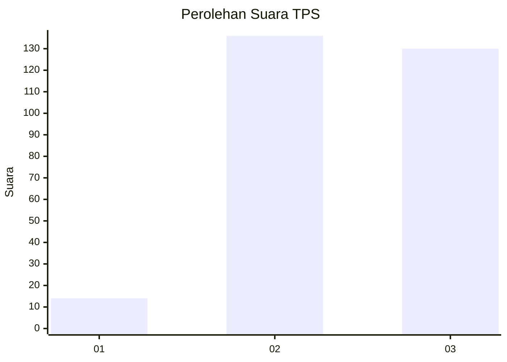
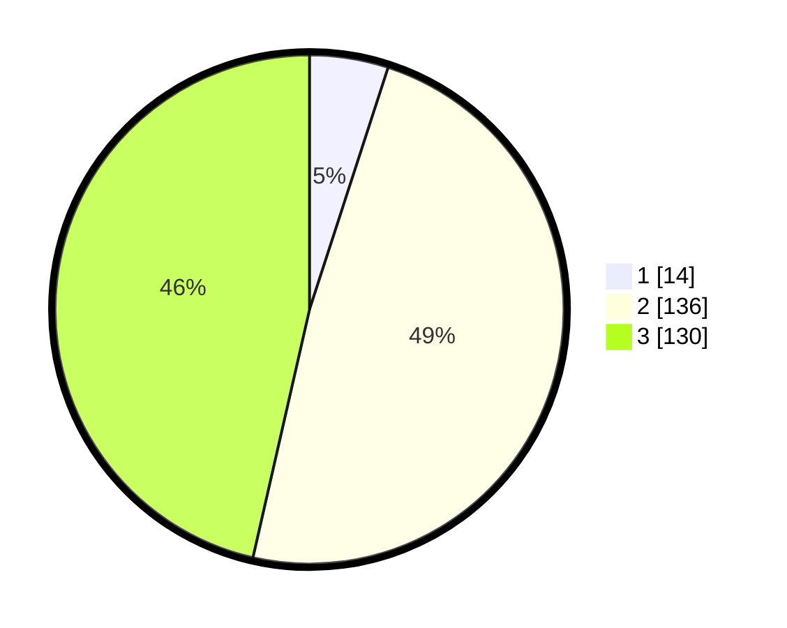

# Hasil

## Grafik

## Tabel

| No. | Nama Paslon    | Suara | Suara (raw) | Persentase |
|:--- |:-------------- | -----:| -----------:| ----------:|
| 1   | ANIES MUHAIMIN | 14    | [14][p-1]   | 5,00       |
| 2   | PRABOWO GIBRAN | 136   | [136][p-2]  | 48,57      |
| 3   | GANJAR MAHFUD  | 130   | [130][p-3]  | 46,43      |

[p-1]: https://github.com/gigit-pemilu/pemilu-2024-33-jawa-tengah/blob/main/pilpres/hitung-suara/sub/33-jawa-tengah/sub/74-kota-semarang/sub/06-pedurungan/sub/1007-gemah/sub/030-tps/sub/paslon-1.txt
[p-2]: https://github.com/gigit-pemilu/pemilu-2024-33-jawa-tengah/blob/main/pilpres/hitung-suara/sub/33-jawa-tengah/sub/74-kota-semarang/sub/06-pedurungan/sub/1007-gemah/sub/030-tps/sub/paslon-2.txt
[p-3]: https://github.com/gigit-pemilu/pemilu-2024-33-jawa-tengah/blob/main/pilpres/hitung-suara/sub/33-jawa-tengah/sub/74-kota-semarang/sub/06-pedurungan/sub/1007-gemah/sub/030-tps/sub/paslon-3.txt

## Foto C Plano

https://sirekap-obj-formc.kpu.go.id/deac/pemilu/ppwp/33/74/06/10/07/3374061007030-20240215-080730--eabd546e-8346-4c7a-85b4-46709e54f006.jpg

https://sirekap-obj-formc.kpu.go.id/deac/pemilu/ppwp/33/74/06/10/07/3374061007030-20240216-075800--d0b2368c-c8ec-4fa6-9147-e6d8991e1885.jpg

https://sirekap-obj-formc.kpu.go.id/deac/pemilu/ppwp/33/74/06/10/07/3374061007030-20240215-150107--6a618d85-5f4c-4b88-9079-e2c44f9256eb.jpg

## Metadata

| Key        | Value               |
| ---------- | ------------------- |
| Time Stamp | 2024-02-16 16:25:10 |

