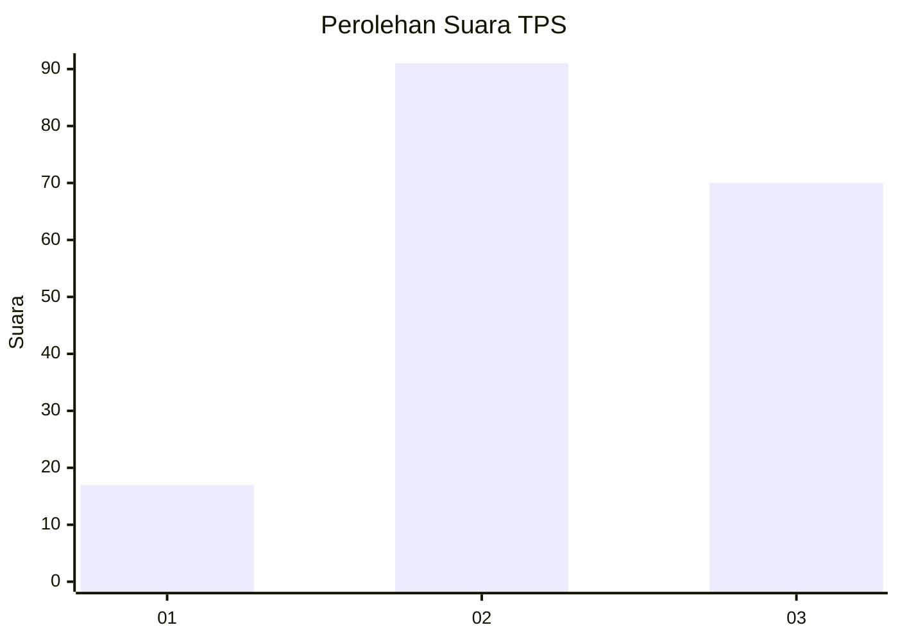
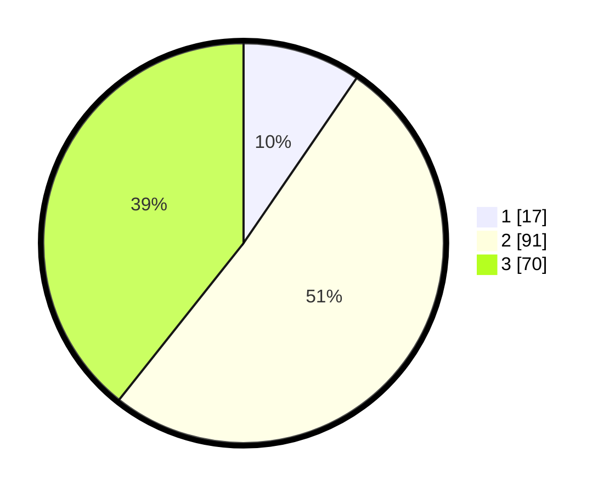

# Hasil

## Grafik

## Tabel

| No. | Nama Paslon    | Suara | Suara (raw) | Persentase |
|:--- |:-------------- | -----:| -----------:| ----------:|
| 1   | ANIES MUHAIMIN | 17    | [17][p-1]   | 9,55       |
| 2   | PRABOWO GIBRAN | 91    | [91][p-2]   | 51,12      |
| 3   | GANJAR MAHFUD  | 70    | [70][p-3]   | 39,33      |

[p-1]: https://github.com/gigit-pemilu/pemilu-2024/blob/main/pilpres/hitung-suara/sub/33-jawa-tengah/sub/74-kota-semarang/sub/07-semarang-selatan/sub/1001-randusari/sub/003-tps/sub/paslon-1.txt
[p-2]: https://github.com/gigit-pemilu/pemilu-2024/blob/main/pilpres/hitung-suara/sub/33-jawa-tengah/sub/74-kota-semarang/sub/07-semarang-selatan/sub/1001-randusari/sub/003-tps/sub/paslon-2.txt
[p-3]: https://github.com/gigit-pemilu/pemilu-2024/blob/main/pilpres/hitung-suara/sub/33-jawa-tengah/sub/74-kota-semarang/sub/07-semarang-selatan/sub/1001-randusari/sub/003-tps/sub/paslon-3.txt

## Foto C Plano

https://sirekap-obj-formc.kpu.go.id/6a47/pemilu/ppwp/33/74/07/10/01/3374071001003-20240215-005107--15266fb8-cb3d-4d1c-9420-2d7aa4a5923e.jpg

https://sirekap-obj-formc.kpu.go.id/6a47/pemilu/ppwp/33/74/07/10/01/3374071001003-20240215-005425--49773078-e958-4776-8fb3-a84ffba16591.jpg

https://sirekap-obj-formc.kpu.go.id/6a47/pemilu/ppwp/33/74/07/10/01/3374071001003-20240215-005326--a5476bb3-6634-4c12-b87a-7e06d613c2cb.jpg

## Metadata

| Key        | Value               |
| ---------- | ------------------- |
| Time Stamp | 2024-02-15 18:30:25 |

