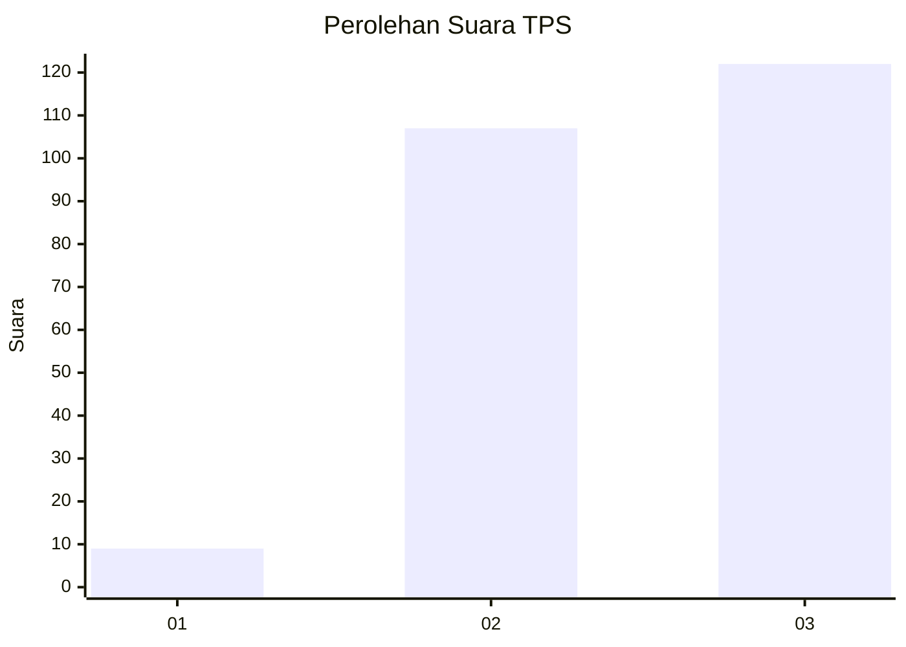
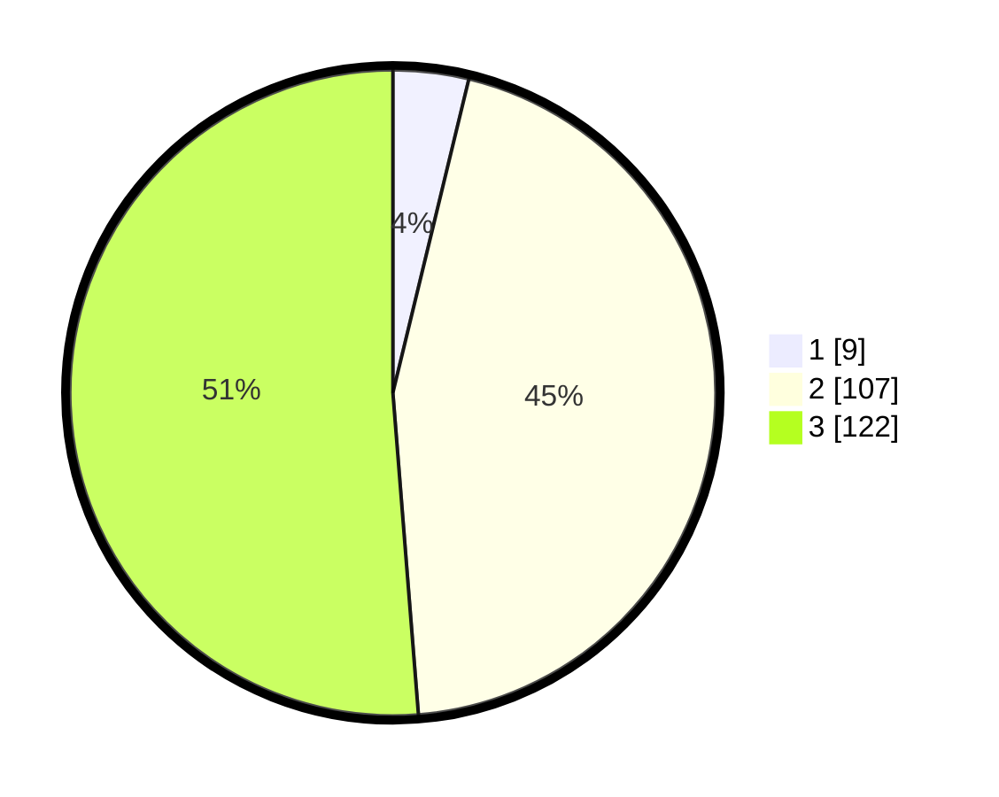

# Hasil

## Grafik

## Tabel

| No. | Nama Paslon    | Suara | Suara (raw) | Persentase |
|:--- |:-------------- | -----:| -----------:| ----------:|
| 1   | ANIES MUHAIMIN | 9     | [9][p-1]    | 3,78       |
| 2   | PRABOWO GIBRAN | 107   | [107][p-2]  | 44,96      |
| 3   | GANJAR MAHFUD  | 122   | [122][p-3]  | 51,26      |

[p-1]: https://github.com/gigit-pemilu/pemilu-2024-33-jawa-tengah/blob/main/pilpres/hitung-suara/sub/33-jawa-tengah/sub/74-kota-semarang/sub/07-semarang-selatan/sub/1001-randusari/sub/006-tps/sub/paslon-1.txt
[p-2]: https://github.com/gigit-pemilu/pemilu-2024-33-jawa-tengah/blob/main/pilpres/hitung-suara/sub/33-jawa-tengah/sub/74-kota-semarang/sub/07-semarang-selatan/sub/1001-randusari/sub/006-tps/sub/paslon-2.txt
[p-3]: https://github.com/gigit-pemilu/pemilu-2024-33-jawa-tengah/blob/main/pilpres/hitung-suara/sub/33-jawa-tengah/sub/74-kota-semarang/sub/07-semarang-selatan/sub/1001-randusari/sub/006-tps/sub/paslon-3.txt

## Foto C Plano

https://sirekap-obj-formc.kpu.go.id/09f9/pemilu/ppwp/33/74/07/10/01/3374071001006-20240215-001316--69a38293-2231-45c1-b724-54cb890a83fa.jpg

https://sirekap-obj-formc.kpu.go.id/09f9/pemilu/ppwp/33/74/07/10/01/3374071001006-20240214-193219--656c2673-c640-461d-b578-057a82fadc55.jpg

https://sirekap-obj-formc.kpu.go.id/09f9/pemilu/ppwp/33/74/07/10/01/3374071001006-20240214-193309--46eb6d1e-aae5-41c3-9683-d0417af58815.jpg

## Metadata

| Key        | Value               |
| ---------- | ------------------- |
| Time Stamp | 2024-02-15 12:00:28 |

