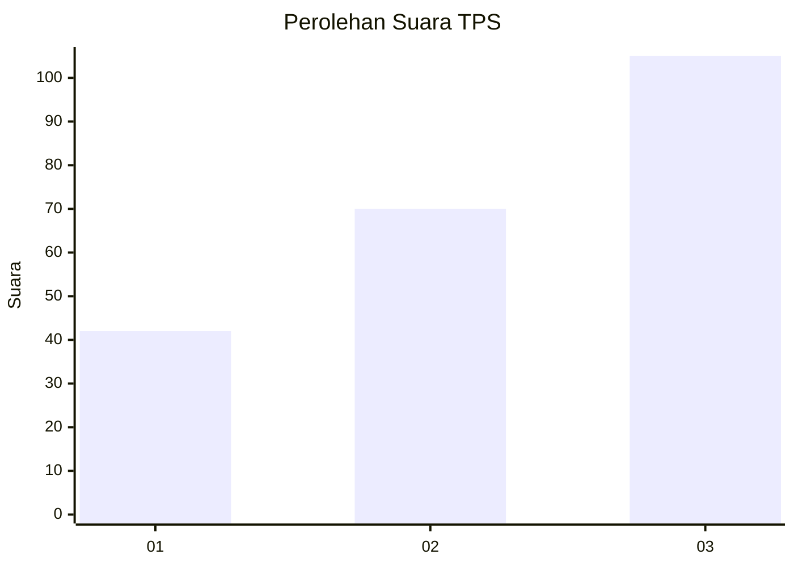
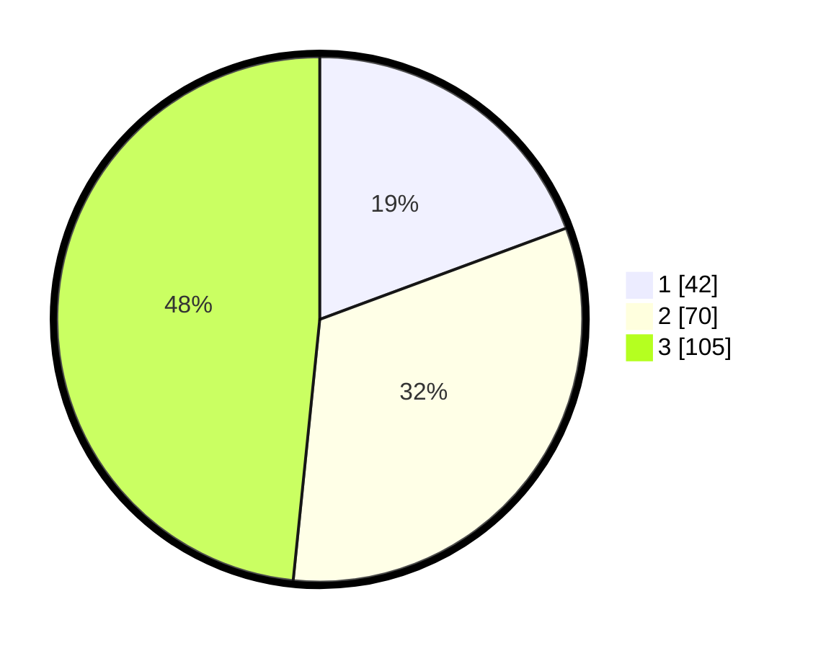

# Hasil

## Grafik

## Tabel

| No. | Nama Paslon    | Suara | Suara (raw) | Persentase |
|:--- |:-------------- | -----:| -----------:| ----------:|
| 1   | ANIES MUHAIMIN | 42    | [42][p-1]   | 19,35      |
| 2   | PRABOWO GIBRAN | 70    | [70][p-2]   | 32,26      |
| 3   | GANJAR MAHFUD  | 105   | [105][p-3]  | 48,39      |

[p-1]: https://github.com/gigit-pemilu/pemilu-2024/blob/main/pilpres/hitung-suara/sub/33-jawa-tengah/sub/74-kota-semarang/sub/07-semarang-selatan/sub/1004-mugasari/sub/004-tps/sub/paslon-1.txt
[p-2]: https://github.com/gigit-pemilu/pemilu-2024/blob/main/pilpres/hitung-suara/sub/33-jawa-tengah/sub/74-kota-semarang/sub/07-semarang-selatan/sub/1004-mugasari/sub/004-tps/sub/paslon-2.txt
[p-3]: https://github.com/gigit-pemilu/pemilu-2024/blob/main/pilpres/hitung-suara/sub/33-jawa-tengah/sub/74-kota-semarang/sub/07-semarang-selatan/sub/1004-mugasari/sub/004-tps/sub/paslon-3.txt

## Foto C Plano

https://sirekap-obj-formc.kpu.go.id/073f/pemilu/ppwp/33/74/07/10/04/3374071004004-20240214-214754--50d32f6d-a9f4-4a38-ac5e-b0c645f6e128.jpg

https://sirekap-obj-formc.kpu.go.id/073f/pemilu/ppwp/33/74/07/10/04/3374071004004-20240215-045434--87c56af3-809d-4f9a-ae10-f2be86b72243.jpg

https://sirekap-obj-formc.kpu.go.id/073f/pemilu/ppwp/33/74/07/10/04/3374071004004-20240215-045622--90779ce3-59f3-41ac-8f53-dd4bd835c7e3.jpg

## Metadata

| Key        | Value               |
| ---------- | ------------------- |
| Time Stamp | 2024-02-15 20:00:44 |

