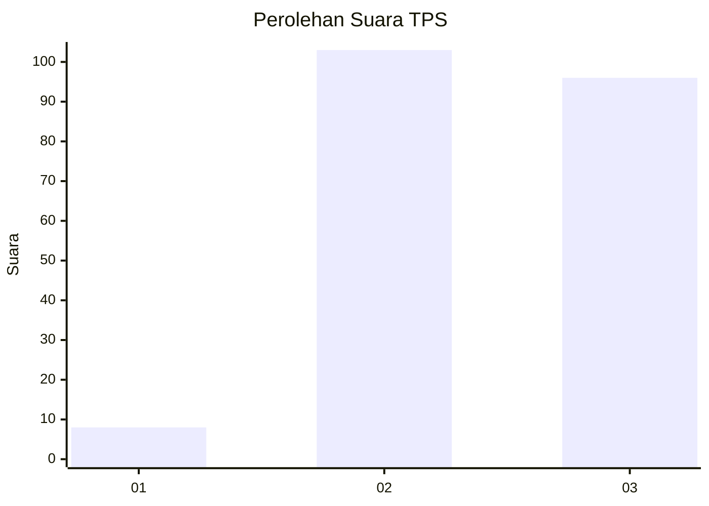
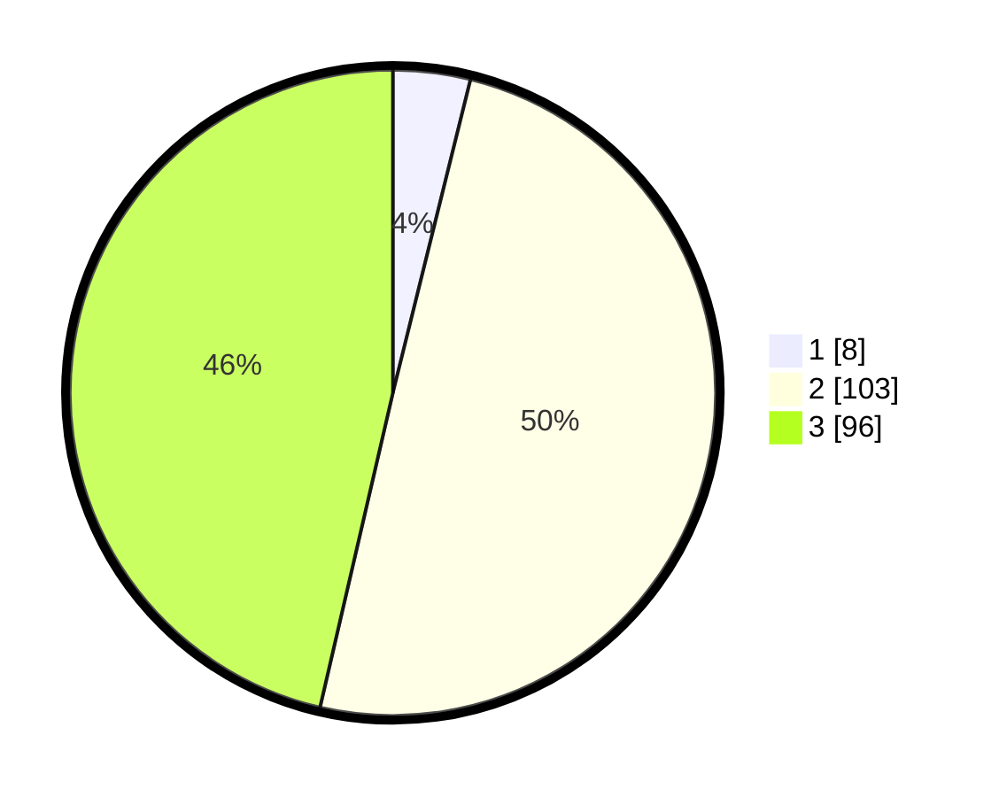

# Hasil

## Grafik

## Tabel

| No. | Nama Paslon    | Suara | Suara (raw) | Persentase |
|:--- |:-------------- | -----:| -----------:| ----------:|
| 1   | ANIES MUHAIMIN | 8     | [8][p-1]    | 3,86       |
| 2   | PRABOWO GIBRAN | 103   | [103][p-2]  | 49,76      |
| 3   | GANJAR MAHFUD  | 96    | [96][p-3]   | 46,38      |

[p-1]: https://github.com/gigit-pemilu/pemilu-2024/blob/main/pilpres/hitung-suara/sub/33-jawa-tengah/sub/74-kota-semarang/sub/08-candisari/sub/1001-candi/sub/003-tps/sub/paslon-1.txt
[p-2]: https://github.com/gigit-pemilu/pemilu-2024/blob/main/pilpres/hitung-suara/sub/33-jawa-tengah/sub/74-kota-semarang/sub/08-candisari/sub/1001-candi/sub/003-tps/sub/paslon-2.txt
[p-3]: https://github.com/gigit-pemilu/pemilu-2024/blob/main/pilpres/hitung-suara/sub/33-jawa-tengah/sub/74-kota-semarang/sub/08-candisari/sub/1001-candi/sub/003-tps/sub/paslon-3.txt

## Foto C Plano

https://sirekap-obj-formc.kpu.go.id/7880/pemilu/ppwp/33/74/08/10/01/3374081001003-20240214-235616--58ca21fd-0362-48d0-ab7f-90ae86ba548e.jpg

https://sirekap-obj-formc.kpu.go.id/7880/pemilu/ppwp/33/74/08/10/01/3374081001003-20240214-235652--524bced3-e831-45c8-98ed-d57a413fe54a.jpg

https://sirekap-obj-formc.kpu.go.id/7880/pemilu/ppwp/33/74/08/10/01/3374081001003-20240214-235741--d3eacbc7-9883-473f-8ce7-671c23133bec.jpg

## Metadata

| Key        | Value               |
| ---------- | ------------------- |
| Time Stamp | 2024-02-15 23:29:50 |

