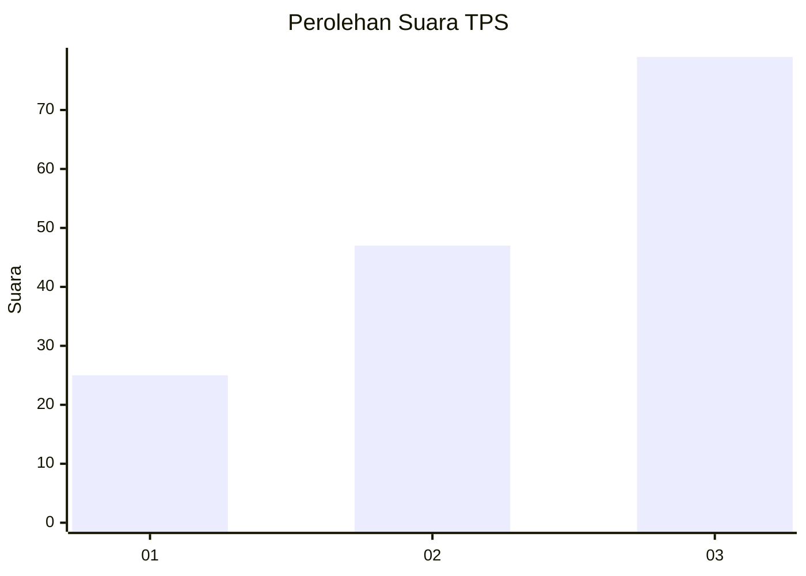
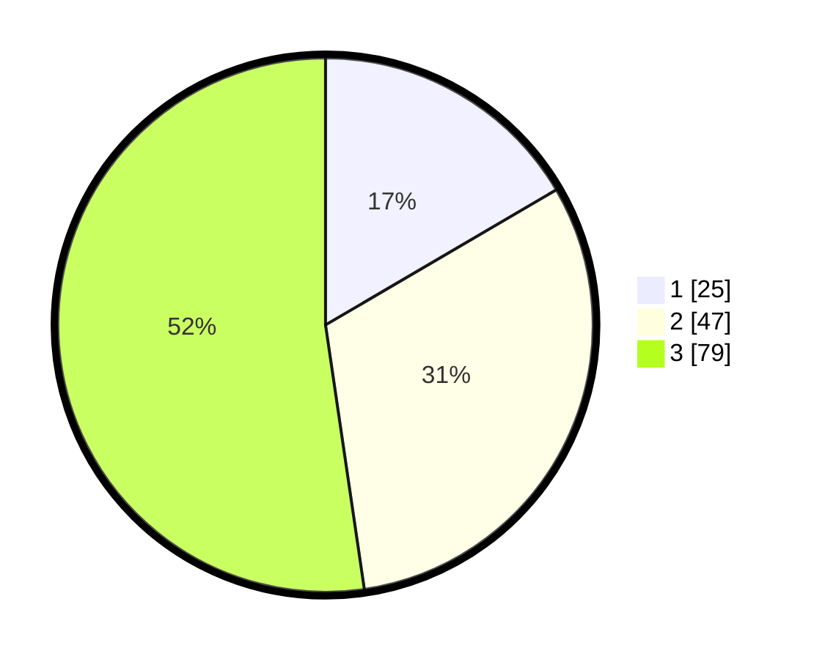

# Hasil

## Grafik

## Tabel

| No. | Nama Paslon    | Suara | Suara (raw) | Persentase |
|:--- |:-------------- | -----:| -----------:| ----------:|
| 1   | ANIES MUHAIMIN | 25    | [25][p-1]   | 16,56      |
| 2   | PRABOWO GIBRAN | 47    | [47][p-2]   | 31,13      |
| 3   | GANJAR MAHFUD  | 79    | [79][p-3]   | 52,32      |

[p-1]: https://github.com/gigit-pemilu/pemilu-2024-33-jawa-tengah/blob/main/pilpres/hitung-suara/sub/33-jawa-tengah/sub/74-kota-semarang/sub/08-candisari/sub/1001-candi/sub/010-tps/sub/paslon-1.txt
[p-2]: https://github.com/gigit-pemilu/pemilu-2024-33-jawa-tengah/blob/main/pilpres/hitung-suara/sub/33-jawa-tengah/sub/74-kota-semarang/sub/08-candisari/sub/1001-candi/sub/010-tps/sub/paslon-2.txt
[p-3]: https://github.com/gigit-pemilu/pemilu-2024-33-jawa-tengah/blob/main/pilpres/hitung-suara/sub/33-jawa-tengah/sub/74-kota-semarang/sub/08-candisari/sub/1001-candi/sub/010-tps/sub/paslon-3.txt

## Foto C Plano

https://sirekap-obj-formc.kpu.go.id/96c5/pemilu/ppwp/33/74/08/10/01/3374081001010-20240214-224940--1dec90e5-06ef-4e6a-bb0c-fdf953e01b0e.jpg

https://sirekap-obj-formc.kpu.go.id/96c5/pemilu/ppwp/33/74/08/10/01/3374081001010-20240214-225053--f45b0e64-a34e-4ab0-a323-b83d0beb863c.jpg

https://sirekap-obj-formc.kpu.go.id/96c5/pemilu/ppwp/33/74/08/10/01/3374081001010-20240214-225121--59858f4a-ba13-46aa-8c17-ba57900ea19e.jpg

## Metadata

| Key        | Value               |
| ---------- | ------------------- |
| Time Stamp | 2024-02-16 12:51:22 |

