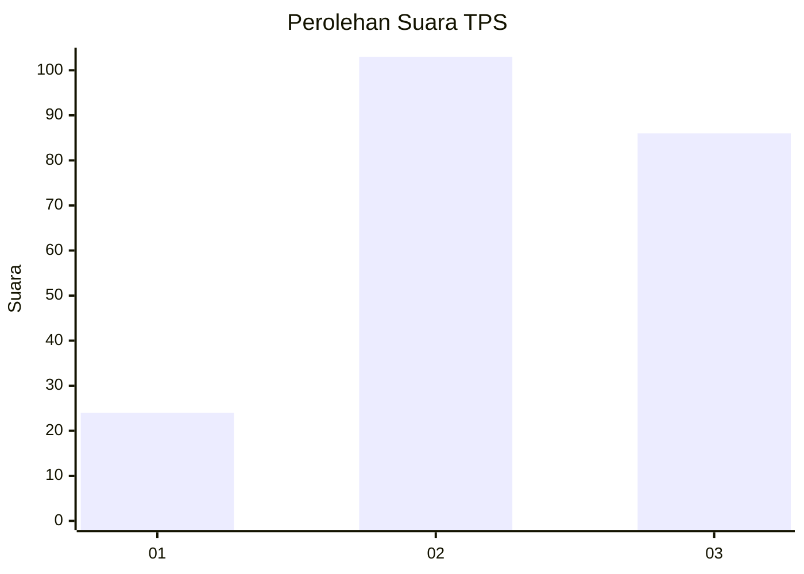
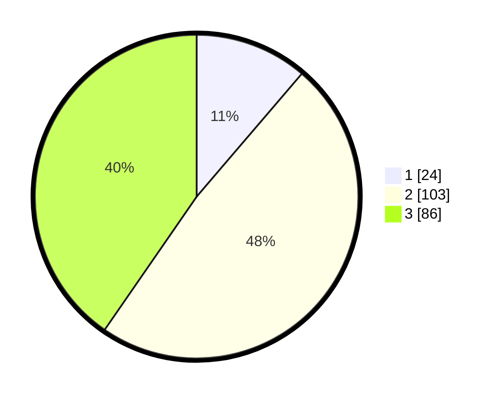

# Hasil

## Grafik

## Tabel

| No. | Nama Paslon    | Suara | Suara (raw) | Persentase |
|:--- |:-------------- | -----:| -----------:| ----------:|
| 1   | ANIES MUHAIMIN | 24    | [24][p-1]   | 11,27      |
| 2   | PRABOWO GIBRAN | 103   | [103][p-2]  | 48,36      |
| 3   | GANJAR MAHFUD  | 86    | [86][p-3]   | 40,38      |

[p-1]: https://github.com/gigit-pemilu/pemilu-2024-33-jawa-tengah/blob/main/pilpres/hitung-suara/sub/33-jawa-tengah/sub/74-kota-semarang/sub/08-candisari/sub/1001-candi/sub/012-tps/sub/paslon-1.txt
[p-2]: https://github.com/gigit-pemilu/pemilu-2024-33-jawa-tengah/blob/main/pilpres/hitung-suara/sub/33-jawa-tengah/sub/74-kota-semarang/sub/08-candisari/sub/1001-candi/sub/012-tps/sub/paslon-2.txt
[p-3]: https://github.com/gigit-pemilu/pemilu-2024-33-jawa-tengah/blob/main/pilpres/hitung-suara/sub/33-jawa-tengah/sub/74-kota-semarang/sub/08-candisari/sub/1001-candi/sub/012-tps/sub/paslon-3.txt

## Foto C Plano

https://sirekap-obj-formc.kpu.go.id/5b75/pemilu/ppwp/33/74/08/10/01/3374081001012-20240214-221908--7e1e0050-22de-4808-9302-f2fc49978faf.jpg

https://sirekap-obj-formc.kpu.go.id/5b75/pemilu/ppwp/33/74/08/10/01/3374081001012-20240214-222049--8ba907ff-7eb9-4467-93bb-0e98755faf62.jpg

https://sirekap-obj-formc.kpu.go.id/5b75/pemilu/ppwp/33/74/08/10/01/3374081001012-20240214-222643--4f613157-9cd1-4ae6-a492-2969a8a36cb4.jpg

## Metadata

| Key        | Value               |
| ---------- | ------------------- |
| Time Stamp | 2024-02-15 23:29:50 |

