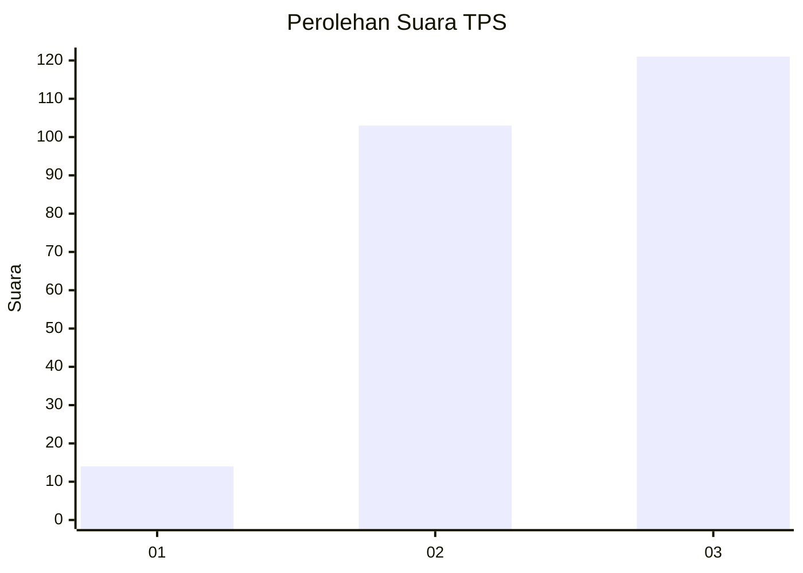
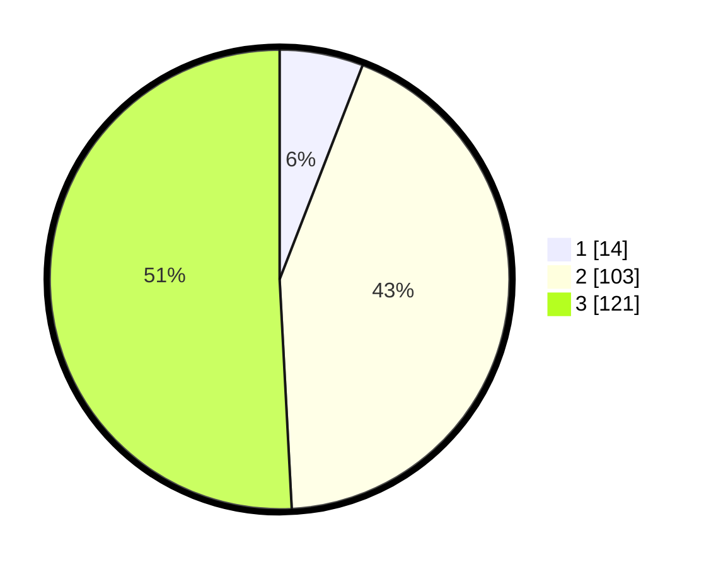

# Hasil

## Grafik

## Tabel

| No. | Nama Paslon    | Suara | Suara (raw) | Persentase |
|:--- |:-------------- | -----:| -----------:| ----------:|
| 1   | ANIES MUHAIMIN | 14    | [14][p-1]   | 5,88       |
| 2   | PRABOWO GIBRAN | 103   | [103][p-2]  | 43,28      |
| 3   | GANJAR MAHFUD  | 121   | [121][p-3]  | 50,84      |

[p-1]: https://github.com/gigit-pemilu/pemilu-2024-33-jawa-tengah/blob/main/pilpres/hitung-suara/sub/33-jawa-tengah/sub/74-kota-semarang/sub/08-candisari/sub/1001-candi/sub/020-tps/sub/paslon-1.txt
[p-2]: https://github.com/gigit-pemilu/pemilu-2024-33-jawa-tengah/blob/main/pilpres/hitung-suara/sub/33-jawa-tengah/sub/74-kota-semarang/sub/08-candisari/sub/1001-candi/sub/020-tps/sub/paslon-2.txt
[p-3]: https://github.com/gigit-pemilu/pemilu-2024-33-jawa-tengah/blob/main/pilpres/hitung-suara/sub/33-jawa-tengah/sub/74-kota-semarang/sub/08-candisari/sub/1001-candi/sub/020-tps/sub/paslon-3.txt

## Foto C Plano

https://sirekap-obj-formc.kpu.go.id/49b3/pemilu/ppwp/33/74/08/10/01/3374081001020-20240215-011905--e81fb996-dc78-427b-ad20-1cd227b25f84.jpg

https://sirekap-obj-formc.kpu.go.id/49b3/pemilu/ppwp/33/74/08/10/01/3374081001020-20240215-021332--f098378f-b58b-447c-b0f2-43531f26b269.jpg

https://sirekap-obj-formc.kpu.go.id/49b3/pemilu/ppwp/33/74/08/10/01/3374081001020-20240215-012103--8b3a080c-ae53-4f0f-b116-498cbd4bef75.jpg

## Metadata

| Key        | Value               |
| ---------- | ------------------- |
| Time Stamp | 2024-02-15 23:29:50 |

