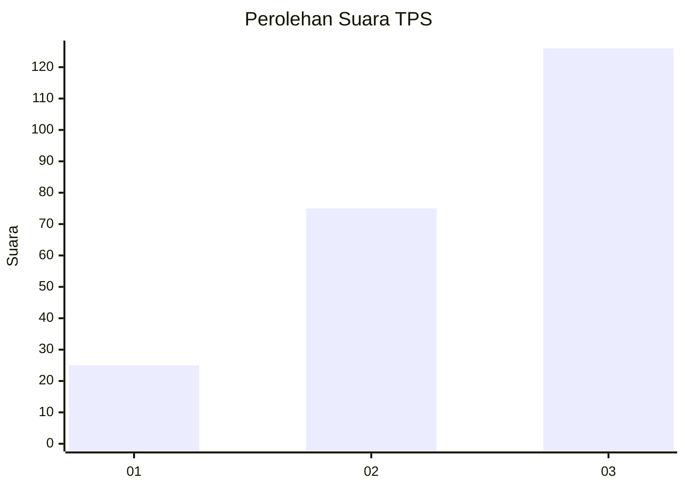
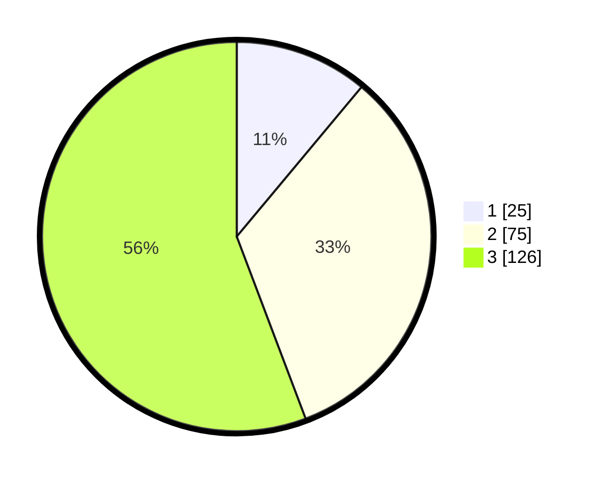

# Hasil

## Grafik

## Tabel

| No. | Nama Paslon    | Suara | Suara (raw) | Persentase |
|:--- |:-------------- | -----:| -----------:| ----------:|
| 1   | ANIES MUHAIMIN | 25    | [25][p-1]   | 11,06      |
| 2   | PRABOWO GIBRAN | 75    | [75][p-2]   | 33,19      |
| 3   | GANJAR MAHFUD  | 126   | [126][p-3]  | 55,75      |

[p-1]: https://github.com/gigit-pemilu/pemilu-2024/blob/main/pilpres/hitung-suara/sub/33-jawa-tengah/sub/74-kota-semarang/sub/08-candisari/sub/1002-jatingaleh/sub/001-tps/sub/paslon-1.txt
[p-2]: https://github.com/gigit-pemilu/pemilu-2024/blob/main/pilpres/hitung-suara/sub/33-jawa-tengah/sub/74-kota-semarang/sub/08-candisari/sub/1002-jatingaleh/sub/001-tps/sub/paslon-2.txt
[p-3]: https://github.com/gigit-pemilu/pemilu-2024/blob/main/pilpres/hitung-suara/sub/33-jawa-tengah/sub/74-kota-semarang/sub/08-candisari/sub/1002-jatingaleh/sub/001-tps/sub/paslon-3.txt

## Foto C Plano

https://sirekap-obj-formc.kpu.go.id/11de/pemilu/ppwp/33/74/08/10/02/3374081002001-20240214-225804--67518a44-3bb0-4daf-b7be-19594fe68c35.jpg

https://sirekap-obj-formc.kpu.go.id/11de/pemilu/ppwp/33/74/08/10/02/3374081002001-20240214-230013--92904bc0-3585-478b-bdde-ad60154d2979.jpg

https://sirekap-obj-formc.kpu.go.id/11de/pemilu/ppwp/33/74/08/10/02/3374081002001-20240214-230237--254ed487-3a5f-4da7-9833-4b6280faec25.jpg

## Metadata

| Key        | Value               |
| ---------- | ------------------- |
| Time Stamp | 2024-02-15 23:29:50 |

