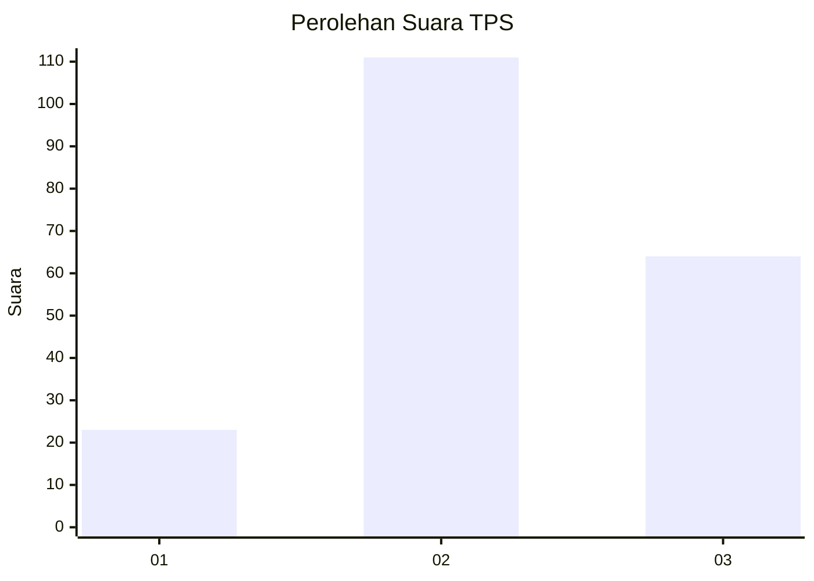
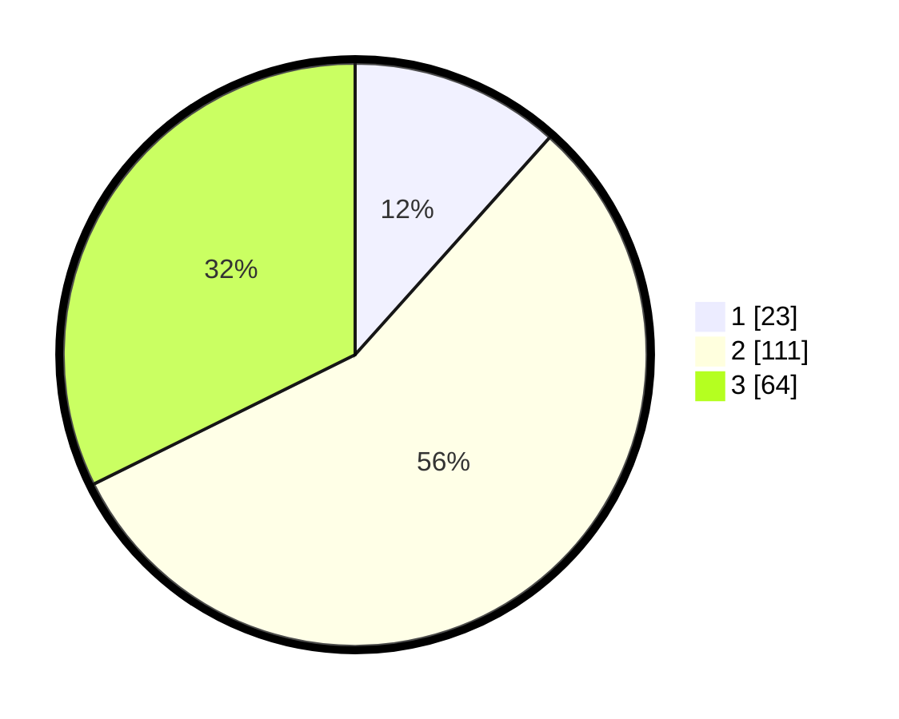

# Hasil

## Grafik

## Tabel

| No. | Nama Paslon    | Suara | Suara (raw) | Persentase |
|:--- |:-------------- | -----:| -----------:| ----------:|
| 1   | ANIES MUHAIMIN | 23    | [23][p-1]   | 11,62      |
| 2   | PRABOWO GIBRAN | 111   | [111][p-2]  | 56,06      |
| 3   | GANJAR MAHFUD  | 64    | [64][p-3]   | 32,32      |

[p-1]: https://github.com/gigit-pemilu/pemilu-2024/blob/main/pilpres/hitung-suara/sub/33-jawa-tengah/sub/74-kota-semarang/sub/09-gajahmungkur/sub/1001-karangrejo/sub/010-tps/sub/paslon-1.txt
[p-2]: https://github.com/gigit-pemilu/pemilu-2024/blob/main/pilpres/hitung-suara/sub/33-jawa-tengah/sub/74-kota-semarang/sub/09-gajahmungkur/sub/1001-karangrejo/sub/010-tps/sub/paslon-2.txt
[p-3]: https://github.com/gigit-pemilu/pemilu-2024/blob/main/pilpres/hitung-suara/sub/33-jawa-tengah/sub/74-kota-semarang/sub/09-gajahmungkur/sub/1001-karangrejo/sub/010-tps/sub/paslon-3.txt

## Foto C Plano

https://sirekap-obj-formc.kpu.go.id/2bea/pemilu/ppwp/33/74/09/10/01/3374091001010-20240215-002519--147340a6-4f7e-4188-ac12-748a9899ccdc.jpg

https://sirekap-obj-formc.kpu.go.id/2bea/pemilu/ppwp/33/74/09/10/01/3374091001010-20240215-002615--0b9166c8-b57d-440d-9dca-72970e398fe3.jpg

https://sirekap-obj-formc.kpu.go.id/2bea/pemilu/ppwp/33/74/09/10/01/3374091001010-20240215-002643--c1ac5a55-82ab-479d-b329-f9461041bad1.jpg

## Metadata

| Key        | Value               |
| ---------- | ------------------- |
| Time Stamp | 2024-02-16 14:30:33 |

