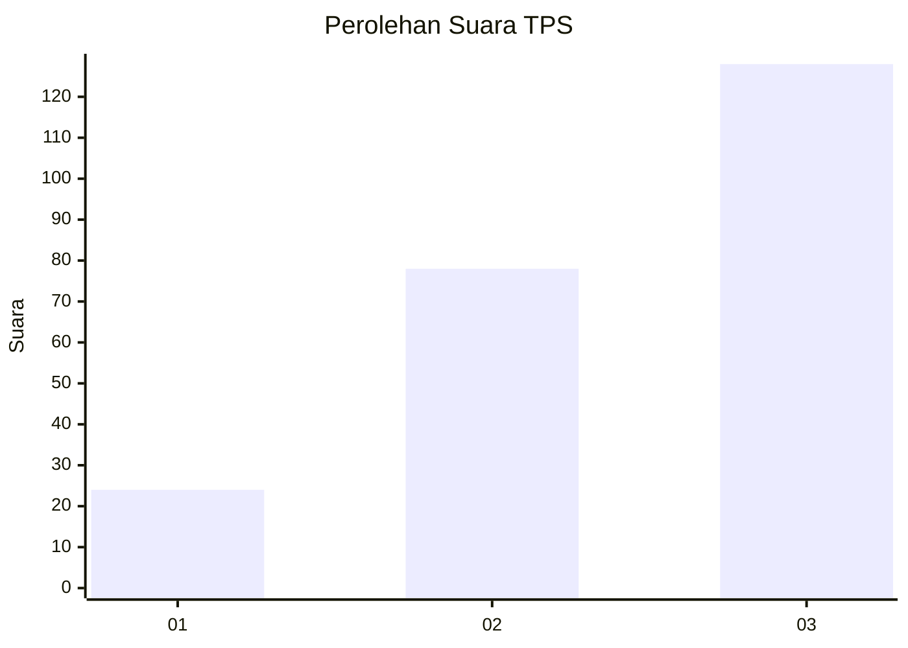
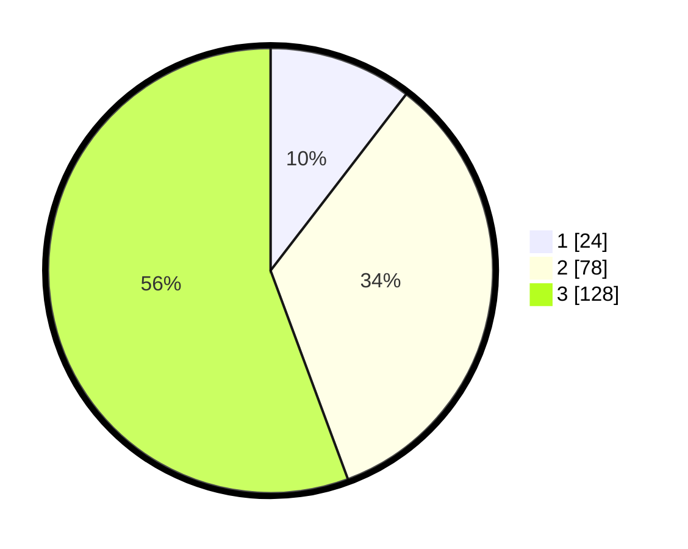

# Hasil

## Grafik

## Tabel

| No. | Nama Paslon    | Suara | Suara (raw) | Persentase |
|:--- |:-------------- | -----:| -----------:| ----------:|
| 1   | ANIES MUHAIMIN | 24    | [24][p-1]   | 10,43      |
| 2   | PRABOWO GIBRAN | 78    | [78][p-2]   | 33,91      |
| 3   | GANJAR MAHFUD  | 128   | [128][p-3]  | 55,65      |

[p-1]: https://github.com/gigit-pemilu/pemilu-2024/blob/main/pilpres/hitung-suara/sub/33-jawa-tengah/sub/74-kota-semarang/sub/09-gajahmungkur/sub/1006-lempongsari/sub/003-tps/sub/paslon-1.txt
[p-2]: https://github.com/gigit-pemilu/pemilu-2024/blob/main/pilpres/hitung-suara/sub/33-jawa-tengah/sub/74-kota-semarang/sub/09-gajahmungkur/sub/1006-lempongsari/sub/003-tps/sub/paslon-2.txt
[p-3]: https://github.com/gigit-pemilu/pemilu-2024/blob/main/pilpres/hitung-suara/sub/33-jawa-tengah/sub/74-kota-semarang/sub/09-gajahmungkur/sub/1006-lempongsari/sub/003-tps/sub/paslon-3.txt

## Foto C Plano

https://sirekap-obj-formc.kpu.go.id/2a78/pemilu/ppwp/33/74/09/10/06/3374091006003-20240214-205101--81decd79-69b4-4d31-903a-ea3257a36028.jpg

https://sirekap-obj-formc.kpu.go.id/2a78/pemilu/ppwp/33/74/09/10/06/3374091006003-20240214-200918--ddba76c0-77a7-468e-bd21-6b0d4c4b5213.jpg

https://sirekap-obj-formc.kpu.go.id/2a78/pemilu/ppwp/33/74/09/10/06/3374091006003-20240214-205302--a60e1a10-126f-4e9c-813e-c02c42542c69.jpg

## Metadata

| Key        | Value               |
| ---------- | ------------------- |
| Time Stamp | 2024-02-17 14:45:18 |

