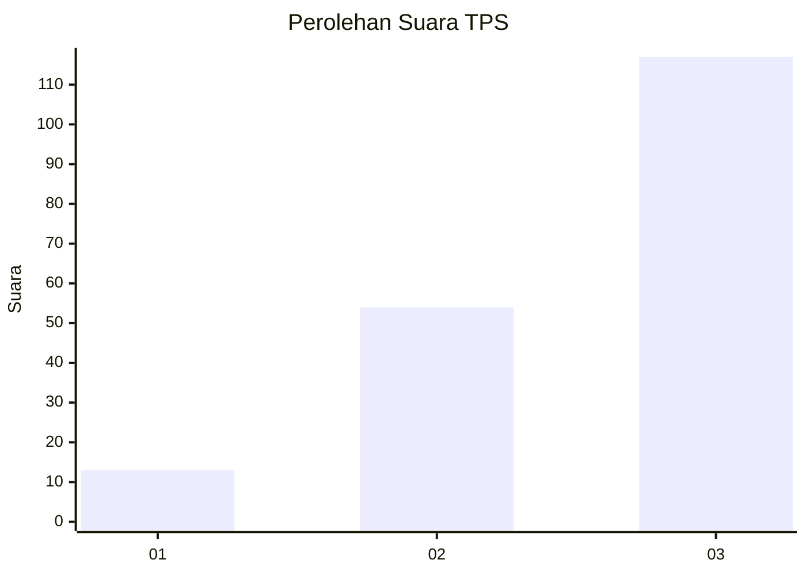
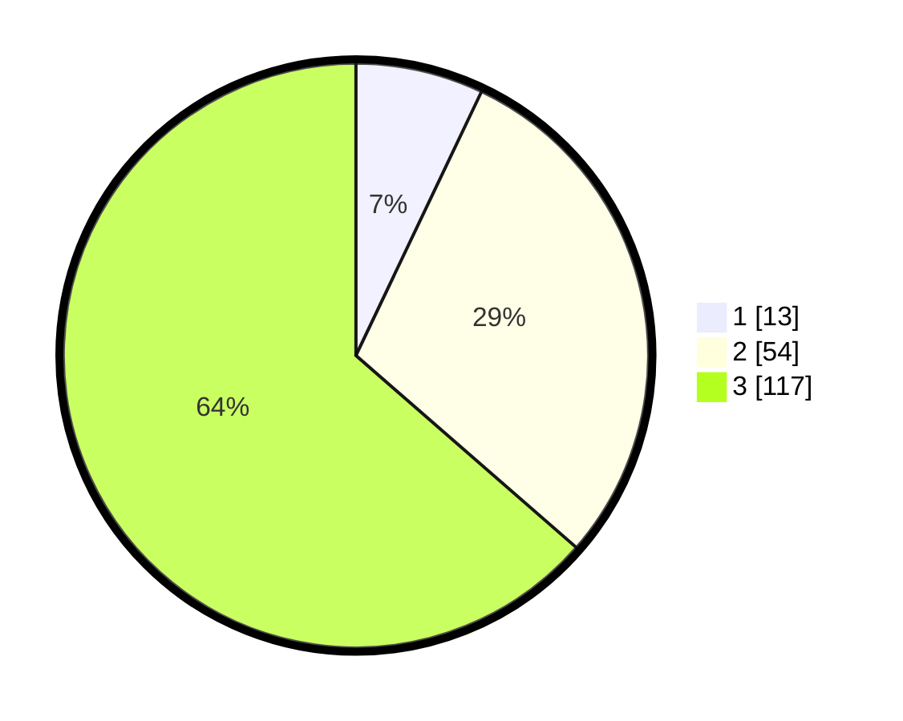

# Hasil

## Grafik

## Tabel

| No. | Nama Paslon    | Suara | Suara (raw) | Persentase |
|:--- |:-------------- | -----:| -----------:| ----------:|
| 1   | ANIES MUHAIMIN | 13    | [13][p-1]   | 7,07       |
| 2   | PRABOWO GIBRAN | 54    | [54][p-2]   | 29,35      |
| 3   | GANJAR MAHFUD  | 117   | [117][p-3]  | 63,59      |

[p-1]: https://github.com/gigit-pemilu/pemilu-2024/blob/main/pilpres/hitung-suara/sub/33-jawa-tengah/sub/74-kota-semarang/sub/09-gajahmungkur/sub/1006-lempongsari/sub/009-tps/sub/paslon-1.txt
[p-2]: https://github.com/gigit-pemilu/pemilu-2024/blob/main/pilpres/hitung-suara/sub/33-jawa-tengah/sub/74-kota-semarang/sub/09-gajahmungkur/sub/1006-lempongsari/sub/009-tps/sub/paslon-2.txt
[p-3]: https://github.com/gigit-pemilu/pemilu-2024/blob/main/pilpres/hitung-suara/sub/33-jawa-tengah/sub/74-kota-semarang/sub/09-gajahmungkur/sub/1006-lempongsari/sub/009-tps/sub/paslon-3.txt

## Foto C Plano

https://sirekap-obj-formc.kpu.go.id/ddb8/pemilu/ppwp/33/74/09/10/06/3374091006009-20240215-002658--390b623b-7560-41b5-b2f0-0aa361056795.jpg

https://sirekap-obj-formc.kpu.go.id/ddb8/pemilu/ppwp/33/74/09/10/06/3374091006009-20240215-002808--fce77ea7-4971-4def-a60a-f58e7161bf41.jpg

https://sirekap-obj-formc.kpu.go.id/ddb8/pemilu/ppwp/33/74/09/10/06/3374091006009-20240215-003023--6a837782-26f2-41f5-986d-2a8155b69ca1.jpg

## Metadata

| Key        | Value               |
| ---------- | ------------------- |
| Time Stamp | 2024-02-16 00:00:26 |

