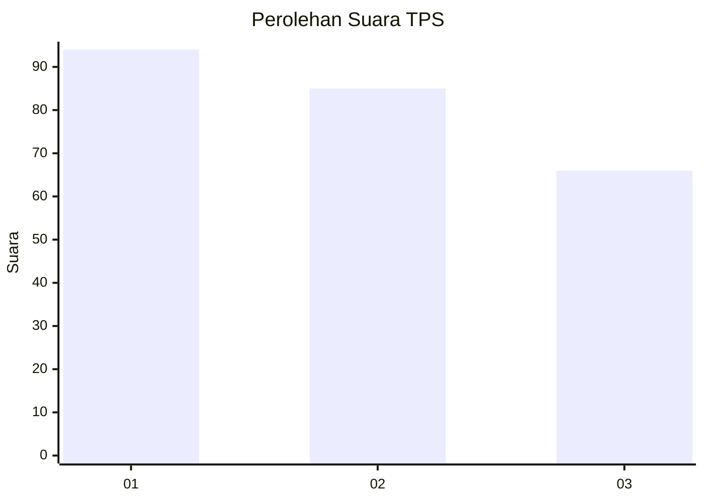
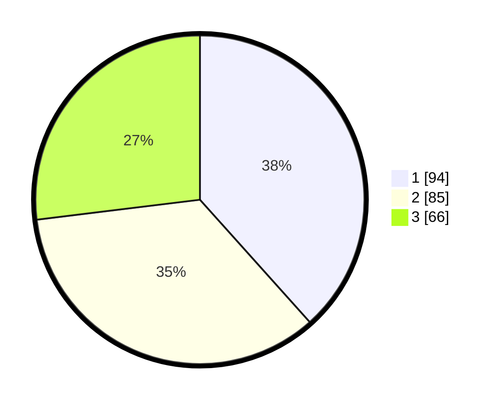

# Hasil

## Grafik

## Tabel

| No. | Nama Paslon    | Suara | Suara (raw) | Persentase |
|:--- |:-------------- | -----:| -----------:| ----------:|
| 1   | ANIES MUHAIMIN | 94    | [94][p-1]   | 38,37      |
| 2   | PRABOWO GIBRAN | 85    | [85][p-2]   | 34,69      |
| 3   | GANJAR MAHFUD  | 66    | [66][p-3]   | 26,94      |

[p-1]: https://github.com/gigit-pemilu/pemilu-2024/blob/main/pilpres/hitung-suara/sub/33-jawa-tengah/sub/74-kota-semarang/sub/10-tembalang/sub/1001-meteseh/sub/050-tps/sub/paslon-1.txt
[p-2]: https://github.com/gigit-pemilu/pemilu-2024/blob/main/pilpres/hitung-suara/sub/33-jawa-tengah/sub/74-kota-semarang/sub/10-tembalang/sub/1001-meteseh/sub/050-tps/sub/paslon-2.txt
[p-3]: https://github.com/gigit-pemilu/pemilu-2024/blob/main/pilpres/hitung-suara/sub/33-jawa-tengah/sub/74-kota-semarang/sub/10-tembalang/sub/1001-meteseh/sub/050-tps/sub/paslon-3.txt

## Foto C Plano

https://sirekap-obj-formc.kpu.go.id/728d/pemilu/ppwp/33/74/10/10/01/3374101001050-20240214-235701--4bd95ba0-9800-42f1-9618-ffc337b2c695.jpg

https://sirekap-obj-formc.kpu.go.id/728d/pemilu/ppwp/33/74/10/10/01/3374101001050-20240214-235451--7cc6c9ab-d96a-4253-b62c-97b0c5136a1a.jpg

https://sirekap-obj-formc.kpu.go.id/728d/pemilu/ppwp/33/74/10/10/01/3374101001050-20240214-223651--f0d4adc8-a4db-4065-a896-1595b6e2563c.jpg

## Metadata

| Key        | Value               |
| ---------- | ------------------- |
| Time Stamp | 2024-02-16 14:30:33 |

