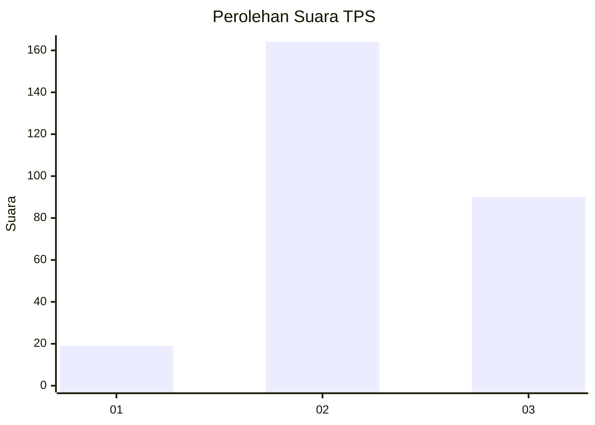
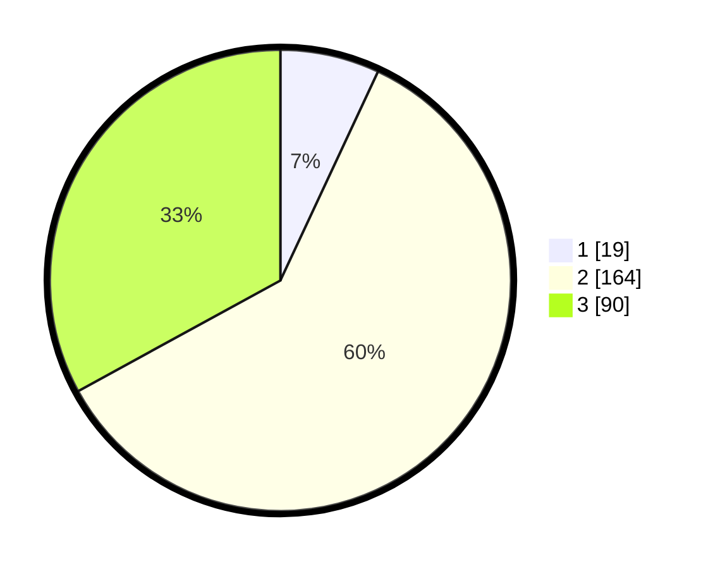

# Hasil

## Grafik

## Tabel

| No. | Nama Paslon    | Suara | Suara (raw) | Persentase |
|:--- |:-------------- | -----:| -----------:| ----------:|
| 1   | ANIES MUHAIMIN | 19    | [19][p-1]   | 6,96       |
| 2   | PRABOWO GIBRAN | 164   | [164][p-2]  | 60,07      |
| 3   | GANJAR MAHFUD  | 90    | [90][p-3]   | 32,97      |

[p-1]: https://github.com/gigit-pemilu/pemilu-2024/blob/main/pilpres/hitung-suara/sub/33-jawa-tengah/sub/74-kota-semarang/sub/10-tembalang/sub/1002-rowosari/sub/025-tps/sub/paslon-1.txt
[p-2]: https://github.com/gigit-pemilu/pemilu-2024/blob/main/pilpres/hitung-suara/sub/33-jawa-tengah/sub/74-kota-semarang/sub/10-tembalang/sub/1002-rowosari/sub/025-tps/sub/paslon-2.txt
[p-3]: https://github.com/gigit-pemilu/pemilu-2024/blob/main/pilpres/hitung-suara/sub/33-jawa-tengah/sub/74-kota-semarang/sub/10-tembalang/sub/1002-rowosari/sub/025-tps/sub/paslon-3.txt

## Foto C Plano

https://sirekap-obj-formc.kpu.go.id/d278/pemilu/ppwp/33/74/10/10/02/3374101002025-20240215-014402--53a3d713-907d-4467-95b5-24812a9487fe.jpg

https://sirekap-obj-formc.kpu.go.id/d278/pemilu/ppwp/33/74/10/10/02/3374101002025-20240215-014644--58c4b698-997a-4c5c-83d1-27ee5a79aaa7.jpg

https://sirekap-obj-formc.kpu.go.id/d278/pemilu/ppwp/33/74/10/10/02/3374101002025-20240215-023246--b9aa598b-f4fa-45d4-b06a-d2c29b89688b.jpg

## Metadata

| Key        | Value               |
| ---------- | ------------------- |
| Time Stamp | 2024-02-16 14:30:33 |

