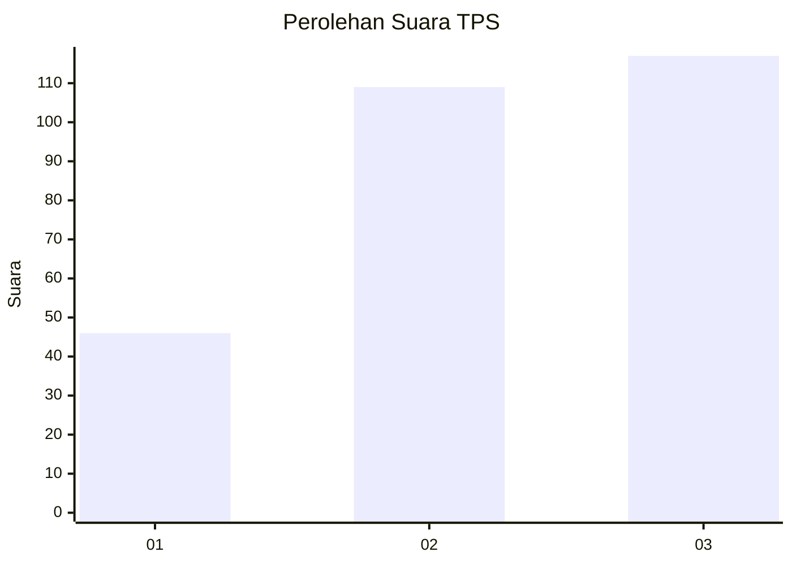
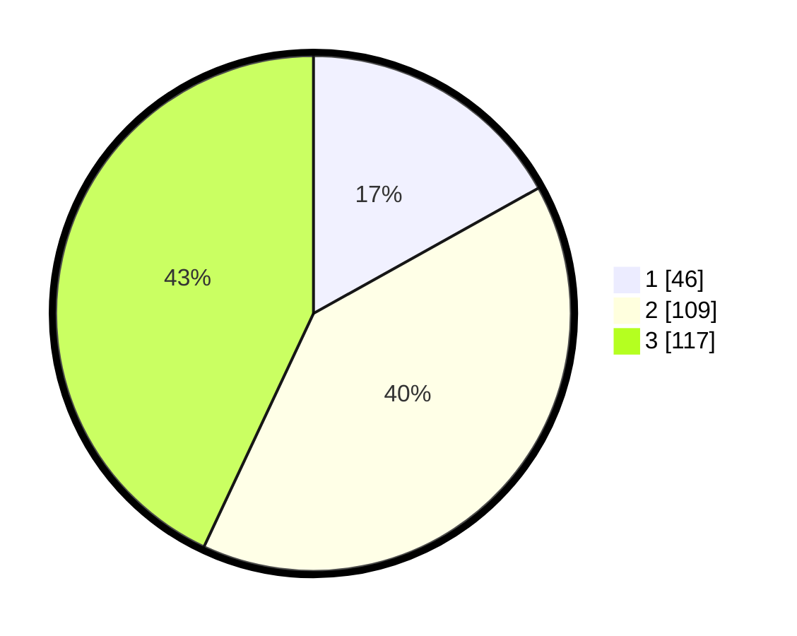

# Hasil

## Grafik

## Tabel

| No. | Nama Paslon    | Suara | Suara (raw) | Persentase |
|:--- |:-------------- | -----:| -----------:| ----------:|
| 1   | ANIES MUHAIMIN | 46    | [46][p-1]   | 16,91      |
| 2   | PRABOWO GIBRAN | 109   | [109][p-2]  | 40,07      |
| 3   | GANJAR MAHFUD  | 117   | [117][p-3]  | 43,01      |

[p-1]: https://github.com/gigit-pemilu/pemilu-2024/blob/main/pilpres/hitung-suara/sub/33-jawa-tengah/sub/74-kota-semarang/sub/10-tembalang/sub/1004-bulusan/sub/008-tps/sub/paslon-1.txt
[p-2]: https://github.com/gigit-pemilu/pemilu-2024/blob/main/pilpres/hitung-suara/sub/33-jawa-tengah/sub/74-kota-semarang/sub/10-tembalang/sub/1004-bulusan/sub/008-tps/sub/paslon-2.txt
[p-3]: https://github.com/gigit-pemilu/pemilu-2024/blob/main/pilpres/hitung-suara/sub/33-jawa-tengah/sub/74-kota-semarang/sub/10-tembalang/sub/1004-bulusan/sub/008-tps/sub/paslon-3.txt

## Foto C Plano

https://sirekap-obj-formc.kpu.go.id/c116/pemilu/ppwp/33/74/10/10/04/3374101004008-20240215-230144--621485cd-0174-4bf0-90d8-e96f58c5210b.jpg

https://sirekap-obj-formc.kpu.go.id/c116/pemilu/ppwp/33/74/10/10/04/3374101004008-20240215-234849--f68595ab-f05d-44e4-9a1e-d014bd163cb5.jpg

https://sirekap-obj-formc.kpu.go.id/c116/pemilu/ppwp/33/74/10/10/04/3374101004008-20240215-233934--02a29076-1b9b-4400-a453-943a410fbf37.jpg

## Metadata

| Key        | Value               |
| ---------- | ------------------- |
| Time Stamp | 2024-02-16 14:30:33 |

