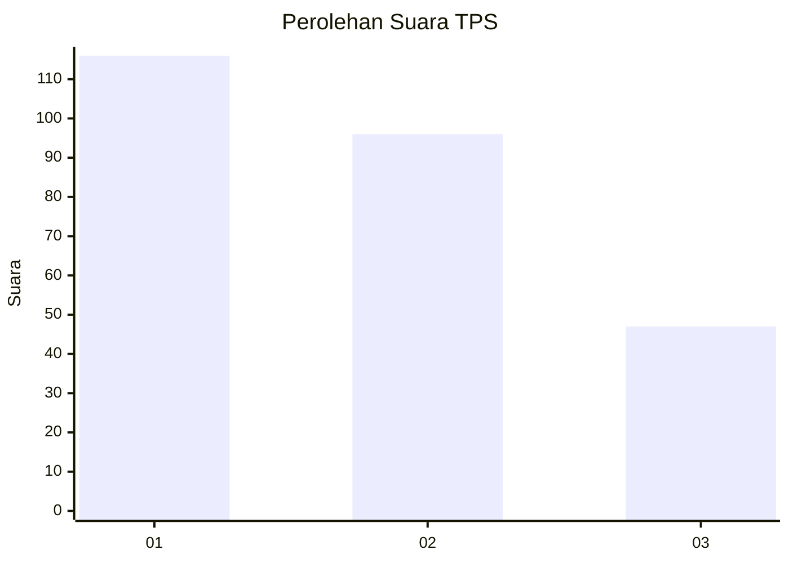
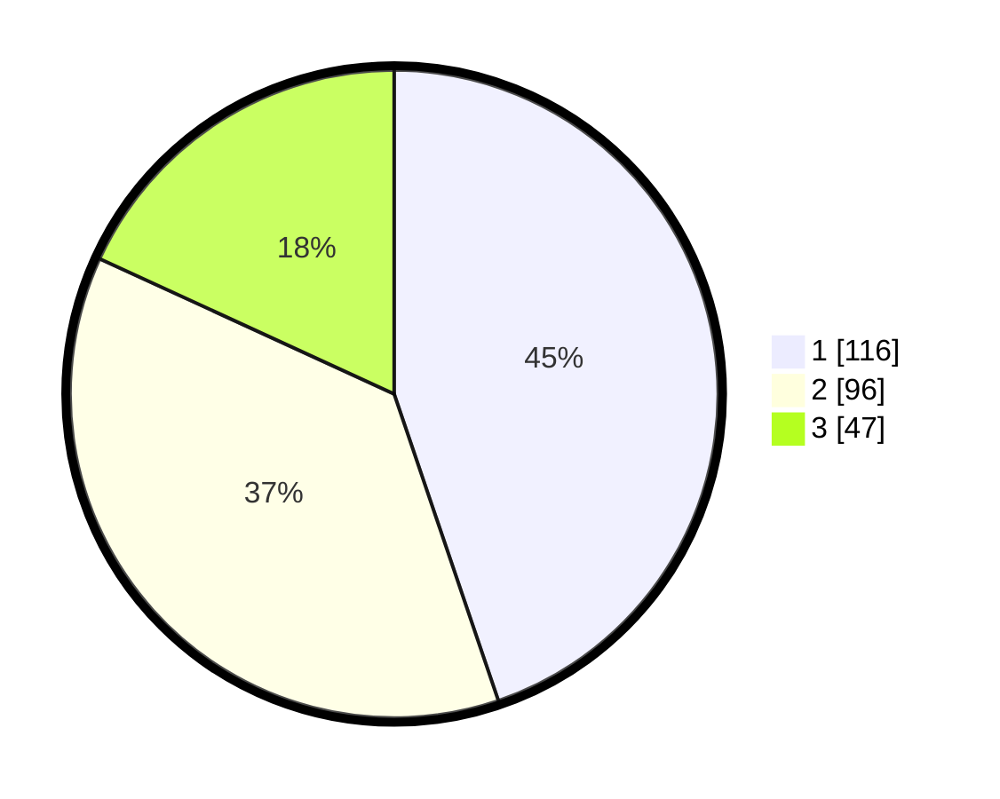

# Hasil

## Grafik

## Tabel

| No. | Nama Paslon    | Suara | Suara (raw) | Persentase |
|:--- |:-------------- | -----:| -----------:| ----------:|
| 1   | ANIES MUHAIMIN | 116   | [116][p-1]  | 44,79      |
| 2   | PRABOWO GIBRAN | 96    | [96][p-2]   | 37,07      |
| 3   | GANJAR MAHFUD  | 47    | [47][p-3]   | 18,15      |

[p-1]: https://github.com/gigit-pemilu/pemilu-2024-33-jawa-tengah/blob/main/pilpres/hitung-suara/sub/33-jawa-tengah/sub/74-kota-semarang/sub/10-tembalang/sub/1004-bulusan/sub/015-tps/sub/paslon-1.txt
[p-2]: https://github.com/gigit-pemilu/pemilu-2024-33-jawa-tengah/blob/main/pilpres/hitung-suara/sub/33-jawa-tengah/sub/74-kota-semarang/sub/10-tembalang/sub/1004-bulusan/sub/015-tps/sub/paslon-2.txt
[p-3]: https://github.com/gigit-pemilu/pemilu-2024-33-jawa-tengah/blob/main/pilpres/hitung-suara/sub/33-jawa-tengah/sub/74-kota-semarang/sub/10-tembalang/sub/1004-bulusan/sub/015-tps/sub/paslon-3.txt

## Foto C Plano

https://sirekap-obj-formc.kpu.go.id/d196/pemilu/ppwp/33/74/10/10/04/3374101004015-20240214-204537--9bf78dc9-d0f5-47aa-a296-3576fb228b7e.jpg

https://sirekap-obj-formc.kpu.go.id/d196/pemilu/ppwp/33/74/10/10/04/3374101004015-20240214-204559--4f1c4e6a-a25e-405b-8fc0-aaca27391447.jpg

https://sirekap-obj-formc.kpu.go.id/d196/pemilu/ppwp/33/74/10/10/04/3374101004015-20240214-204515--897fde9e-1d15-41c6-94cd-5e9a344a48ee.jpg

## Metadata

| Key        | Value               |
| ---------- | ------------------- |
| Time Stamp | 2024-02-16 08:00:28 |

